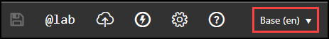
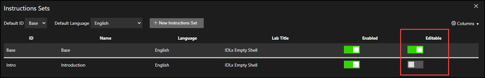
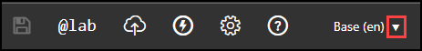

# Instruction Sets 

## Overview 

Instruction Sets for Lab Profiles allows lab authors to create and use different sets of instructions for a given lab profile. This feature is particularly useful for users who need lab instructions in multiple languages or users who work with different audiences who may require different sets of instructions. It allows lab authors to customize their lab instructions and ensure that everyone who uses the lab has access to the correct instructions. Instruction sets can also be used with our API to launch a lab with a specific set of instructions.

Overall, Instruction Sets for Lab Profiles is a powerful tool for creating flexible, customizable lab instructions that can meet the needs of a wide range of users.

## Table of Contents 

- [Create Instruction Sets](#create-instruction-sets)
  - [Clone Instruction Set](#clone-instruction-set)
- [Default Instruction Sets](#default-instruction-sets)
- [Manage Instruction Sets](#manage-instruction-sets)
- [Editing Instructions](#editing-instructions)
- [API](#api)
  - [Example API Command](#example-api-command)
- [Setting the Displayed Lab Title Using Instruction Sets](#setting-the-displayed-lab-title-using-instruction-sets)
- [Best Practices](#best-practices)
- [Use Cases](#use-cases)
- [Related Topics](#related-topics)

## Create Instruction Sets 

Instruction sets are created on Lab Profiles. Instruction sets can only be used with the Lab profile, where they are created. 

To create an Instruction Set:

1. Navigate to the Lab Profile you wish to add Instruction Sets to. 

1. Select **Edit Instructions** in the upper-right corner of the page. 

1. Select the **Instruction selector** at the top of the instructions editor.

    

1. Select **Manage Instruction Sets**.

    The Instruction Management window will now open. This is where you can add, remove and manage Instruction Sets. 

1. Select **+ Instruction Set** to add a new Instruction Set. 

1. Next, Select **New Instructions set (blank)** and then select **OK**. 

1. Enter an **ID** for the Instruction Set. This ID will be used to identify the Instruction set, and used as a parameter in API calls. Instruction Set IDs can be used in an API launch command, to launch a lab with a specific set of instructions. 

1. Enter a **Name** for the Instruction set. This is used to identify the instruction set. 

1. Select the language you wish the lab window text to be displayed in. 

    >[note] Please note that selecting a language from this menu does not translate your lab instructions into that language. As a lab author, you must enter the lab instructions into the lab instruction editor, using the chosen language. 
 
1. Enter a **Lab Title** for the Instruction Set. This title will be displayed as the lab title in a launched lab. For more information, see [Setting the Displayed Lab Title Using Instruction Sets](#setting-the-displayed-lab-title-using-instruction-sets).

1. Select the **Enabled** toggle to enable the Instruction Set to be used. 

The Instruction Set is now created and be used with this Lab Profile. 

### Clone Instruction Set

To clone an Instruction Set: 

1. Navigate to the Lab Profile you wish to add Instruction Sets to. 

1. Select **Edit Instructions** in the upper-right corner of the page. 

1. Select the **Instruction selector** at the top of the instructions editor.

1. Select **Manage Instruction Sets**.

    The Instruction Management window will now open. This is where you can add, remove and manage Instruction Sets. 

1. Select **+ Instruction Set** to add a new Instruction Set. 

1. Next, Select **Clone From** and then select the drop-down menu to choose an Instruction Set to clone from. Then select **OK**. 

    A new Instruction Set will be listed. You will need to enter a new ID, Name and Lab Title to the Instruction Set. 

## Default Instruction Sets

Lab Profiles have a default Instruction Set and default language for the lab window text. When a lab is launched directly in Studio or via API, the default instruction set and default language is used in the lab instance, unless another Instruction set is specified during the launch. 

To set an Instruction Set as a default: 

1. Navigate to the Lab Profile you wish to configure a default Instruction Set. 

1. Select **Edit Instructions** in the upper-right corner of the page. 

1. Select the Instruction selector at the top of the instructions editor.

    

1. Select **Manage Instruction Sets**.

1. Select the **Default ID** drop-down menu and select the **ID** of the Instruction Set you wish to be the default. 

1. Select the language you wish the lab window text to be displayed in. 

    >[note] Please note that selecting a language from this menu does not translate your lab instructions into that language. As a lab author, you must enter the lab instructions into the lab instruction editor, using the chosen language. 

The default Instruction Set and default language can be changed at any time. If a lab instance is launched, and then defaults are changed, the Instruction Set and language in the launched lab will not change to the new default Instruction Set and language. 

## Manage Instruction Sets

Instruction sets are managed on the Edit Instructions page, on a Lab Profile. 

1. Navigate to the Lab Profile you wish to add Instruction Sets to. 

1. Select **Edit Instructions** in the upper-right corner of the page. 

1. Select the **Instruction selector** at the top of the instructions editor.

1. Select **Manage Instruction Sets**.

    The Instruction Management window will now open. This is where you can add, remove and manage Instruction Sets. 

This management page allows you to manage Instruction Sets. The following options are available:  

- Add new Instruction Sets
- Delete Instruction Sets
- Edit the ID, Name, Language and Lab title of Instruction Sets
- Enable/disable Instruction Sets

## Editing Instructions 

Lab instructions can either be editable or not editable. This setting is managed in the Instruction Management window. If the Editable setting is not enabled for an Instruction Set, it will be read-only and cannot be edited until that setting is set to editable.

To edit an Instruction Set that is editable: 

1. Navigate to the Lab Profile you wish to add Instruction Sets to. 

1. Select **Edit Instructions** in the upper-right corner of the page. 

1. Select the drop-down menu on the Instruction selector, at the top of the instructions editor.

    

1. Select the Instruction Set you wish to edit. The lab instruction editor should now be displayed, so that you can edit the instructions. 

For more information about Markdown, please see our [Markdown User Guide](/guides/idl2/markdown-user-guide.md).

## API 

Instruction Sets can be specified during an API lab launch. This allows a lab to be launched with a specific instruction set or language, without affecting all other launches of the lab profile. This is a useful option if your lab has Instruction Sets based on difficulty, lab user experience or lab user language. 

### Example API Command 

To specify an Instruction Set or language in an API launch command, add the Instruction Set ID and language parameters to the Launch Command. 

- Instruction Set parameter: `instructionsId=[your instruction set name]`
- Language: `lang=[language code]`
- Example launch command with Instruction Set and Language parameters:  `launch?labId=12345&instructionsId=base&lang=en`

>[!knowledge] An API example that contains these parameters is displayed on the Lab Profile. To view the example, navigate to the Manage Instructions Sets page on the Lab Profile. Next, select the Columns menu in the upper-right, and enable the API example column. An API example will be displayed next to each instruction set, with the ID and language parameters. 

For more information about our API, please see the [Skillable Studio Lab API](https://connect.skillable.com/lab/operation/Launch/).

## Setting the Displayed Lab Title Using Instruction Sets

The lab title displayed in the lab user interface is now determined by the lab title configured in the active instruction set for the lab instance. This feature update will require a change in the way that lab authors configure the displayed titles of their labs, which had previously been equivalent to the lab profile name.
 
Each instruction set has an associated lab title field which may be specified by the lab author. This ability to provide a custom lab title for each of multiple instruction sets supports localization.
 
  >[!knowledge] Lab profiles which inherit instructions from another lab profile will derive their displayed lab titles from the inherited instruction sets.
 
 To change the Lab Title of a lab, perform the following steps: 
 
1. Navigate to the lab profile.
1. Select **Edit Instructions**.
1. Select any Instruction Set.
1. From the instructions editor, in the center of the top bar of the Edit Instructions page, select the name of the current Instruction Set and then select **Manage Instructions Sets**.
1. On this page, a table of instruction sets is displayed. Select the **edit** button next to the Lab Title field on any row to change the lab title associated with that instruction set.
1. After editing the Lab Title for an Instruction Set, select the **OK** button to save your changes.
1. You may now exit the Instructions editor page without any additional save actions required. 

## Best Practices 

- If your Lab profile may be used by users that read different languages, it is suggested to create multiple version of your Instruction Sets with different languages configured. As a lab author, you must enter the lab instructions into the lab instruction editor, using the chosen language.

- Set the default Instruction Set and Language to match the majority of the anticipated audience for your Lab Profile. 

- When creating Instruction Sets, use a descriptive Name for your instruction set, to make it easier to determine which Instruction Set to use.

## Use Cases

- Your lab could have two sets of instructions for different experience levels. There could be an Instruction Set for beginner users, and an Instruction Set for expert users. Specifying Instruction Sets accordingly, will allow different Instruction Sets to be shown to users, for the same lab profile.

## Related Topics

- [Activities](/lod/activities.md): Activities are either automated activities or question-based activities.
- [Lab Variables](/lod/variables.md): Variables store information and then that information can be recalled or used in the lab.
- [Markdown User Guide](/guides/idl2/markdown-user-guide.md): overview on Mardown syntax used in Skillable Studio. 
- [Replacement Tokens](/lod/feature-focus/cloud-resource-templates/replacement-tokens.md): Replacement Tokens are used to replace text with a variable that is unknown at the time of authoring the lab. 
