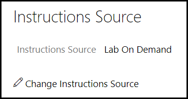
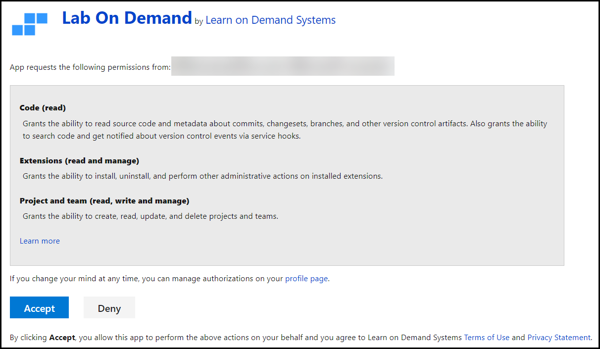
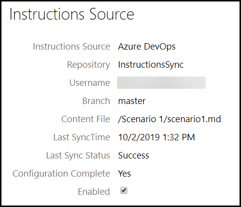
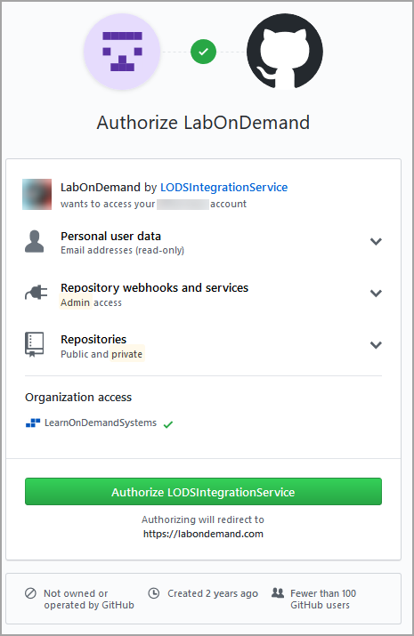
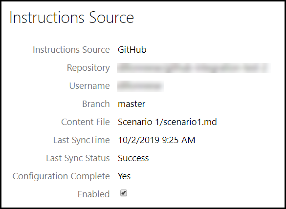
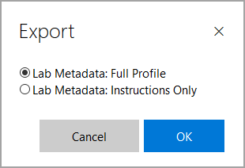

# External Instruction Source

1. [Overview](#overview)
    - [Benefits](#external-management-benefits)
1. [Getting Started](#getting-started)
    - [Azure DevOps](#azure-devops)
    - [GitHub](#github)
    - [Copying Existing Lab Content](#copying-existing-lab-content)
1. [Markdown Resources](#markdown-resources)

# Overview

Lab on Demand allows you to integrate an external ADO or GitHub repository into a lab and use that repository as the source of IDLx content for that lab. 

Choosing to leverage these features means moving all of your content management (including editing) for a lab into ADO or GitHub. Once you have enabled this instruction source for a lab, the content in that lab will automatically be updated
based on the the latest changes you make to your content in the external repository. 

There is a small learning curve to overcome with Markdown such as syntax and structure; however, the benefits you will realize once you have
learned how to write your lab content in Markdown and once you have stored those files in GitHub are well worth the effort. For more information on Markdown, see our [Markdown User Guide](https://raw.githubusercontent.com/LearnOnDemandSystems/docs/master/guides/idl2/markdown-user-guide.md)

## External Management Benefits

1. **Offline editing** - With external instruction management, content is created/edited as part of a structured Markdown file, that can be edited offline using one of the many free or commercial Markdown editors that are available for all mainstream platforms/devices being used today, including Windows, macOS, Linux, iOS, and Android.
1. **Revision control** - ADO and GitHub natively support revision control, which means you get revision control for your content in labs that leverage the integration feature. This allows you to compare revisions, roll back changes, view revision history, etc.
1. **Multi-author support** - By managing your content in a lab that leverages external instruction source, you can support multiple content authors contributing to the content for one lab at the same time.

# Getting started

For external instruction sources, you will need to have an account on the selected platform and will be prompted to login. If
you do not have one yet, you can create an account:

- [Azure DevOps (ADO)](#azure-devops)
- [GitHub](#github)

Your repository will need a .md file that defines the lab content in Markdown. This file will contain the lab instructions for your lab, formatted in Markdown. 

> [!KNOWLEDGE] Any images that are used in the instructions need to be at the same level in the repository as the .md file, or in a folder that is at the same level as the .md file. If your images are not structured like this, they will not display correctly in labs. 

When you configure a lab profile to use an external instruction source, you will be directed to an external login page, where you will be asked to allow Lab On Demand permission to access your repositories. Lab On Demand will need access to your email address for push notifications, repository access, and admin permissions to modify web hooks.

## Azure DevOps

If you do not have an ADO account set up yet, you can [create an account here](https://docs.microsoft.com/en-us/azure/devops/organizations/accounts/create-organization?).

1. Create a new ADO repository where you will manage your lab content.
1. Create a folder to store your lab instructions and any other files used in the lab.
1. Create a new file in the folder called content.md.
1. If you want to store screenshots for your lab in ADO, create a _media_ folder, inside of the folder created on step 2.
1. If you want to store videos for your lab in ADO, these can be stored in the _media_ folder as well.

If you are moving content for a lab that has
content into ADO, see the [Copying Existing Lab Content into GitHub](copying-existing-content) section below to start that way instead.

> [!KNOWLEDGE] You can manage more than one lab profile from a single ADO repository, by separating the lab profiles with folders in your repository. 

To integrate the Markdown document in your ADO repository with a lab profile, navigate to the lab profile you want to integrate with, then follow these steps:

1. From your lab profile page, click **Edit**.

1. Click on the **Advanced tab**, then click **Instruction Source**.

    

1. Select **ADO Repository**.

1. If you're not logged in already, you be will prompted to log in to the ADO account that has a repository containing lab content you want to integrate into the lab profile.

1. Once you are logged into ADO, you will be asked to authorize Lab on Demand to have access to your ADO account. This access is only used to create a webhook so that LOD can be notified whenever the content in your ADO repository changes. Click **Accept** to continue with the integration.

    

1. At this point you will be presented with a list of organizations that are associated with your ADO account. Click select next the organization containing the project file to be used as the instructions source. 

1. Select the ADO project that contains your repository.

1. Select the repository containing the markdown file to be used as the instructions source. Repositories without proper permissions will not be displayed.

    > [!ALERT] When you complete the following step, any existing content in your lab profile will be overwritten, and anything lost will be unrecoverable. If you have content in the lab profile, you can export the lab instructions by clicking the export button at the top of the lab profile details page. 

1. Select the markdown file to be used as the instructions source. Once you select the Markdown file that defines the lab content, LOD will process all lab content referenced by that markdown file and add it into the lab profile instructions. At any point that the ADO content changes, the lab profile will be updated automatically.

1. Once the synchronization process is complete, you will have completed your integration. Click **Close** to finish the Integration wizard.

1. Your lab profile now shows that content is integrated from your
ADO repository. Click the **Save** button at the bottom of your lab profile window to exit the lab profile editor.

    

## GitHub 

If you do not have a GitHub account set up yet, you can [create an account here](https://github.com).

1. Create a new GitHub repository where you will manage your lab content.
1. Create a folder to store your lab instructions and any other files used in the lab.
1. Create a new file in the folder called content.md.
1. If you want to store screenshots for your lab in GitHub, create a _media_ folder, inside of the folder created on step 2.
1. If you want to store videos for your lab in GitHub, these can be stored in the _media_ folder as well.

If you are moving content for a lab that has
content into GitHub, see the **Copying Existing Lab Content into GitHub** section below to start that way instead.

> [!KNOWLEDGE] You can manage more than one lab profile from a single GitHub repository, by separating the lab profiles with folders in your repository. 

To integrate the Markdown document in your GitHub repository with a lab profile,
navigate to the lab profile you want to integrate with, then follow these steps:

1. From your lab profile page, click **Edit**.

1. Click on the **Advanced tab**, then click **Instruction Source**.

    

1. Select **GitHub Repository**.

1. If you're not logged in already, you be will prompted to log in to the GitHub account that has a repository containing lab content you want to integrate into the lab profile.

1. Once you are logged into GitHub, you will be asked to authorize Lab on Demand to have access to your GitHub account. This access is only used to create a webhook so that LOD can be notified whenever the
content in your GitHub repository changes. Click **Authorize application** to
continue with the integration.

    

1. At this point you will be presented with a list of repositories that are associated with your GitHub account. Click select next the repository containing the markdown file to be used as the instructions source. 

    > [!ALERT] When you complete the following step, any existing content in your lab profile will be overwritten, and anything lost will be unrecoverable. If you have content in the lab profile, you can export the lab instructions by clicking the export button at the top of the lab profile details page. 

1. After choosing your repository, you need to identify the markdown file that defines the lab content within that repository. Click **Select** next to the markdown file to use as the source of your lab content.

1. Once you select the Markdown file that defines the lab content, LOD will process all lab content referenced by that markdown file and add it into the lab profile instructions. At any point that the GitHub content changes, the lab profile will be updated automatically.

1. Once the synchronization process is complete, you will have completed your
integration. Click **Close** to finish the Integration wizard.

1. Your lab profile now shows that content is integrated from your
GitHub repository. Click the **Save** button at the bottom of your lab profile window to exit the lab profile editor.

    

### Copying Existing Lab Content

If you have a lab that already has IDLx content in LOD, you can use ADO or GitHub to manage that content as well. To get this set up you must do the following:

1. In Lab on Demand, navigate to the lab profile whose content you want to
manage in GitHub.

1. Click **Export**.

    

1. In the **Export** window, select **Lab Metadata: Instructions Only** and click
**OK**.

    

1. In the **Save** dialog, navigate to the location where you want to save the archive file.

The archive file that is saved will contain a content.md file as well as folders for screenshots and videos if either of these were present in the original lab profile. Add these files to the ADO or GitHub repository that you want to use to manage your lab content, and then proceed to the configure the lab profile to use an external instruction source for [ADO](#azure-devops) or [GitHub](#github)
   
## Markdown Resources

- [IDLx Authoring Guide](../guides/idl2/idlv2-authoring-guide-and-best-practice.md)

    This document covers Markdown, IDLx best practices, lab instruction editor interface, uploading files into your lab, and many other topics to assist with authoring your IDLx lab.

- [Markdown user Guide](../guides/idl2/markdown-user-guide.md)

    This document covers Markdown in detail, including syntax for all supported Markdown.

- [IDLx Activities](activities.md)

    Activities fall into two broad categories: Questions and Automated.

    - Questions are simply multiple choice or short answer questions.
    - Automated Activities have a script configured to run against a cloud subscription or Windows-based virtual machines running on Hyper-V in the lab.

- [IDLx Lab Variables](variables.md)

    Variables are used to store information that is not known at the time of lab instruction authoring. Variables store information and then that information can be recalled in later lab steps using a Replacement Token. This document covers how to use Variables in your IDLx lab. 

- [IDL Lab Development Best Practices](/lod/idlx-development-best-practices.md)

    This document covers best practices for IDLx lab development, to assist in creating a rich learning experience.

- [Replacement Tokens](feature-focus/cloud-resource-templates/replacement-tokens.md)

    Replacement tokens use the syntax &commat;lab.replacementTokenName. You can see the list of all &commat;lab replacement tokens available to your lab by simply editing the instructions, and clicking on the &commat;lab button.

[Back to top](#external-instruction-source)

