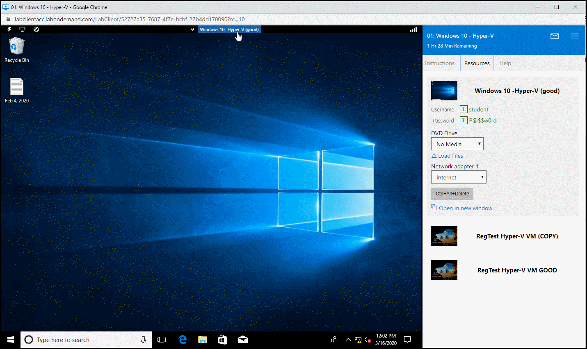

# Is There A Quick Way To Switch Virtual Machines?
 
There are two options when switching between Virtual Machines. 

The quickest way to switch is to use the Machine menu just above the VM. 
1. Click the name of the machine you are currently working in.
1. Select the name of the machine you would like to use next.

Alternately, you can use the Resources tab to the right of the VM.
1. In the resources pane, all virtual machines in the lab are listed. 
1. Select the machine you would like to use next.

