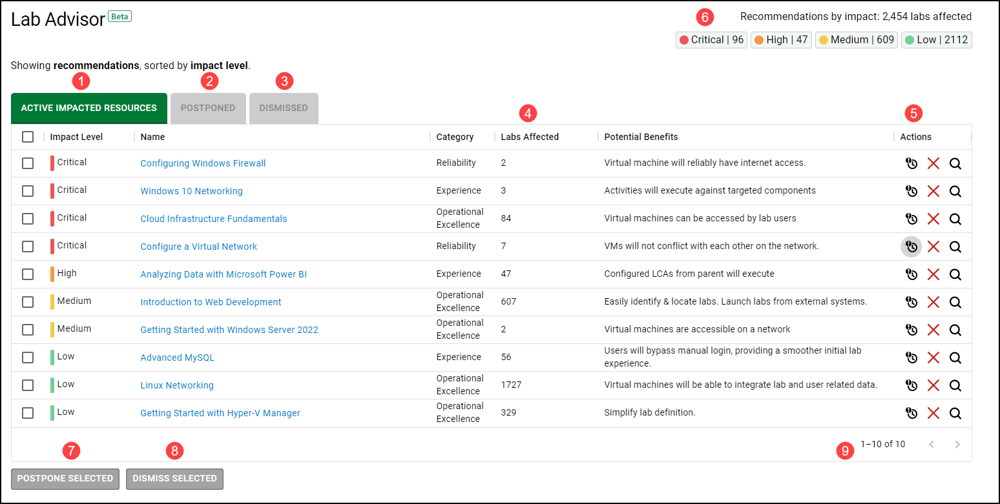
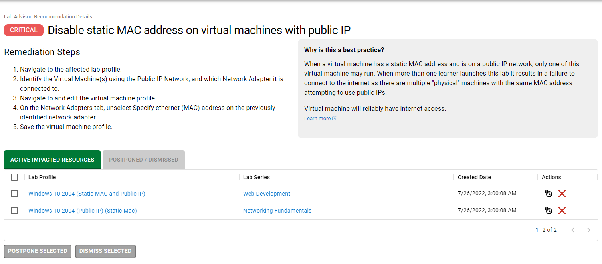

# Lab Advisor

The Skillable Studio Lab Advisor scans lab profiles and determines if any possible issues could arise based on the configuration of the lab profile, and the components used in the lab profile. Lab Advisor uses these findings to generate specific recommendations for remediation. 

Lab Advisor is accessed from your Skillable Studio dashboard. 

## Table of Contents

- [Overview](#overview)
- [Remediate a Recommendation](#remediate-a-recommendation)
- [Frequently Asked Questions](#frequently-asked-questions)

## Overview

1. **Active Impacted Resources**: This tab toggles the view to show active impacted resources. 

1. **Postponed/Dismissed**: This tab toggles the view to show resources that have been postponed or dismissed from the active impacted resources tab.

1. **Recommendations**: Recommendations found by the Lab Advisor will be displayed here. Recommendations are sorted by impact level, and provide relevant information such as the number of labs affected, the potential benefits of the recommendation, and the last date the resource was updated. Selecting the name of a lab profile will allow you to remediate a recommendation.

1. **Actions**: If you do not wish to remediate the recommendation, there are two actions available: 

    - **Postpone**: Selecting the postpone option will move the recommendation to the _Postponed/Dismissed_ tab. Once it is moved, it will stay behind that tab for 7 days. After 7 days has elapsed, the recommendation will be moved back to the _Active Impacted Resources_ tab. 

    - **Dismiss**: Selecting the dismiss option will move the recommendation to the _Postponed/Dismissed_ tab. Once it is moved, it will stay behind that tab indefinitely, unless you select the option on the Dismissed tab to bring it back to the _Active Impacted Resources_ tab. 

1. **Recommendations by Impact**: This displays the number of all resources that are affected by recommendations found by the Lab Advisor. These are sorted from critical to low, with a numeric value that represents the number of affected resources for each impact level. 

1. **Postpone Selected**: This allows you to select multiple recommendations, to be postponed. 

1. **Dismiss Selected**: This allows you to select multiple recommendations, to be dismissed. 

1. **Page Selection**: When there are several recommendations found for resources that you manage, they are displayed in multiple pages. 

## Remediate a Recommendation

To remediate a recommendation, perform the following steps: 

1.  Select the **Name of the recommendation** from the list.

    The next page will show all lab profiles that are affected by the recommendation.

    

1. Select the **lab profile** that you wish to remediate, by clicking on the link in the Lab Profile column.

1. Follow the remediation steps at the top of the page. 

    To better understand why this recommendation is suggested, there is an explanation at the top of the page with more information. 

## Frequently Asked Questions

- **Q**: What resources can Lab Advisor provide recommendations for? 
 
  **A**: Lab Advisor scans lab profiles and reports issues found with lab profile configuration and components used in lab profiles.

- **Q**: Which lab profiles will lab advisor show me on my dashboard? 

    **A**: Lab Advisor can report on lab profiles that are configured on your user account on the _Managed Organizations_ tab. 

- **Q**: What information can the lab advisor recommend? 
 
  **A**: Lab Advisor can provide recommendations for the following categories: 
    
  - Cost
  - In-lab Experience
  - Operational Excellence
  - Performance
  - Reliability
  - Security