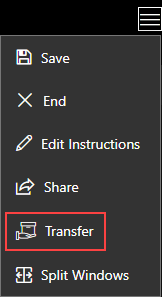
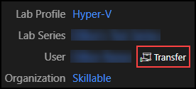

# Lab Instance Transfer

Lab Instance Transfer allows a running lab to transferred to another user account. Once the lab instance is transferred, only the recipient will have access to the lab instance. 

Lab Instance Transfer is enabled a the organization level. Once it is enabled, all users within that organization will have the ability to transfer lab instances to another user within the organization. 

## Table of Contents 

* [Enable Lab Instance Transfer](#enable-lab-instance-transfer)
* [Transferring a Lab Instance](#transferring-a-lab-instance)
  + [Transfer From a Running Lab](#transfer-from-a-running-lab)
  + [Transfer From a Saved Lab](#transfer-from-a-saved-lab)
* [Accessing a Transferred Lab Instance](#accessing-a-transferred-lab-instance)
  + [Lab on Demand User](#lab-on-demand-user)
  + [Training Management System User](#training-management-system-user)
  + [API User](#api-user)

## Enable Lab Instance Transfer

When enabled, lab instances that belong to this organization can be transferred between users. The receiving user must belong to this organizational tree (this organization, a parent organization, a child organization, or a sibling organization).

To enable Lab Instance Transfer, it must be enabled at organization level. 

1. Contact our [Customer Support Team](https://skill.info/support) to request enabling this feature.  

1. Provide a custom message that will sent to lab instance recipients. When a lab is transferred from one user to another, the recipient receives a simple email notification. Any text provided here will be appended to the message. 

## Transferring a Lab Instance

Lab instances can be transferred from a running lab or from a saved lab. 

### Transfer From a Running Lab 

To transfer a lab instance from a running lab, complete the following steps: 

1. In the running lab, select the hamburger menu in the upper-right corner. 

1. Select **Transfer**.

    

1. Enter the **E-mail address** of the recipient of the lab instance. 

1. Optionally, check the box to **save the lab instance**. If the lab instance is not saved, it will be sent to the user in a running state. 

1. Select **Next**. 

1. On the next screen, confirm you wish to transfer the lab instance by clicking **Transfer**. Once the lab instance is transferred, you will lose access to the lab instance immediately and permanently. 

### Transfer From a Saved Lab 

To transfer a lab instance from a saved lab, complete the following steps: 

1. In Lab on Demand, navigate to the lab instance details page for the lab instance you wish to transfer. 

1. Select the **Transfer** button next to the User name. 

    

1. Enter the last name of the user you wish to transfer the lab instance to, or use any of the available search filters to locate the recipient. 

1. Select the user and click **OK**.

1. On the next screen, confirm you wish to transfer the lab instance by clicking **OK**. Once the lab instance is transferred, you will lose access to the lab instance immediately and permanently. 

## Accessing a Transferred Lab Instance

### Lab on Demand User

If the **recipient is a Lab on Demand user**, complete the following steps to find lab instances that are transferred to your account: 

1. Log in to your Lab on Demand account. 

1. Select **Dashboard** at the top of the page. 

1. All active labs will be displayed, including the lab instance that was transferred. 

1. **Select the lab instance** that was transferred. 

1. Select **Resume**. 

### Training Management System User

If the **recipient is a TMS user**, complete the following steps to find lab instances that are transferred to your account: 

1. Log in to your TMS account. 

1. Navigate to your user account.

1. Select **Current Training**.

1. **Select the lab instance** that was transferred. 

1. Select **Launch**. 

### API User

If the **recipient is an API user** that access lab instances from an external system, please refer to your external system's native tools to access the lab instance.