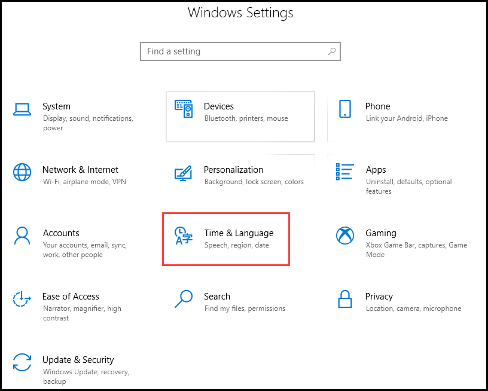
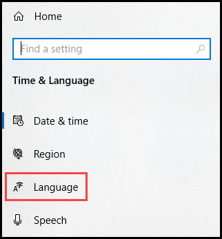
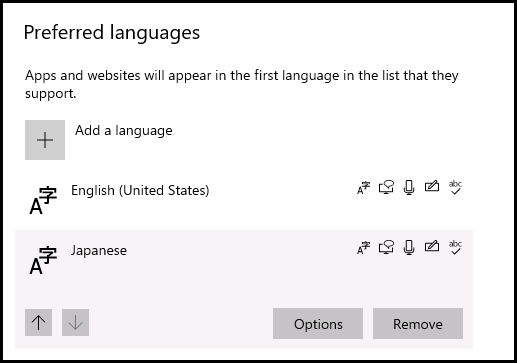
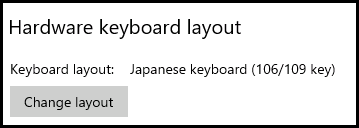

## How Do I Make My International Keyboard Work In The Lab Interface?

When using the Lab on Demand (LOD) lab interface, there is support for international keyboards and languages. However, depending on the lab platform and the controller you are using, you may need to change settings in your browser, and/or the VM.

## Table of Contents
- [General Requirements for International Keyboards](#general-requirements-for-international-keyboards)
- [Change Settings in Web Browsers](#changing-settings-in-web-browsers)
- [Changing Settings in Windows](#changing-settings-in-windows)
- [Steps to Change Languages in Linux](#steps-to-change-languages-in-linux)
- [Supported Keyboard Layouts](#supported-keyboard-layouts)
    - [VMware Keyboard Layouts](#vmware-keyboard-layouts)
    - [Hyper-V Keyboard Layouts](#hyper-v-keyboard-layouts)

## General Requirements for International Keyboards:

1. Your web browser should be set to the desired language. 

1. The language settings in the lab's virtual machine must be set to the desire language. 

1. The hardware keyboard layout settings in the lab's virtual machine must be set to a keyboard layout that matches the desired language. 

## Changing settings in web browsers

- In **Edge**, the language is tied to the local machine's language settings.

    1. Set your local machine settings to the desired language. 

- In **Internet Explorer**;

    1. Open **Internet Options**

    1. At the bottom of the **General Tab**, click **Languages**

    1. Click **Set Language Preferences**.

    1. Ensure your language is listed as the top option.

- In other browsers such as **Google Chrome** or **Mozilla Firefox**;

    1. Open the **Settings** menu and locate the **language settings** section.

    1. Ensure the desired language is listed at the top of the list of languages. 

## Changing Settings in Windows

Your lab’s VMs must be set to the correct language. To do this, follow these steps on for each VM in the lab:

1. Open the **Control Panel**.

1. Click **Time & Language**.

    

1. Click **language** on the left side of the window.

    

1. Scroll down to the **Preferred Languages** section, select the language you prefer to use, and then click **Options**.

    

1. Scroll down to the **Hardware keyboard layout** section and click **Change layout**. 

    

You will be prompted to sign out of Windows on the VM, for the changes to take effect. 

## Steps to Change Languages in Linux

Linux can set the language/region in many ways. Here’s an example for SUSE Linux:

You may have to download/install the language pack if it hasn’t already been installed and that can require either the install media or an Internet connection if end users need the ability to change that.

It is also possible to change the language/region using the command line interface (aka Terminal). You will need to check on how specifically to do it with your distro of Linux, but here’s an example of how to do it:

1. **Edit** the following file `/etc/default/locale`:

    - `LANG="en_US"`

    - `LANGUAGE="en_US:en"`

1. **Edit** the following file `~/.pam_environment`:

    - `LANG=en_US`

    - `LANGUAGE=en_US`

## Supported Keyboard Layouts

### VMware Keyboard Layouts

- English (US)
- French
- German
- Italian
- Japanese
- Spanish
- Portuguese
- Swiss-French
- Swiss-German

### Hyper-V Keyboard Layouts

- Bulgarian
- Croatian
- Czech
- Danish
- Dutch (Belgian)
- Dutch (Standard)
- English (US)
- English (Australia)
- English (Canada)
- English (United Kingdom)
- English (Ireland)
- English (New Zealand)
- Finnish
- French
- French (Belgium)
- French (Canada)
- French (Switzerland)
- German
- German (Austrian)
- German (Switzerland)
- Greek
- Hungarian
- Icelandic
- Italian
- Italian (Swiss)
- Japanese
- Korean
- Norwegian (Bokmal)
- Norwegian (Nynorsk)
- Polish
- Portuguese
- Portuguese(Brazilian)
- Romanian
- Russian (Russia)
- Slovakian
- Slovenian
- Spanish (Spain)
- Spanish (Mexico)
- Spanish (Guatemala)
- Spanish (Costa Rica)
- Spanish (Panama)
- Spanish (Dominican Republic)
- Spanish (Venezuela)
- Spanish (Colombia)
- Spanish (Peru)
- Spanish (Argentina)
- Spanish (Ecuador)
- Spanish (Chile)
- Spanish (Uruguay)
- Spanish (Paraguay)
- Spanish (Bolivia)
- Spanish (El Salvador)
- Spanish (Honduras)
- Spanish (Nicaragua)
- Spanish (Puerto Rico)
- Swedish
- Turkish

<!--
When using the Enhanced Controller with Hyper-V, your non-US keyboard should automatically be detected for the following languages:

- English
- Japanese
- German
- Italian
- Portuguese
- French

Our default HTML5 controller is built for quick and easy launches with minimum launch requirements. It may not understand different keyboard layouts depending on the configuration of the lab you are accessing. For example, even when the language within the VM is set to German, your German keyboard may not be properly recognized. Your browser must be set to the desired language for your non-US keyboard to work as intended.
-->