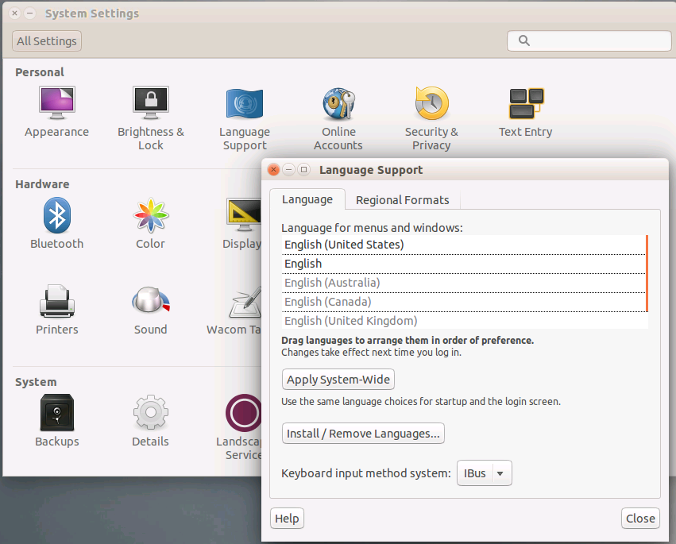

## How Do I Make My International Keyboard Work In The Lab Interface?

When using the Lab on Demand (LOD) lab interface, there is some support for international keyboards and languages. However, depending on the lab platform and the controller you are using, you may need to change settings on your local machine, the browser, and/or the VM and possibly download a file.

#### General Requirements for International Keyboards:

1. Your local machine must be set to the desired language (see [Changing Local Settings on Local or Virtual Machines](#changing-local-settings-on-local-or-virtual-machines) below)

1. The Lab VM(s) must be set to the desired language.

### When Using the HTML5 Controller in Hyper-V and vSphere Labs

Our default HTML5 controller is built for quick and easy launches with minimum launch requirements. It may not understand different keyboard layouts depending on the configuration of the lab you are accessing. For example, even when the language within the VM is set to German, your German keyboard may not be properly recognized. Your browser must be set to the desired language for your non-US keyboard to work as intended:

1. In **Edge**, the language is tied to the local machine's language.

1. In **Internet Explorer**;

    - Open **Internet Options**

    - At the bottom of the **General Tab**, click **Languages**

    - Click **Set Language Preferences**.

    - Ensure your language is listed as the top option.

1. In other browsers such as Google Chrome or Mozilla Firefox;

    - Open the **Settings** menu and locate the **language settings** section.

    - Ensure the desired language is listed at the top of the list of languages. 

### When Using the Enhanced Controller in Hyper-V and vSphere Labs

When using the Enhanced Controller with Hyper-V, your non-US keyboard should automatically be detected for the following languages:

- English
- Japanese
- German
- Italian
- Portuguese
- French

### Changing Local Settings on Local or Virtual Machines

Your local machine and the lab’s VMs must be set to the correct language. To do this, follow these steps on your local machine and each VM:

1. Open the **Control Panel**.

1. In the Search Control Panel field, type: location and **press Enter**.

1. Click **Change location**.

1. From the **Home location** drop-down, select your location.

1. You may also need to change the system locale on the **Administrative tab**.

If you are unable to change these settings on the VMs or your keyboard still does not work, ask your instructor for assistance or contact our Help Desk to see if your class has labs available in your language.

### Steps to Change Languages in Linux

Linux can set the language/region in many ways. Here’s an example for SUSE Linux:

You may have to download/install the language pack if it hasn’t already been installed and that can require either the install media or an Internet connection if end users need the ability to change that.

It is also possible to change the language/region using the command line interface (aka Terminal). You will need to check on how specifically to do it with your distro of Linux, but here’s an example of how to do it:

1. **Edit** the following file `/etc/default/locale`:

    - `LANG="en_US"`

    - `LANGUAGE="en_US:en"`

1. **Edit** the following file `~/.pam_environment`:

    - `LANG=en_US`

    - `LANGUAGE=en_US`

## Supported Keyboard Layouts

For both VMware and Hyper-V LOD will detect the language set in the browser, to select the keyboard layout. If LOD doesn't support the detected language, it will default to English (US).

### VMware Keyboard Layouts

- English (US)
- French
- German
- Italian
- Japanese
- Spanish
- Portuguese
- Swiss-French
- Swiss-German

### Hyper-V Keyboard Layouts

- Bulgarian
- Croatian
- Czech
- Danish
- Dutch (Belgian)
- Dutch (Standard)
- English (US)
- English (Australia)
- English (Canada)
- English (United Kingdom)
- English (Ireland)
- English (New Zealand)
- Finnish
- French
- French (Belgium)
- French (Canada)
- French (Switzerland)
- German
- German (Austrian)
- German (Switzerland)
- Greek
- Hungarian
- Icelandic
- Italian
- Italian (Swiss)
- Japanese
- Korean
- Norwegian (Bokmal)
- Norwegian (Nynorsk)
- Polish
- Portuguese
- Portuguese(Brazilian)
- Romanian
- Russian (Russia)
- Slovakian
- Slovenian
- Spanish (Spain)
- Spanish (Mexico)
- Spanish (Guatemala)
- Spanish (Costa Rica)
- Spanish (Panama)
- Spanish (Dominican Republic)
- Spanish (Venezuela)
- Spanish (Colombia)
- Spanish (Peru)
- Spanish (Argentina)
- Spanish (Ecuador)
- Spanish (Chile)
- Spanish (Uruguay)
- Spanish (Paraguay)
- Spanish (Bolivia)
- Spanish (El Salvador)
- Spanish (Honduras)
- Spanish (Nicaragua)
- Spanish (Puerto Rico)
- Swedish
- Turkish