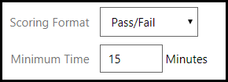

# Lab on Demand LTI Integration

In Learning Tools Interoperability (LTI), the learning system being used by a student is referred to as the **LTI Consumer**, and the external tool or service that is being integrated into that learning system is referred to as the **LTI Provider**. This LTI support is what allows external course authors to integrate rich Lab on Demand content directly into their learning solution. Since LTI is a standard protocol, Lab on Demand content can be integrated into any learning system that supports the LTI standard as an LTI Consumer.

To integrate content from an **LTI Provider** into an **LTI Consumer**, the following information is required:

- **LTI Client Key** – this is the account identifier for the LTI Provider, which allows LTI Consumers to identify the account needed to access LTI Provider content; for OneLearn Lab on Demand, this is referred to as the LTI Key
- **LTI Client Secret** – this is the password/passcode used to authenticate to the LTI Provider account; for OneLearn Lab on Demand, this is referred to as the LTI Secret
- **Content URL** – this is the URL that exposes the content to be integrated into the LTI Consumer training materials; for OneLearn Lab on Demand, this is referred to as the LTI Launch URL

If you are an existing customer of Learn on Demand Systems and you want to launch your labs via LTI, request the LTI Key and LTI Secret for your lab(s) from our Support team at https://lod.one/help.

Once you have these pieces of information in hand, you can begin integrating your Lab on Demand lab into an external course.

[LTI Scoring](#lti-scoring)

[Integrating Content](#integrating-content)

[LOD LTI Implementation Details](#lod-lti-implementation-details)

## LTI Scoring

>[!alert] If you are configuring scoring on an IDLx lab and have scoring enabled in the Activities menu, the below steps to configure scoring in the Advanced tab **do not apply to scoring enabled IDLx labs**. 
>
> After gathering your LTI Client Key, LTI Client Secret, and Content URL, the next step is to [Integrate Content into an LTI consumer.](#integrating-content) 

Labs that are launched from within LTI Providers may return a score back to the provider upon completion. If the lab is includes scored activities or performance-based testing items, the score calculated at the end of the lab will automatically be sent to the LTI Provider; however, if the lab does not include scored activities or performance-based testing items, you can still configure a LTI scoring policy for the lab such that the lab is scored based on the amount of time that a learner spent in the lab, or based on the number of tasks that were completed in the lab.

To configure a lab to use a LTI scoring policy, there are several options in the **LTI** section of the **Advanced** tab of a lab profile.

- You will see either one or two options in the **Scoring Policy** drop-down menu, depending on whether or not the lab has IDL content: 
    - **Time Spent** (always present)  
    - **Tasks Complete** (only present for labs that have IDL content).

        

### Time Spent Scoring Policy

- If you select **Time Spent** scoring policy, the scoring will be based on how much time the student spends in the lab. 

    When you select **Time Spent**, **Scoring Format** will contain two options:

    1. **% Complete**, and the **Time** a student needs to spend in the lab, to receive a score of 100%.

        

    1. **Pass/Fail** and the **Minimum Time** a student needs to spend in the lab to pass the lab.

        

### Tasks Complete Scoring Policy

- If you have IDLx Content in the lab and select **Tasks Complete**, the scoring will be based on the number of tasks the student marks as complete by clicking the **task checkbox** in IDLx content. 

    When you select **Tasks Complete**, **Scoring Format** will contain two options:

    1. **% Complete**, where the score is the exact percentage of the tasks the student marks complete.

        

    1. **Pass/Fail** with **Minimum Tasks Complete**, which represents the percentage of tasks the student needs to mark complete to pass the lab.

        

Once you have finished configuring LTI scoring, click **Save**. 

> [!knowledge] These options can be changed at any time if necessary, by editing the lab profile and repeating the above steps. Any running labs will need to be relaunched to reflect the new configuration. 

## Integrating Content

Content can be integrated with various LMS systems (LTI Consumer). Below are some examples of how to use LTI with some popular systems. Scoring results can be obtained from the LTI Consumer that you chosen to integrated content into.

- [Blackboard](https://help.blackboard.com/Learn/Administrator/SaaS/Integrations/Learning_Tools_Interoperability)

- [edX](../guides/lti/lod-lti.md)

- [Moodle](https://docs.moodle.org/35/en/LTI_and_Moodle)

## LOD LTI Implementation Details

### LTI Launch Specification

For launches, Lab On Demand supports LTI Basic Launch 1.1. 

https://www.imsglobal.org/specs/ltiv1p1/implementation-guide

#### Required Values

- lti_message_type - must be set to “basic-lti-launch-request”

- lti_version - must be set to “LTI-1p0”

- resource_link_id - must be set to the ID of the lab being launched

- oauth_consumer_key -  must be set to the API consumer key provided by LODS

- oauth_timestamp -  must be set to the current time (Unix epoch time). Requests older than 1 hour are rejected

- oauth_signature_method-  must be set to a valid OAuth 1.0 signing method (minimum HMAC-SHA1)

- oauth_signature -  must be set to the OAuth signature generated using the LTI secret key shared with LODS

- oauth_nonce -  must be set to a unique value (each request will have a unique nonce)

#### Optional Values

- user_id - The user ID in the calling system. If not provided, the lab will launch anonymously. Note that anonymous launch is typically not allowed and is enabled on a lab-by-lab basis. **Technically, this field is optional, but in practice, it will be required for the vast majority of labs.**

- lis_person_name_given - The user’s first name. If not provided, Lab on Demand will use a value of “User.”

- lis_person_name_family - The user’s last name. If not provided, Lab on Demand will use the name of the API Consumer (i.e. your customer/company name).

- lis_person_contact_email_primary - The user’s email address.

## LTI Scoring Specification 

For scoring, Lab On Demand support LTI Basic Outcomes 1.0.

https://www.imsglobal.org/specs/ltiv1p1/implementation-guide#toc-6

Outcomes is completely optional. If the values are included in the LTI launch, LOD will use them to report scoring information.

- lis_outcome_service_url - The URL to make the callback request to

- lis_result_sourcedid – A unique identifier for the launch. When provided, this will be included in the callback so your system can know which lab launch the score pertains to.

> ### Looking for more information?
>
> If you're looking for more information, or have questions, check out the resources available to you on our [Contact Us](/contact-us.md) page.

[Back to top](#get-scoring-results-from-lod-via-lti-outcomes)
