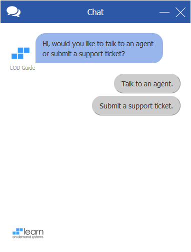
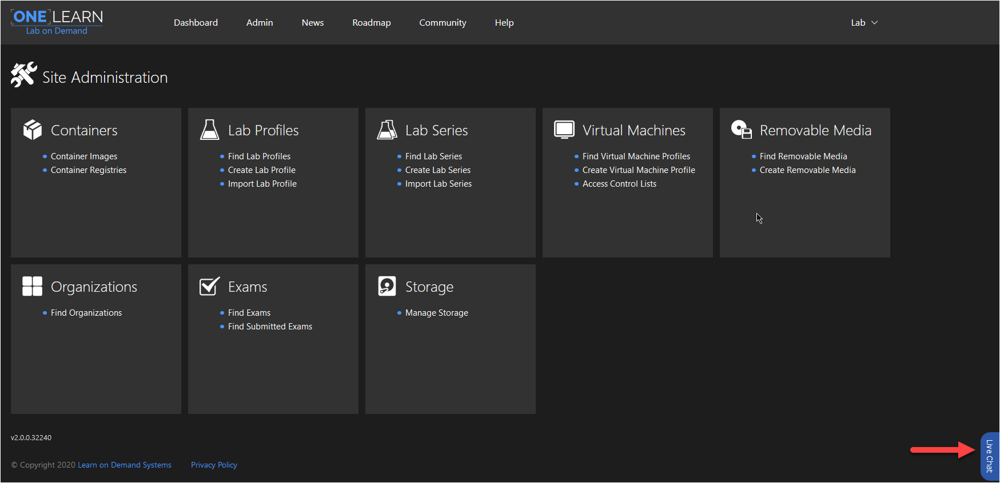
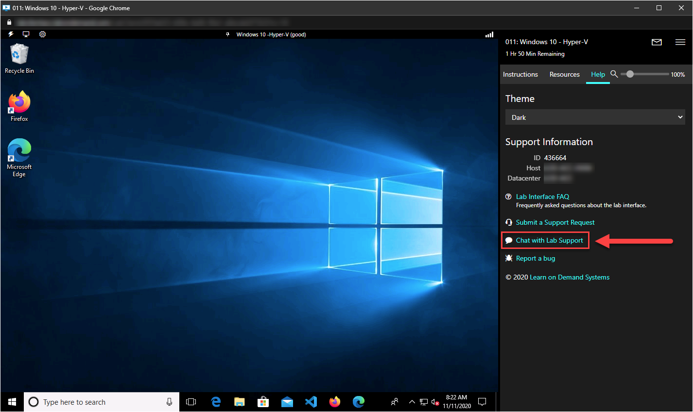

# Lab on Demand Support Chat

Lab on Demand (LOD) has a support chat option on the Admin site, as well as in the lab client in a launched lab. 

1. [Overview](#overview)
1. [Admin Site](#admin-site)
1. [Lab Client](#lab-client)
1. [Enable/Disable Support Chat](#enable-or-disable-support-chat)

## Overview

- The chat feature is enabled in the lab client by default for all organizations, but it can be disabled if needed, from the organization profile.
- The chat feature is enabled for all lab authors in the LOD Admin site and cannot be disabled.  
- Lab authors and learners can initiate a chat session with our Support team or submit a Support ticket.
- Chat transcripts are stored in a support ticket with our Support staff, and a copy is emailed to the user when the chat session is ended.
- When a chat is initiated, information about the user will be sent to our support staff with the chat, such as first name, last name, lab instance ID, etc. This helps our Support staff 

    

## Admin Site

The chat feature can be found on the right side of the page on all Admin site pages. Once the chat is initiated, the chat session will persist while navigating to other pages within the LOD Admin site, until the chat session is ended. 

 

## Lab Client

The chat feature can be found on the **Help** tab from within the lab client. The chat in the lab client supports the same options as the lab client; users can initiate a chat session with our Support staff or submit a support ticket. 

## Enable or Disable Support Chat

Support chat can be enabled or disabled from the LOD organization profile page. This setting controls support chat for the lab client for labs that belong to the organization.

>[!knowledge] The chat feature is enabled for all lab authors in the LOD Admin site and cannot be disabled.  

1. Navigate to the Organization profile. 
1. Click the **Edit** button to edit the Organization profile. 
1. Check or uncheck the box next to **Show Support Chat in Lab Client**. 
1. Save the organization profile. 

    
