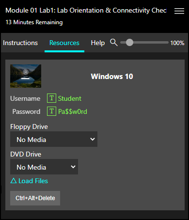

# Unable to Log in to Virtual Machine 

You can log in to a virtual machine (VM) by using the credentials provide on the _Resources_ tab in the lab environment. One the _Resources_ tab, you will find a list of all VMs that are in the lab, along with a username and password for each VM. 

To log in to a VM, perform the following steps 

1. Select the Resources tab. 

1. Select the VM you wish to log in to. 

1. Select the username field in the VM. 

1. Click the TypeText (T) button next to the username in the Resource tab, or type the username into the VM username field. 

1. Click the TypeText (T) button next to the password in the Resource tab, or type the password into the VM password field. 

>[!knowledge] For a more detailed explanation of the lab interface, please see our [Lab Interface Documentation](https://docs.learnondemandsystems.com/lod/lab-interface.md).

<!--search terms-->

<b>how to</b>
<b>how do i</b>
<b>save lab</b>
<b>login to vm</b>
<b>log in to vm</b>
<b>vm login</b>
<b>vm log in</b>
<b>type text</b>
<b>screen size</b>
<b>screen resize</b>
<b>restart vm</b>
<b>vm password</b>
<b>vm username</b>
<b>how to login</b>

