# LTI 1.3 Integration

> [!alert] All letters in any given URL/URI should be lowercase. 

- [Blackboard Integration](#blackboard-integration)
- [Canvas Integration](#canvas-integration)

## Blackboard Integration

### Registering an Application

1. Create a Lab on Demand API consumer and enable LTI 1.3 under the LTI tab. Keep this page open for reference.

1. Visit https://developer.blackboard.com/ and register an account. Obtain access to the Learn on Demand Systems group for new accounts. An active admin can assist you with this.

1. Select *My Apps* from the top level menu bar.

1. Off to the right, under the main title is a *+* icon. Use this icon to register a new application.

    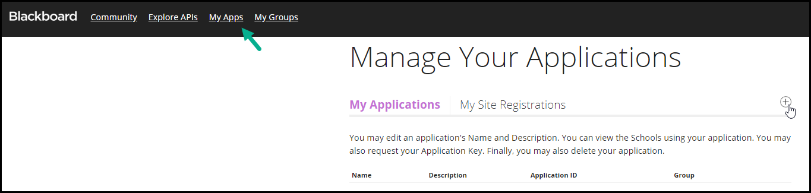
    
1. On the Register a new application page, toggle the *My Integration supports LTI 1.3* option and fill in the information provided from the API consumer as follows. 
   
    > [!alert] When configuring the URIs, please use all lower case letters.
    
    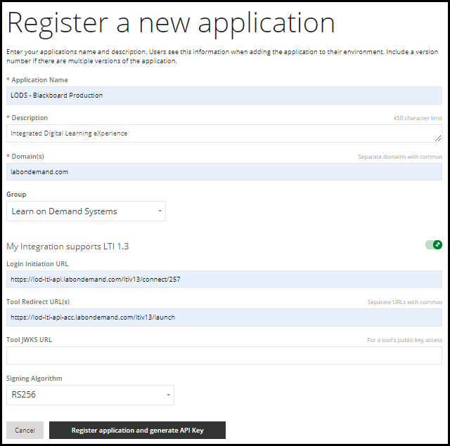
    
    - Application Name: *LODS - API Consumer Name*
    - Description: Integrated Digital Learning eXperience
    - Domain(s): lod-lti-api.labondemand.com:257 (replace 257 with the API Consumer ID)
    - Group: Learn on Demand Systems (may need permissions to access.)
    - Login Initiation URL: This is the LTI 1.3 Login / Connect URL
    - Tool Redirect URL(s): This is the *LTI 1.3 Launch URL*
    - Tool JWKS URL: Leave this field blank to generate a private key.
    - Signing Algorithm: RS256
    
1. When the app is successfully registered, you will receive the values need to finish configuring the LOD API Consumer. They consist of the following;
    - Application key: You can copy this into the consumer but is not required for LTI 1.3
    - Secret: You can copy this into the consumer but is not required for LTI 1.3
    - Application ID: This serves as the Client ID
    - Issuer: The LTI 1.3 Issuer
    - Public keyset URL: This is the LTI 1.3 JWK Set URL
    - Auth token endpoint: LTI 1.3 Access Token URL
    - OIDC auth request endpoint: LTI 1.3 Authorize URL
    - Tool Private Key: Copy this into the Private Key field on the API Consumer.
    
1. Review all settings and save the Lab on Demand API consumer before closing out the above information. You will not be able to access this information again.

1. Share the Application ID/Client ID with the Blackboard administrator so that they can complete the following section. 

### Register the Application Key

> [!note] As a Blackboard administrator, you may need to enable LTI if this is the first LTI provider to be configured. You may read about it [here.](https://docs.blackboard.com/standards/LTI%20In%20Learn%20-%20Turn%20On%20All%20The%20Switches!)

1. Under the System Admin page, select *LTI Tool Providers.*

    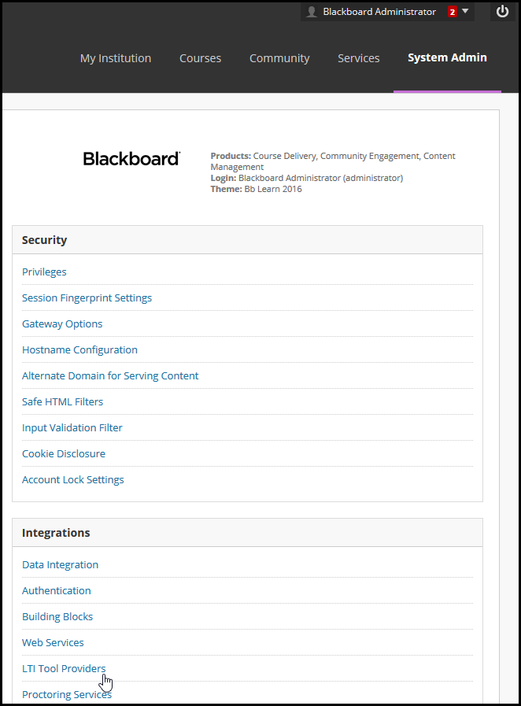

1. In the LTI Tool Providers portal, select *Register LTI 1.3 Tool.*

    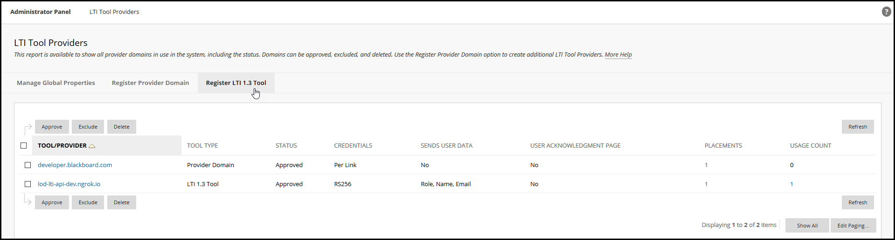

1. On the Register LTI 1.3 Tool Page, enter the Application/Client ID into the Client ID field and submit.
1. Review and accept the LTI 1.3 Tool settings. We recommend a fairly open Institution Policy.

    

    - User Fields to Send
        - Role in Course
        - Name
        - Email Address
    - Allow grade service access - yes
    - Allow Membership Service Access - yes
1. Make sure the tool is set to approved. In the next section, we'll manage a simple placement.

### Configuring a Placement

1. From the LTI Tools Provider page, hover over the Tool/Provider and select *Manage Placements* from the drop-down menu.

    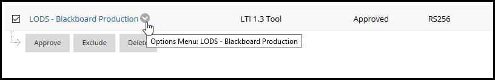

1. On the Manage Placements page, select *Create Placement*.

    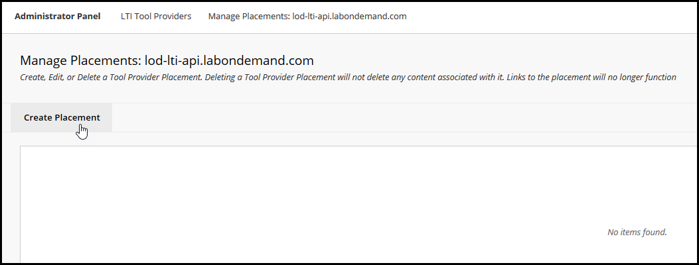

1. The placement information is per lab. We recommend the following values.
    - Label: Title of the Lab Profile, your requirements may be different.
    - Handle: Title of the Lab Profile. If there are different versions, we recommend appending the Lab Profile ID to this field
    - Availability: Yes
    - Type: we recommend a *Course Content tool* that *Allows grading*
    - Launch in New Window: Blackboard works best when the lab is launched in a new tab/window

        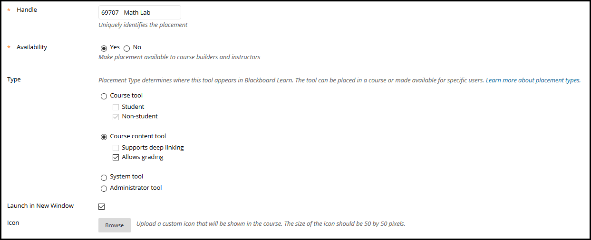

    - Tool Provider URL: lod-lti-api.labondemand.com:257 (replace 257 with the API Consumer ID)
    - Tool Provider Custom Parameters: labid=69707
        *In this example, 69707 is the Lab Profile ID of the Lab I will be using in a course.*

        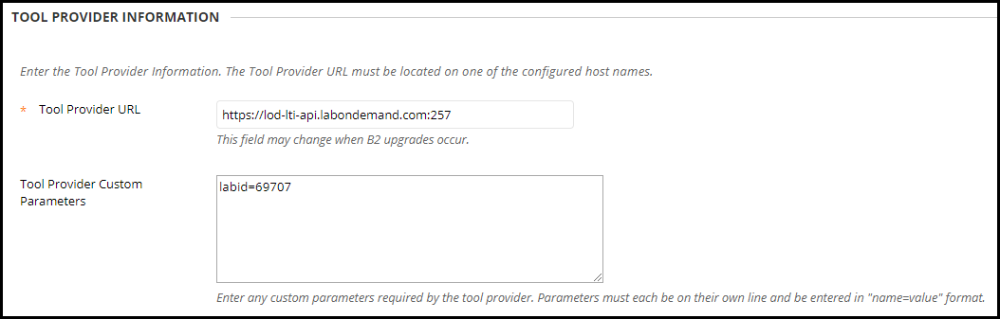

### Adding the Placement to the Course

1. When on the course page, the lab can be selected under the * Build Content* menu on the *Content* page.
    The title under build content is the same title used when configuring the placement.

    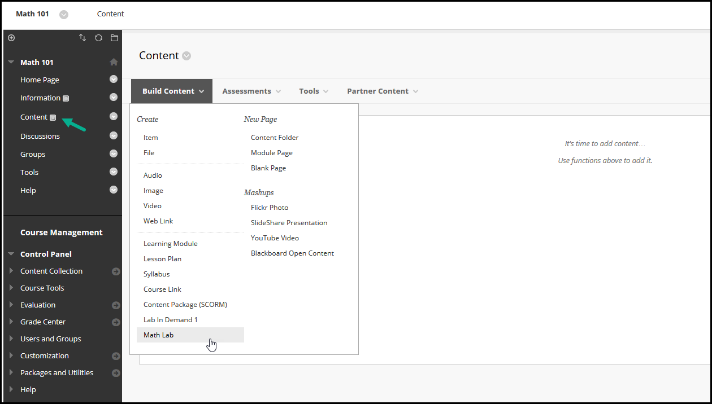

1. Once the lab is selected, you can enter a Name you would like students to see in their course, and set the grading (if required.) 
1. Once the course is published, students will be able to access the lab.

## Canvas Integration

### Developer Key

1. Create a Lab on Demand API consumer and enable LTI 1.3 under the LTI tab. Be sure to generate the Public/Private Key set before saving the consumer. Keep this page open for reference.
   
1. From a Canvas Administrative account, select Admin > Site Admin.

    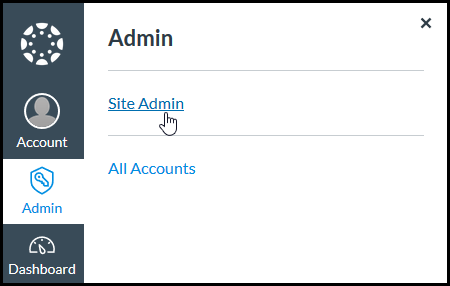

1. From the Admin panel, select Developer Keys. 

1. On the Developer Key page, select the blue drop down menu labeled +Developer Key and select +LTI Key.

    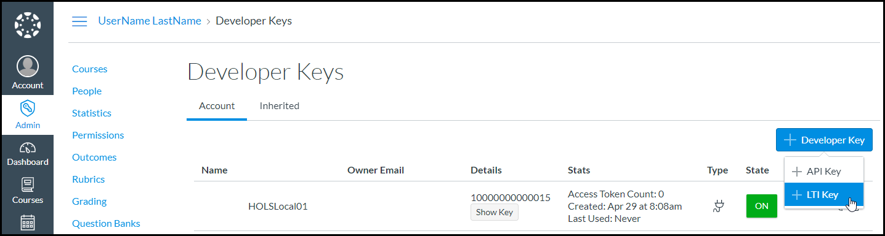

1. On the Key Settings page, choose the Manual Entry method and fill in the information provided from the API consumer as follows.

    > [!alert] When configuring the URIs, please use all lower case letters.

    - Redirect URIs: This is the *LTI 1.3 Launch URL
    - Title: Learn on Demand Systems
    - Description: Integrated Digital Learning eXperience
    - Target Link URI: This is the *LTI 1.3 Launch URL
    - OpenID Connect Initiation URL: This is the *LTI 1.3 Login / Connect URL
    - Public JWK: This can be copied from https://lod-lti-api.labondemand.com/LtiV13/Config/Jwk/246 where 246 is replaced with the API consumer ID. This is (hopefully) a temporary work around for a bug in Canvas. Eventually, they will be able to use the *LTI 1.3 JWKS URL provided in the API Consumer.
    - The LTI Advantage Services should include 
        - Can create and view assignment data in the gradebook associated with the tool.
        - Can view assignment data in the gradebook associated with the tool.
        - Can create and update submission results for assignments associated with the tool.
    - Finally, an Assignment Selection Placement should be created.
        - Target Link URI: The *LTI 1.3 Launch URL*
        - Message Type: LtiResourceLinkRequest
        - Title: Learn on Demand Systems
    - Other fields including Key Name and Owner Email can be set at the discretion of the institution or Canvas admin.

1. Once you save the key, you will be returned to the Admin Page. Set the state of the key to on and note the client ID.

    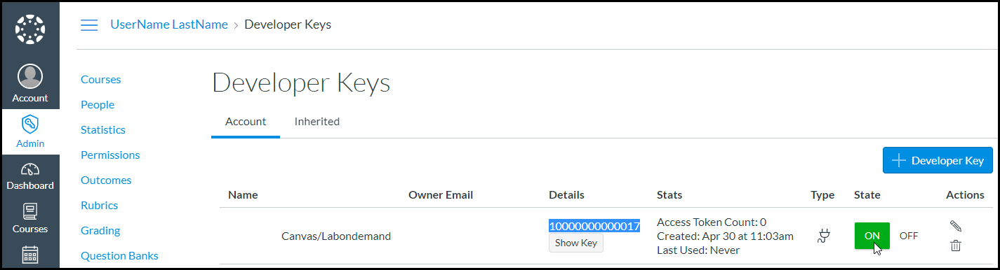

1.  Navigate to Settings. On the Settings page, select the Apps tab from the top of the page and then +App

    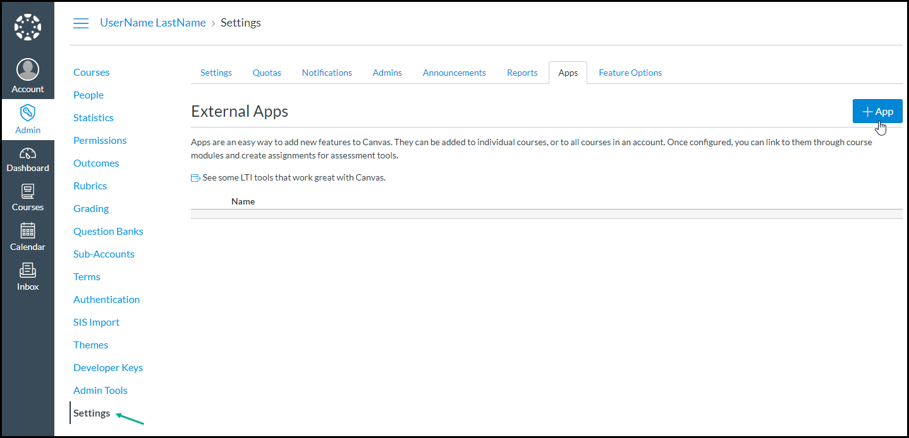

1. From the Configuration Type drop-down menu, select *By Client ID* and enter the Client ID from the Developer Key page. Finish installing the app by following the prompts.

### Adding a Lab to the Course

A lab can now be added to the course as an assignment. 

1. From the main menu on the left side, select Courses and then from the flyout, the course you will be adding the lab to.
1. On the course page, select Assignments > + Assignment

    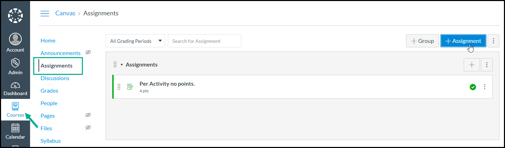
    
1. When adding as an assignment, choose *External Tool* as the *Submission Type.* To find the placement you configured, Select Find.

    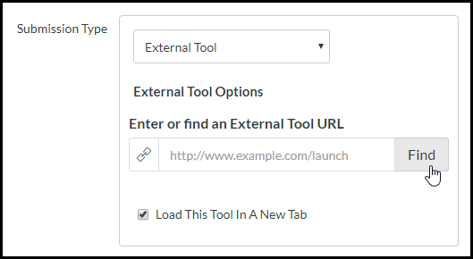
    
1. Locate and select the tool/placement.

    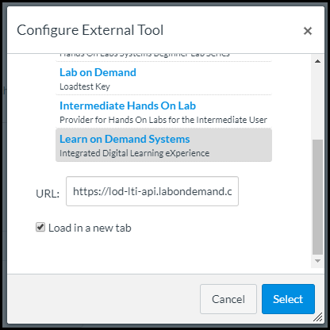
    
1. Once back on the assignment page, edit the URL to include the Lab Profile ID before saving and publishing the assignment. We can provide a list of the Lab Profiles available. Once the assignment is published, the lab will be available to launch.

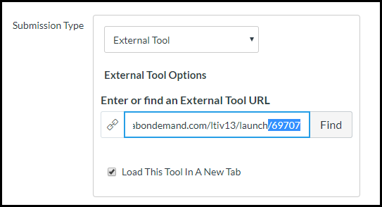
