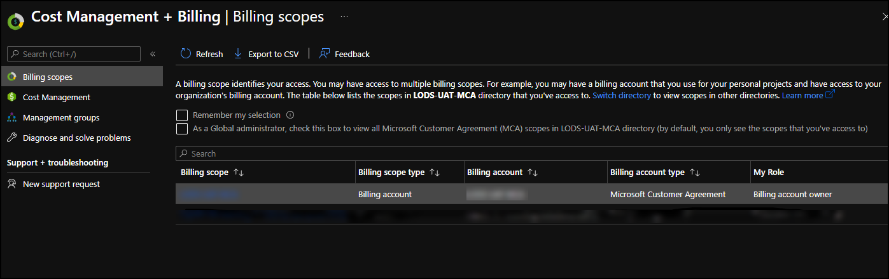
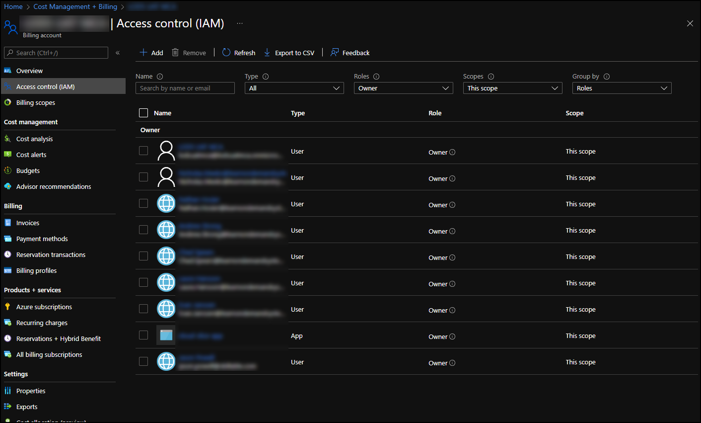
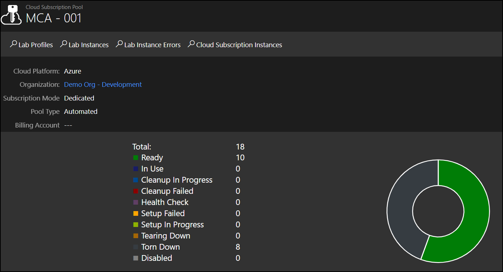

# Azure CSS With Microsoft Customer Agreement  

## Overview

Microsoft Azure Cloud Slice Subscription (CSS) provides an environment that allows training on Microsoft Azure and gives the lab user access to administrative settings in the Azure subscription. CSS labs require a Skillable Studio subscription pool that is bound to an Microsoft Customer Agreement (MCA). 

All pools need to be created with the MCA tenant. The MCA Billing API requires working with a Billing Account as the top level management group for subscriptions, and only one Billing Account can be used per MCA tenant. 

## Table of Contents

* [MCA generation](#mca-generation)
* [Create a Cloud Slice Application](#create-a-cloud-slice-application)
* [MCA CSS Pool Creation](#mca-css-pool-creation)
    - [Azure Billing Scope and IAM Configuration](#azure-billing-scope-and-iam-configuration)
    - [Subscription Pool Creation](#subscription-pool-creation)
* [Account Provisioning](#account-provisioning)

## MCA generation
1. If a new MCA tenant is required, create the new tenant, using a new local login as the global admin for that tenant. 
1. Reach out to your Azure CSM to generate a new MCA for the tenant that was created and the new account username that was created. 
    >[!note] If possible, this request should be submitted in advance. This could take several days for the MCA to be generated. 

1. When the MC is returned for signing, ensure you are signed in with the account that was created previously. The MCA will be bound to that account, and only 1 MCA is allowed per Azure Active Directory user globally.

## Create a Cloud Slice Application 

An Azure enterprise application needs to be created for Cloud Slice. The application will be used for management of subscriptions by Skillable Studio. 

1. In the Azure portal, navigate to Azure Active Directory. 
1. Select **Enterprise Applications**.
1. Select **+ New Application**.
1. Select **+ Create your own application**.
1. Enter a name for the application. 
1. Select the option **Integration any other application you don't find in the gallery (Non-gallery)**.
1. Select **Create**.
1. Navigate to **App Registrations** in Azure AD and select the application you just created.
1. Select **Certificates & Secrets** and generate a client secret for Skillable Studio to use, taking note of the value of the secret you generate. Store this information in a secure location. 
 
## MCA CSS Pool Creation

Configuration of the MCA must be completed in the Azure portal, and a subscription pool must be created in Skillable Studio. 

### Azure Billing Scope and IAM Configuration 

1. Sign into the MCA tenant with the local global admin account you created, and navigate to the "Cost Management + Billing" Section.

1. In the Azure portal, navigate to **Cost Management + Billing**. 
1. Select **Billing Scopes**.
1. Select the **Billing Account** for the MCA you've just created.
 
    
 
1. Navigate to **Access Control (IAM)** and add the cloud slice application created in previous steps, as well as any users that you need to have **management access to the billing scope**.

    
 
### Subscription Pool Creation

1. From the Skillable Studio admin page, select **Subscription Pools**. 
1. In the upper-right of the page, select **Create Cloud Subscription Pool**.
1. Complete each field on each tab in the following order. 
    1. On the **Authentication** tab, enter the **Tenant Name**, **Application ID**, and **Application Secret**. 
    1. On the **Basic Information** tab, select **Dedicated** as the **Subscription Mode**. 
    1. On the **Basic Information** tab, select **Choose** next to **Billing Account**, then select the billing account and click **OK**. 
    1. Complete the remaining fields on the **Basic Information** tab. 
        - **Cloud Platform**: select **Azure**.
       - **Name**: enter a name for the subscription pool. 
        - **Description**: enter a description for the subscription pool. 
        - **Organization**: select the organization that will own and use the subscription pool. 
        - **Custom subscription unavailable message**: enter a custom message that will be displayed to users if no subscriptions are available.
        - **Enabled**: select this box to enable the subscription pool for use. 
        - **Enable Health Checks**: select this enable Health Checks across all subscriptions in this pool. Skillable Studio will periodically check the subscription for configuration errors and other potential problems. 
        - **Send Health Check email**: select this to send an email with health check errors and warnings to the email address in the _Owner Email_ field. 
        - **Owner E-mail**: enter the email address of the owner of the subscription. This email will be used to receive health check error and warning information. 
        - **Health Check interval**: select the health check frequency. Health checks for each subscription will be completed at the specified interval. 
    1. On the **Automation Settings** tab, complete the following fields:
        - **Number of Subscriptions**: enter the number of subscriptions that should be provisioned ahead of time in the background and made available for lab launches. Skillable Studio will provision this number of subscriptions to be used. 
        - **Subscription Name Prefix**: when subscriptions are created, the name of the subscription or account will start with the text entered here. 
1. Select **Save**. 

## Account Provisioning

Once the subscription pool is saved, provisioning of accounts will begin in Azure. This process may take some time for the accounts to be provisioned and ready for use. 

The details page of the subscription pool will show the status of all accounts that are provisioned or being provisioned. 

