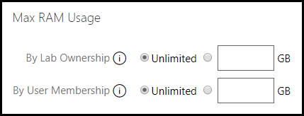
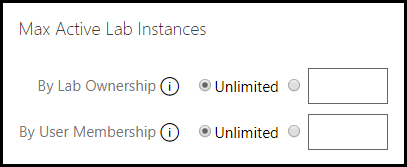
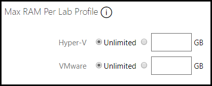

# Organization Maximum RAM

Each limit can be set to unlimited or to a specified amount of gigabytes (GB).

## Max RAM Usage

- By Lab Ownership: Limits the amount of RAM that can be in use at any given time for lab profiles that belong to this organization. This includes labs launched anonymously and by users from different organizations. 

- By User Membership: Limits the amount of RAM that can be in use at any given mtime for users that belong to this organization. 

    

## Max Active Lab Instances

- By Lab Ownership: Limits the number of labn instances that can be active at any given time for lab profiles that belong to this organization. This includes labs launched anonymously and by users from different organizatinos. 

- By User Membership: Limits the number of lab instances that can be active at any given time for users belonging to this organization.

    

## Max RAM Per Lab Profile

- These settings limit the maximum amount of RAM that a lab belonging to this organization can have. This is enforced when editing lab and virtual machine profiles. If a change would cause a lab to exceed this limit, the operation will be blocked. Changes that do not increase the amount of RAM, LOD will allow the update. Disabled lab profiles are not validated for max RAM. Re-enabling a lab will cause validation to occur and if the lab profile causes the RAM limit to be exceeded, LOD will not allow the lab profile to be re-enabled.

- Max RAM limit is set to 50GB by default.

    
