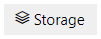
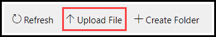
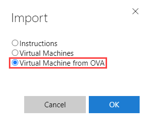

# VMware OVA Import

Virtual machine (VM) profiles can be created by importing an OVA file into a lab profile. An OVA file is created from exporting a VMware VM from outside of Lab on Demand (LOD). 

>[!knowledge] An OVA file is a package that contains files used to describe a VM, which includes an . OVF descriptor file, optional manifest (. MF),  certificate files, and other related files. To learn more about OVA file format, please read [VMware OVA file format and template documentation](https://docs.vmware.com/en/VMware-vSphere/7.0/com.vmware.vsphere.vm_admin.doc/GUID-AE61948B-C2EE-436E-BAFB-3C7209088552.html). 

- [Uploading an OVA File](#uploading-an-ova-file)
    - [Organization Storage](#organization-storage)
- [Importing an OVA File as a VM ](#importing-an-ova-file-as-a-vm)
    - [Lab Profile](#lab-profile)

## Uploading an OVA File

As a lab developer, you can create a VM from an OVA file on a lab profile. Your user account must have the proper permissions to allow editing and importing lab profiles. If you do not have the proper permissions, or if you are unsure if you have the proper permissions, please reach out to our [customer support team](http://www.learnondemandsystems.com/customer-support/).

### Organization Storage

To import a VM from an OVA file into a lab profile, you must first upload the OVA file to your organization's storage in LOD . Once the file is uploaded, it can be used to import the VM into a lab profile. 

1. Ensure that the file you exported from your virtualization application is in OVA format. 

1. Navigate to your organization's profile in LOD. 

1. Click **Storage** at the top of the page. 

    

1. In the upper-left, select the datacenter you wish to upload to. 

    >[!knowledge] Choosing a datacenter where your lab profiles or VMs are stored will improve the initial launch times of your lab profile during lab development. If you choose a datacenter to upload the OVA file that is different from where the lab profile is stored, the files will have to be copied over before the lab will launch successfully.  

1. Select VMware Storage.

1. Select or create a folder in **VMware Storage** to upload to. 

1. Click **Upload File** on the right side of the page. 

    

1. Choose a file or drag files to the designated area, and click **Upload**. 

After the file finishes uploading, it will be available to import as a VM on lab profiles. 

## Importing an OVA File as a VM

The VM will be created by importing the OVA file on the lab profile. Importing requires your user account to have the proper permissions to edit and import lab profiles. If you do not have the proper permissions, or if you are unsure if you have the proper permissions, please reach out to our [customer support team](http://www.learnondemandsystems.com/customer-support/).

### Lab Profile

1. Navigate to the lab profile you wish to import the VM to. 

1. Click **Import** at the top of the page. 

1. Click **Virtual machines from OVA**, then click OK. 

    
    
1. In the _Choose OVA File_ menu, navigate to the OVA file that was uploaded. 

1. Select the OVA file that will be imported as a VM. 

1. On the next screen you will be asked to enter information about the VM that will be imported. 

    - **Name**: The name of the VM profile. 
    - **Username**: The login username for the VM. This must match the username of the VM before it was exported to OVA formatx.  
    - **Password**: The login password for the VM. This must match the password of the VM before it was exported to OVA format.  
    - **Start Automatically**: Enables the VM to start automatically when the lab is launched. If this is not enabled, the VM will not start automatically and the user will have to manually start the VM. 

1. After you have completed each field, click **OK**. LOD will begin to extract the OVA file and create a virtual machine profile. The time it takes to import will vary depending on the size of the OVA file. The import process will timeout after 2 hours have elapsed. If you are not able to upload your file within the timeout period, please reach out to our [customer support team](http://www.learnondemandsystems.com/customer-support/) for assistance. 

    After the import completes, the VM profile will be added to your lab. 

1. You may now launch the lab and continue lab development. 

    >[!knowledge] The first launch of the lab may take longer than expected, while files are copied in the background. Subsequent lab launches should not take an extended amount of time to launch. 

1. After the VM profile is created and you have tested the VM, we recommend removing the OVA file from the storage location it was uploaded to. This will prevent duplicate VM profiles from being created, and help to keep the storage location organized. 

