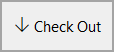
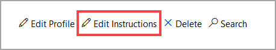

# Adding Instructions to Your Lab

//I wasn't sure which of the below two intro paragraphs I like better--[Option1] or [Option 2].  Your call.

[Option 1] All instructions are authored in Markdown. Markdown allows for easy plain-text authoring of paragraphs, with special syntax when you want certain items to be formatted differently. You can also use HTML alongside, or in place of, Markdown elements. The following sections describe various items used to create lab content with IDL v2.

[Option 2] Lab instructions are constructed using Markdown; an easy to use markup language to format text. Markdown was designed to be easy to learn as well as be easy to read and write. 

> [!ALERT] Did you know that Markdown supports HTML, and HTML syntax can be used in combination with Markdown?

## Check out the Lab Manual and Edit Instructions

Now that you have created a Cloud Sliced lab and enabled cloud orchestration, it is time to add some lab instructions. 

1. **Navigate** to the lab profile page for your Cloud Slice lab. (you may be there already)

1. **Click Check Out** to check out the instructions for your lab.

>[KNOWLEDGE] You must the check out the lab instructions before you can edit them. Checking out the IDL v2 lab instructions ensures that only one person at a time can make changes to the content.

Once you have checked out the lab instructions for editing, you are now ready to edit your lab instructions in the idl-md editor. 

2. While viewing a lab profile where you have already checked out the instructions, click Edit Instructions to open the instruction editor, as shown below. This will open a new window with an idl-md (markdown) editor on the left and a preview pane on the right. This gives you the ability to create lab instructions, and see a live preview of how they will be displayed to the user during the lab.

3. Paste the following into the left side of the idl-md editor. Watch how the syntax is rendered in the Resources Portal on the right side. The rendered content is the lab instructions will be displayed to users that launch your Cloud Slice lab. 

>

# Formatting lab instructions using **Markdown** is **easy**! 

You can emphasize text by making it **bold**, _italics_ or ~strikethrough~.

---

> ##Headings can be different sizes
> # Headings can be this big
>###### Headings can be this small.

---

> [!KNOWLEDGE] ## Knowledge blocks help students learn more. Knowledge blocks are limited to 4 lines of text, then a _show more_ link will be displayed.

> [!ALERT] Alert blocks draw attention to important issues!

> [!NOTE] Notes are similar to Knowledge, but they are not limited to 4 lines. 

---

Code Blocks are an easy way to share code with lab users: 

`get-service | stop-service -whatif`

---

This is an **ordered List**:

1. Item 1
1. Item 2
1. Item 3

>[!ALERT] Did you notice that the list was numbered with **1.** instead of **1.**,**2.**,**3.**? Markdown automatically numbers items in a numbered list, as items are added or removed. Try adding a 4th item to the list and watch how it renders.

---

**Unordered** Lists can be 

---
