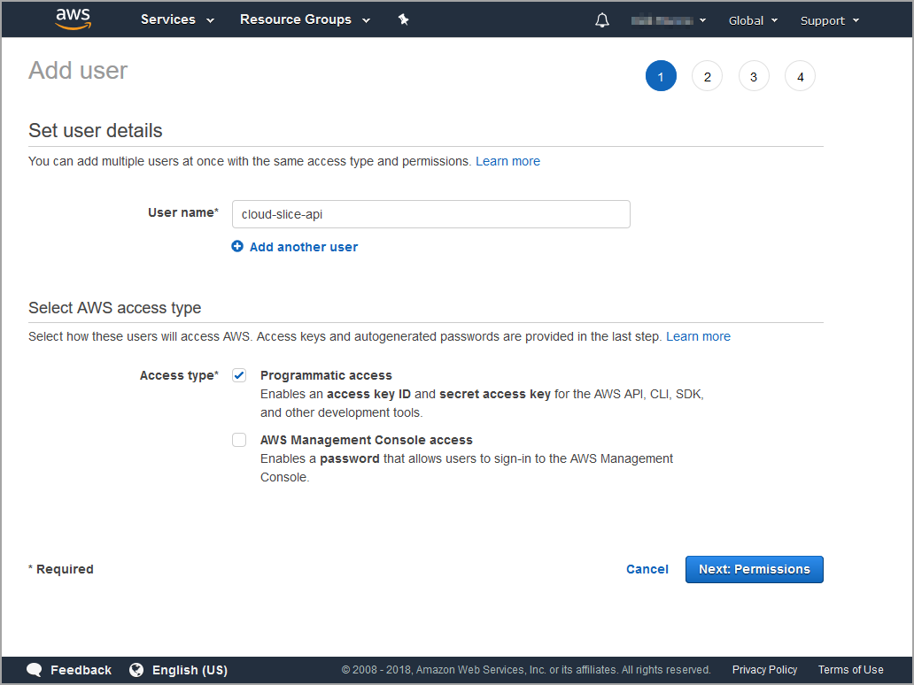
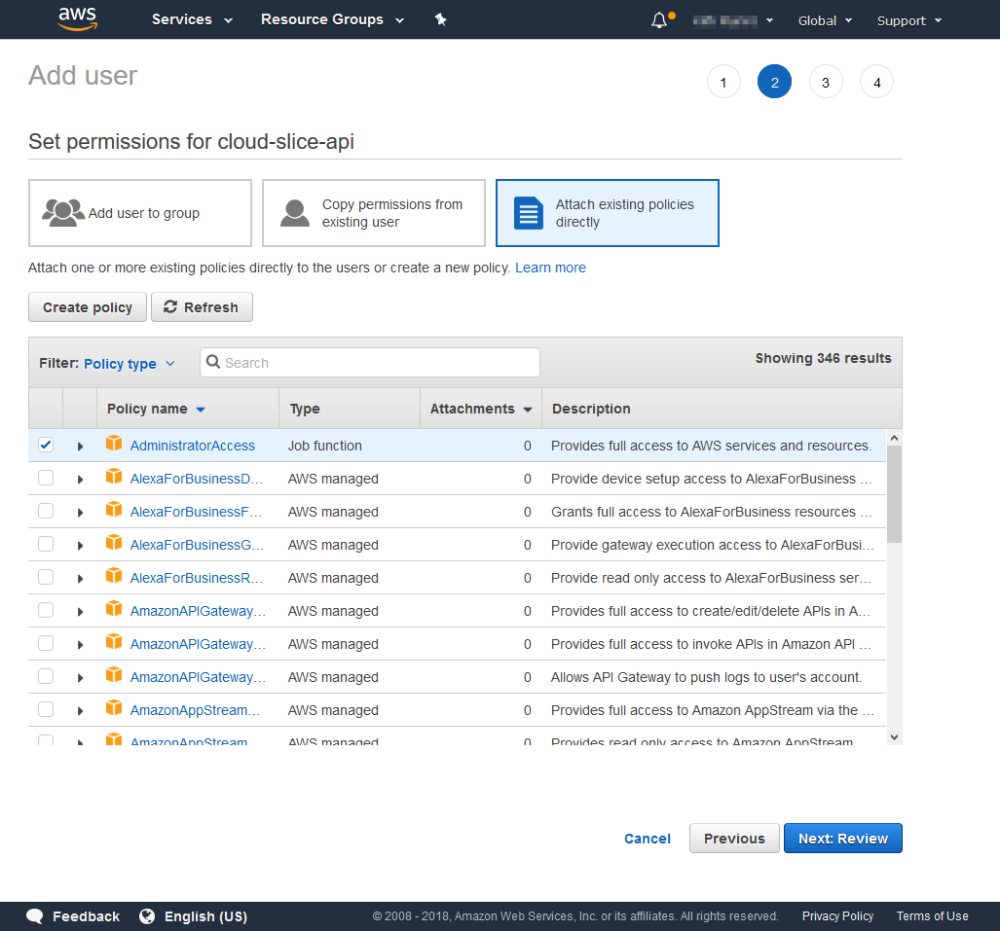
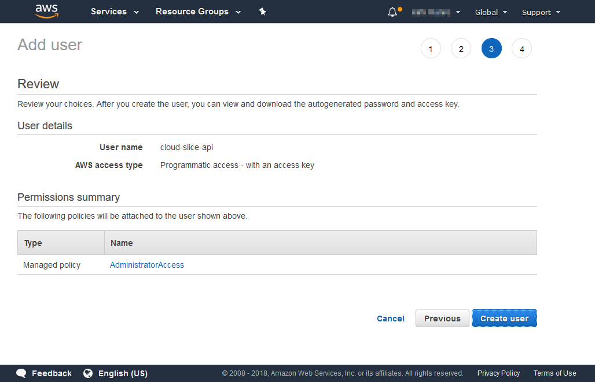
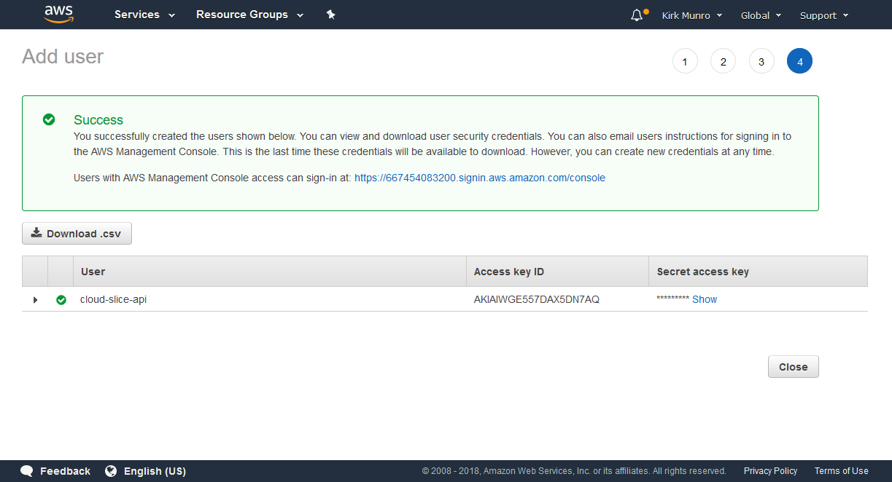

# Cloud Slice Quick Start - Configure Cloud Provider - Amazon Web Services

Estimated time to completion: **5 minutes**.

To set up an Amazon Web Services (AWS) account for use with the OneLearn Lab on Demand platform (LOD) Cloud Slice functionality, you must create an IAM user with administrator access, and download the credentials for the new user.

## Create an IAM user with administrator access

The OneLearn Lab on Demand platform uses an IAM user in Amazon Web Services to provision resources required for each Cloud Slice. This includes providing students with user accounts that can access the resources allocated to them for the duration of their lab.

To create an IAM user with administrator access in AWS, do the following:

1. [] Open the <[AWS Portal](https://console.aws.amazon.com/console/home), and sign-in with a subscription owner.
1. [] Open the IAM <[Add user form](https://console.aws.amazon.com/iam/home#/users$new).
1. [] On step one of the Add user form, enter the following values into the fields provided, and then click **Next: Permissions**.

    |Field Name|Field Value|
    |--|--|
    |**User name**|++cloud-slice-api++ (or any other name you prefer)|
    |**Programmatic access**|Checked|

    

1. [] On step 2 of the Add user form, click **Attach existing policies directly**, check the **AdministratorAccess** policy in the policy list, and then click **Next: Review**.

    

1. [] On step 3 of the Add user form, review the choices you made to ensure that they are correct, and then click **Create user**.

    

1. [] On step 4 of the Add user form, click the **Download .csv** button to download the credentials for your new IAM user, and save the file locally so that you can access it later.

    

1. [] Click the **Close** button to close the Add user form.

[Back to top][back-to-top]

## Review Checklist

At this point you should have created a new IAM user with administrator access in your AWS account.

You should also have downloaded a CSV file containing the following credentials from the new IAM user that you are using for Cloud Slice deployments:

- Access key ID
- Secret access key

These values are required for the OneLearn Lab on Demand platform to be able to provision Cloud Slices for labs on the AWS cloud platform. If you are missing one or more of those values, or if you feel you did not complete one of the tasks listed above, review the steps above to find out what you missed.

Now that you have configured your AWS account properly, click on the link below to go through the next Quick Start where you will setup cloud resource management in LOD, allowing it to manage Cloud Slice and managed VM deployments in your AWS account.

[Setup cloud resource management in LOD](setup-cloud-resource-management-aws.md)

[Back to top][back-to-top]

[back-to-top]: #cloud-slice-quick-start---configure-cloud-provider---amazon-web-services "Return to the top of the document"