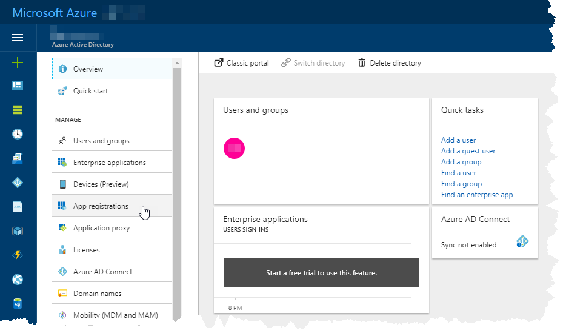
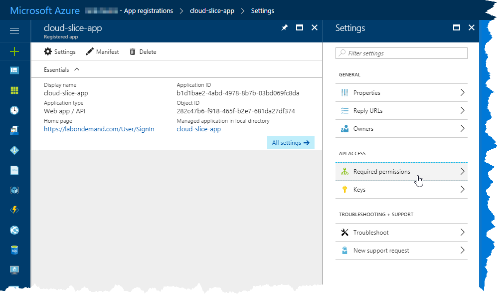
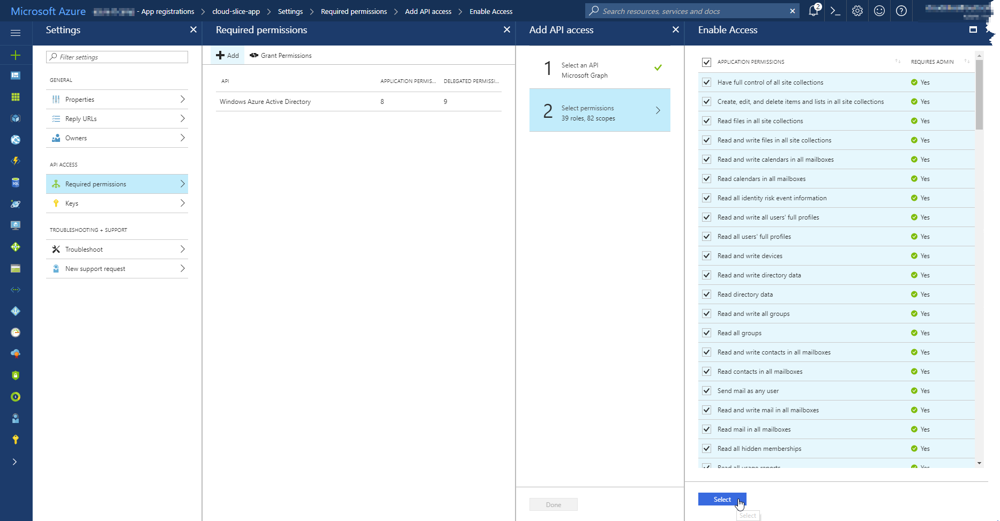
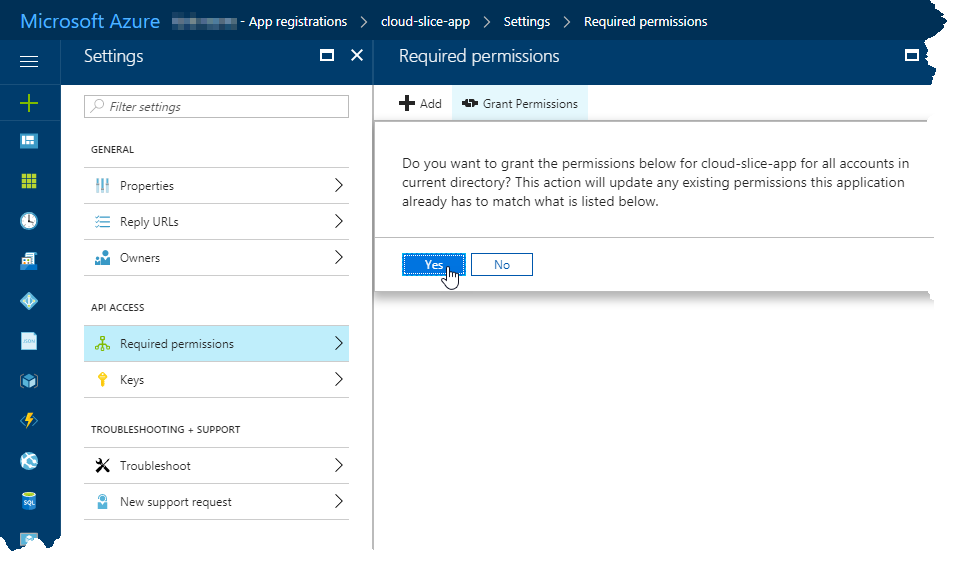
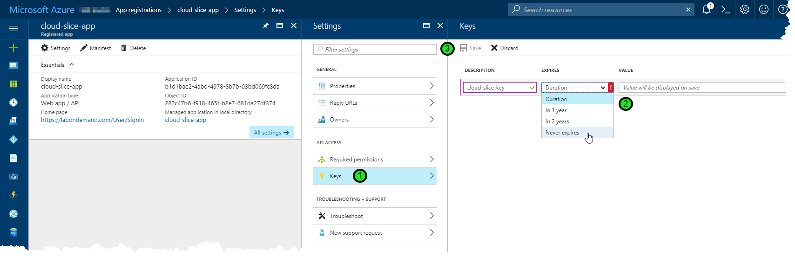
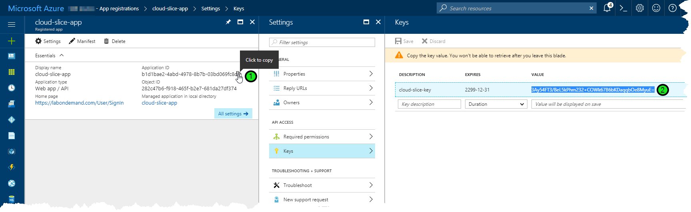
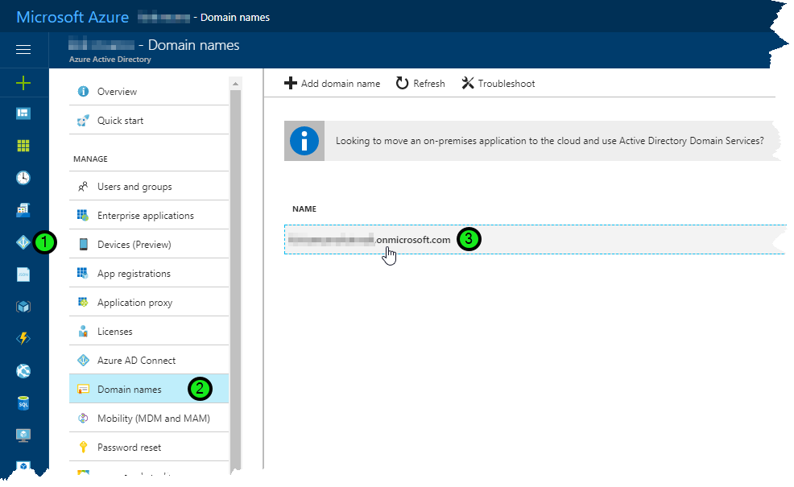
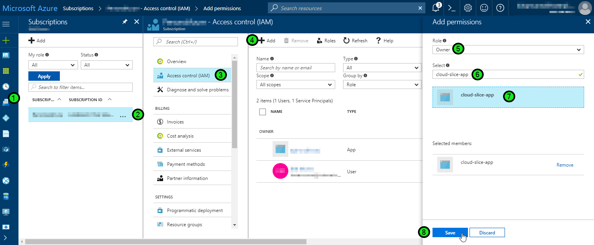

# Cloud Slice Quick Start - Configure Subscription

This document explains how to give the OneLearn Lab on Demand platform (LOD) permissions to each Microsoft Azure subscription that it will use, enabling labs to use those subscriptions when creating Cloud Slices.

## Enable Cloud Slice support in your Microsoft Azure subscription(s)

In Microsoft Azure, an application registration is used to create the subscription and resources contained in each Cloud Slice and to provide students with the user account that they will use to manage that subscription for the duration of their lab. In order to make this possible, this application registration must be configured as owner over each Azure subscription from which it will create each Cloud Slice subscription that is needed. You only need one Azure Subscription to be able to use Cloud Slice functionality in a lab; however, using multiple Azure subscriptions will give you the benefit of automatic load balancing of a lab across a pool of Azure subscriptions. As a best practice, the Azure subscriptions that you grant OneLearn Lab on Demand access to should only be used for the provisioning of Cloud Slices.

To enable Cloud Slice support, you must perform the following tasks once in each Microsoft Azure subscription that you want to use with OneLearn Lab on Demand:

1. [Create a new application registration in Azure Active Directory with a specific set of permissions][create-app-registration].
2. [Create an API key for the application registration and record subscription authentication details][create-api-key-and-record-authentication-details].
3. [Add the application registration as an owner to the Azure subscription][add-app-registration-as-owner].
4. [Assign Company Administrator role to the application registration for cloud slice user management][assign-company-administrator-role].

[create-app-registration]: #create-a-new-application-registration-in-azure-ad "Create a new application registration in Azure AD"
[create-api-key-and-record-authentication-details]: #create-an-api-key-for-the-application-registration-and-record-authentication-details "Create an API key for the application registration"
[add-app-registration-as-owner]: #add-the-application-registration-as-owner-to-the-azure-subscription "Add the application registration as owner to the Azure subscription"
[assign-company-administrator-role]:#assign-company-administrator-role-to-the-application-registration "Assign Company Administrator role to the application registration"


### Create a new application registration in Azure AD

To create a new application registration in Azure Active Directory, open the <a href="https://portal.azure.com/" target="_blank">Microsoft Azure Portal</a>, browse into the **Azure Active Directory** service, and click on **App registrations**. This will open the App registrations blade in the Microsoft Azure Portal.



With the App registrations blade open, click on **New application registration**. This will open a new blade from which you can create your new application registration.


In the Create blade, enter a name for your application registration in the **Name** field. Enter "https://labondemand.com/User/SignIn" into the **Sign-on URL** field. Leave the application type as the default value (Web app / API). Then click on the **Create** button to create the new application registration.


Once the application registration has been created, select it in the list of application registrations. If your new application registration is not showing in the list of available application registrations, click on **Overview**, then on **App registrations** to refresh the list. Once you have selected the application registration, a new blade will open showing the application registration properties.


In the Settings blade, click on **Required permissions** to show the Required permissions blade.



In the Required permissions blade, select **Windows Azure Active Directory** (note: this may be renamed as Microsoft Azure Active Directory in the future). This will display the Enable Access blade. Ensure that all application and delegated permissions are checked in the Enable Access blade.

Once those permissions have been checked, click **Save** at the top of the Enable Access blade.


Now click **Add** at the top of the Required permissions blade to add additional permissions. Click **Select an API** and choose the **Microsoft Graph** API.


Then click **Select permissions**, check all application and delegated permissions in the Enable Access blade, and click **Select** to select those permissions.



Click **Done** to finish adding the Microsoft Graph permissions. Click **Add** and repeat this process to add the single permission included in the Windows Azure Service Management API. Once you have finished adding these permissions your Required permissions blade should look something like this:


Click on the **Grant Permissions** button to grant the new permissions to the application registration. This will result in a confirmation message being displayed in the portal. Click on **Yes** to grant the permissions to the application registration. You may now close the Required permissions blade.



[Back to top][back-to-top]

### Create an API key for the application registration and record authentication details

Now that you have the application registration created, and now that you have assigned appropriate directory permissions for that application registration, you need to create an API key for the application registration, and record it for later. You will also need to record the application registration's application id, the id of the Azure subscription that will be used to provision Cloud Slices, and the Azure Active Directory domain name (this is commonly referred to as your tenant name). These four pieces of information are required by the OneLearn Lab on Demand authentication process in order for it to be able to provision Cloud Slices for your labs in this Azure subscription.

#### Create application registration API key

To create an application registration API key, you need to be in the application registration blade for the application registration you created earlier. If you are following this guide in order, you should already be there. From the application registration blade, you must do the following:

1. Click on **Keys** in the Settings blade to create a new key.
2. Enter a description for the key in the **Description** field and select an appropriate duration for the key from the values in the **Expires** drop down list. You should only set the duration to something other than "Never expires" if you want to periodically change the key before it expires while you do not have any Cloud Slice labs that are using that key that are currently in use.
3. Click on the **Save** button to save the key. Take care not to navigate away from this view in the portal because you will need to be able to access the key that is displayed on save in the next step.



#### Copy the application registration application ID and API key

Once you have the application registration key created, you need to copy both the application ID and the API key. You can only do this at the time when you create the key (see the steps in the previous section identifying how to create an API key). Perform the following tasks to copy the application ID and API key:

1. Hover your mouse over the copy glyph that appears at the end of the Application ID and click to copy that value. Paste it in a document or credential management application where you track credentials so that you can access it later. Record this value as the Cloud Subscription Client ID.
2. Select the text in the value field of the API key and copy it. Paste it into the same document or credential management application where you track credentials so that you can access it later. Record this value as the Cloud Subscription Client Secret.



#### Copy the Azure subscription ID

To copy the Azure subscription ID for later, do the following:

1. Navigate to the Subscriptions service in the <a href="https://portal.azure.com/" target="_blank">Microsoft Azure Portal</a>.
2. Select the value in the Subscription ID field of your Azure subscription and copy it. Paste that value into the same document or credential management application that you used earlier. Record this value as the Cloud Subscription Id. 

#### Copy the Azure Active Directory domain name

To copy the Azure Active Directory domain name, do the following:

1. Navigate to the Azure Active Directory service in the <a href="https://portal.azure.com/" target="_blank">Microsoft Azure Portal</a>.
2. Click on the **Domain names** entry in the list of items you can manage.
3. Copy the domain name that you will use for your Cloud Slice subscriptions. Paste that value into the same document or credential management application that you used earlier. Record this value as the Cloud Subscription Tenant Name.



[Back to top][back-to-top]

### Add the application registration as owner to the Azure subscription

Once you have created the application registration and assigned appropriate directory permissions for that application registration, you need to add it as an owner of the Azure subscription from which you want to provision Cloud Slices. This can be done from within the <a href="https://portal.azure.com/" target="_blank">Microsoft Azure Portal</a>, by following these steps:

1. Open the **Subscriptions** service.
2. Select the Azure subscription from which OneLearn Lab on Demand will create Cloud Slices.
3. Click on **Access control (IAM)** to open the identity and access management options for the subscription.
4. Click on the **Add** button to add permissions to the subscription.
5. In the **Role** drop down list, ensure that Owner is selected.
6. In the **Select** field, enter the name of the application registration that you created for Cloud Slice management to search for that application registration.
7. Select the application registration in the list of search results that are displayed.
8. Click on the **Save** button at the bottom of the Add permissions blade to save the permissions you have selected.



[Back to top][back-to-top]

### Assign Company Administrator role to the application registration

 The last step you need to take is to grant the Company Administrator role role to the application registration that you created earlier. This role can only be granted by a global administrator, and it must be granted using Windows PowerShell.

#### Create a global administrator

If you do not yet have a global administrator set up in your subscription, create a new global administrator account by doing the following:

1. Browse into the Azure Active Directory service, and click **Users and Groups**.

2. Click **All users** to show all users in the directory.

3. Click **New user** to create a new user. This will open the New user blade.

   

4. In the New User blade, configure the new user account using the information provided below. Then click **Create** to create the user.

   | Field              | Value                                    |
   | ------------------ | ---------------------------------------- |
   | **Name**           | Enter "Cloud Slice Admin"                |
   | **User name**      | Enter "cloudsliceadmin@*domainName*.onmicrosoft.com", replacing *domainName*.onmicrosoft.com with the Cloud Subscription Tenant Name that you recorded earlier. |
   | **Directory role** | Select **Global administrator**, then click **Ok**. |
   | **Show Password**  | Check this field, then click the copy button to the right of the field to copy the default password that has been assigned to the new user. Paste this into the document where you have been recording other details, and note that it is the default password for the new Cloud Slice Admin user account. |

   

#### Grant Company Administrator access to the application registration

Now that you have a global administrator account you can use, you need to use Windows PowerShell to add the Company Administrator role. To accomplish this task, do the following using Windows PowerShell 5.0 or later (Windows PowerShell 5.0 or later are installed by default on Windows 10 and Windows Server 2016 or later):

1. Open Windows PowerShell on your local computer as administrator.

2. Invoke the following command in Windows PowerShell:

   ```powershell
   Get-InstalledModule -Name AzureAD -ErrorAction Ignore
   ```

   If that command did not return anything, then you need to install the AzureAD module by invoking this command:

   ```powershell
   Install-Module -Name AzureAD -AllowClobber
   ```

   Otherwise, if `Get-InstalledModule` returned the AzureAD module, make sure you have the latest version by invoking this command:

   ```powershell
   Update-Module -Name AzureAD
   ```

3. Once the AzureAD module has been installed/updated, invoke the following command to log on to AzureAD using your global administrator:

   ```powershell
   Connect-AzureAD -TenantDomain tenantDomain.onmicrosoft.com
   ```

   Note that for this command, you must replace "tenantDomain.onmicrosoft.com" with the Cloud Subscription Tenant Name that you recorded earlier. When you invoke this command, you will be presented with an Azure Active Directory PowerShell login dialog. Enter the username and password for the global administrator account you will use to assign the Company Administrator role to the application registration, and then click **Sign in**.

   

   If you created a new global administrator account and you are signing in with that account for the first time, you will be presented with second dialog to update your password. Enter the current password (the one you copied earlier) for your new global administrator account, and then enter a new password twice to change that password. Click **Update password and sign in** once you have finished. This will return you back to your Windows PowerShell prompt.

   

4. Invoke the following command, replacing the string value with the value you recorded earlier as the Cloud Subscription Client Id to store your application registration id in your Windows PowerShell session:

   ```powershell
   $appRegistrationId = 'b1c1d1e1-ab12-34cd-5e6f-0123456789ab'
   ```

5. Invoke the following commands to retrieve your application registration object, retrieve the Company Administrator role, and add the Company Administrator role to your application registration.

   ```powershell
   $appRegistration = Get-AzureADServicePrincipal -All:$true | Where-Object AppId -eq $appRegistrationId
   $companyAdminRole = Get-AzureADDirectoryRole | Where-Object DisplayName -eq 'Company Administrator'
   Add-AzureADDirectoryRoleMember -ObjectId $companyAdminRole.ObjectId -RefObjectId $appRegistration.ObjectId
   ```

If you made it this far, you have successfully added the Company Administrator role to your application registration. Congratulations!

[Back to top][back-to-top]

## Review Checklist

By now you should have completed the following using one or more Azure subscriptions:

- Created an application registration in Azure Active Directory.
- Assigned the required permissions to that application registration.
- Added the application registration as owner to an Azure subscription.
- Added the Company Administrator role to the application registration.

You should also have captured the following pieces of information for each Azure subscription you are using for Cloud Slice deployment:

- Azure subscription ID
- Azure Active Directory domain name
- Azure application registration application ID
- Azure application registration API key

These values are required for the OneLearn Lab on Demand platform to be able to provision Cloud Slices for your labs. If you are missing one or more of those values, or if you feel you did not complete one of the tasks listed above, review the steps in this document to find out what you missed.

Now that you have configured your cloud subscription properly, click on the link below to go through the next Quick Start by adding your cloud subscription into LOD.

[Add Subscription into LOD Quick Start](add-subscription-into-lod.md).

[Back to top][back-to-top]

[back-to-top]: #cloud-slice-guide---microsoft-azure-setup "Return to the top of the document"
