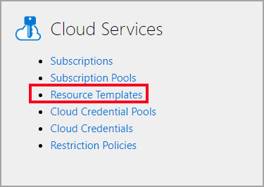

# Deploying a Linux VM on Azure using a template

Deploying a Linux VM on Azure is quick and easy, using Resource Templates. To create a Resource Template in the OneLearn Lab on Demand platform (LOD), you must perform the tasks below.

> [!ALERT] To complete this guide, you must first have a Lab Profile in LOD, and an active Microsoft Azure subscription already loaded into LOD and ready for use with Lab Profiles. If you have not created a Lab Profile, or have not yet configured your Azure subscription for use with LOD, please have a look at our [Building your first Cloud Slice lab](../../../../lod-home.md/#building-your-first-cloud-slice-lab) Quick Start.

1. [] Navigate to the <[Lab on Demand Administration page](/Admin).

1. [] Click <[Resource Templates](/CloudTemplate) on the **Cloud Services** tile.

    

1. [] Click <[Create Resource Template](/CloudTemplate/Create) in the upper-right corner of the page.

    

1. [] Enter ++linux-vm++ into the **Name** field on the **Basic Information** tab.

1. [] Enter ++Deploys a linux virtual machine++ into the **Description** field on the **Basic Information** tab.

1. [] Select your organization, or the organization that will use this resource template.

1. [] Click to open ^INSTRUCTIONS[this dialog containing an Azure Resource Manager (ARM) template](sample-resource-template.md), and follow the instructions in that dialog.

1. [] Now lets define the parameters for the ARM template by selecting the **Parameters** tab.

1. [] Click to open ^INSTRUCTIONS[this dialog containing resource template parameter definitions](parameters-example.md), and follow the instructions in that dialog.

1. [] Note that not all parameters in the ARM template you are using are required. When you want to simply use default values for parameters that are optional, you can remove those optional parameters from the Resource Template parameter list. Remove the following parameters by clicking **Delete** next to each of them:

    - publicIPAddressName
    - vnetName
    - networkSecurityGroupName
    - subnetName
    - securityRuleName
    - size

1. [] For the remaining parameters, configure them as follows: 

    |Name|Display Name|Description|Required|Display To Student|
    |--|--|--|--|--|
    |name|++VM Name++|++The name of the virtual machine++|No|Yes|
    |nicName|++NIC Name++|++The name of the network interface++|Yes|No|
    |adminUsername|++VM Admin Username++|++Admin username to log in to the virtual machine++|No|Yes|
    |adminPassword|++VM Admin Password++|++Admin password to log in to the virtual machine++|No|Yes|
    |dnsName|++DNS Name++|++The DNS name for the virtual machine++|Yes|Yes|

    > [!KNOWLEDGE] **Required** and **Display to Student** are used to assist with the user experience of your lab. Use **Required** for any parameters that do not have default values, or for any optional parameters that you want lab authors to provide values for when they use this template. Use **Display to Student** to identify parameter values that you would like students to be able to see on the **Resources** tab once they are inside of the lab.

1. [] Click **Save**.

**Congratulations!** You have just finished creating a Resource Template in LOD that can be used to deploy an Ubuntu Linux virtual machine as part of a lab. Each student launching a lab that uses this template will receive their own Ubuntu Linux VM, and they will not be able to see or access any of the other VMs that other students are using.

Now that you have that done, it's time to configure your Lab Profile to deploy the resources defined in the Resource Template.

1. [] Return to the <[Lab on Demand Administration page](/Admin).

1. [] Navigate to your Lab Profile.

    > [!KNOWLEDGE] If you are unsure how to get to your Lab Profile, you can get to it by doing the following:
    > - Click <[Find Lab Profiles](/LabProfile) to find your Lab Profile. 
    > - Enter the name of your Lab Profile in the **Name** field.
    > - Change the operator drop-down adjacent to the **Name** field to **Equal**.
    > - Click **Search** to find your Lab Profile. 
    > - In the search results, click the Name hyperlink of your Lab Profile to open the Lab Profile details view.

1. [] Click **Edit Profile** to open the edit view for your lab profile. 

1. [] Select the **Cloud** tab. 

1. [] Ensure that the **Cloud Platform** is set to **Azure**, and the **Cloud Portal URL** is set to ++https://portal.azure.com++.

1. [] If you have not already associated a Cloud Subscription Pool with this lab, click **Choose** next to **Shared Subscription Pool**.

    > [!KNOWLEDGE] REMINDER: If you have not set up a Cloud Subscription Pool yet, please have a look at our [Cloud Slice Quick Start Guide](/lod/quick-starts/cloud-slice/add-subscription-into-lod.md)

    1. [] Click **Search** to see all Cloud Subscription Pools that are available to you. If you want to find a specific pool, enter the name that subscription pool in the Name field before you click **Search**.

    1. [ ] Select your cloud subscription pool in the search results.
    
    1. [ ] Click **OK**.

1. [ ] Click **Add User Account**, and enter ++Taylor++ into the Name Prefix field.

1. [ ] Click **Add Resource Group**, and enter ++corp-data++ into the Name Prefix field.

1. [ ] Click **Add Permission**, select **Taylor** in the combo box, and select **Contributor** in the Role combo box.

1. [] Click **Add Resource Template**.

    1. [] Enter ++linux-vm++ into the **Name** field, and change the operator drop down adjacent to it to **Equal**. 

    1. [] Click **Search** to find your Resource Template.

    1. [] Select your Resource Template in the list of results, then click **OK**.

    1. [] Enter ++nic-@lab.GlobalLabInstanceId++ into the **NIC Name** field, and enter ++ubuntu-@lab.GlobalLabInstanceId++ into the **DNS Name** field. This will give the NIC and DNS unique names.

    1. [] Leave **VM Name**, **VM Admin Username**, and **VM Admin Password** blank. Those parameters are optional.

    1. [] Click **OK**.

> [!KNOWLEDGE] Checking the **Deploy In Background** checkbox next to a Resource Template will allow the lab user to start using the lab even if this Resource Template is still deploying. This is useful when you have tasks that users can complete while these resources are being deployed in the background. **By default, unless you check the Deploy In Background checkbox, users will not be able to start a lab until all Resource Templates have fully deployed.**

1. [] Click **Save** to save the updated lab profile. 

You have now created a Resource Template that will deploy a single Linux Virtual Machine for each student who launches this lab. Let's launch it to see what it looks like!

1. [ ] In the lab profile details view, click **Launch** to launch your lab.

1. [ ] Once the lab has finished deploying, click **Get Started**.

**Congratulations! You have just deployed an Ubuntu Linux Virtual Machine in your lab! You are now seeing the lab from the same perspective of a student.**
