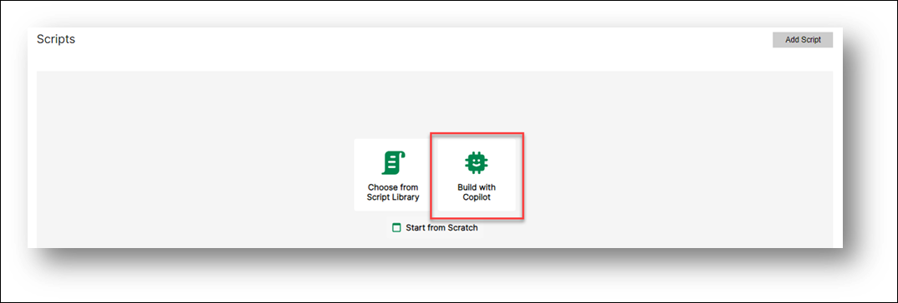
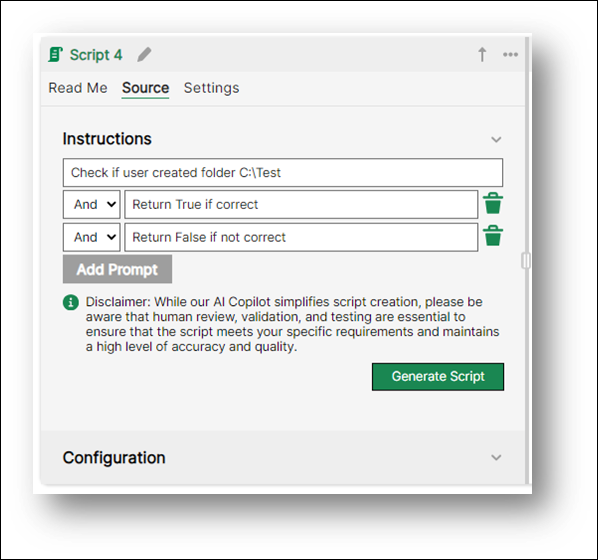
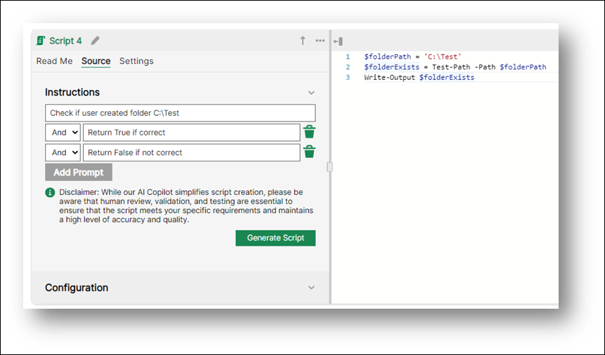

 Script Library AI Copilot

Here’s a simplified guide on how to create a script using Skillable AI Copilot to add scripts to your Automated Activities utilizing AI.

## Create Your First Script with Script Library AI Copilot

1. Start a New Automated Activity: Begin by creating a new automated activity for your instruction set. This is where you’ll add your scripts.

1. Choose ‘Build with Copilot’: Begin your scripting journey with AI Copilot. Look for the option “Build with Copilot”. This is where you’ll start creating your script.

    

1.	Enter Prompts: Start entering prompts that outline what the script is supposed to do. Break down the problem you’re trying to solve into smaller, logical prompts. Use logical operands to tie your prompts together.

    

1.	Set the Target of Your Script: Make sure the target of your script is set appropriately. Go to the Configuration tab and select the desired target for this script. This will provide the AI engine with the information it needs to tailor the script for the specific environment.

1.	Generate the Script: Click on “Generate Script”. This will allow the AI engine to create a script for you.

1.	Review the AI Script: The AI script will be presented back to you in a response window. Here, you can choose to use this script or retry the prompts if needed.

    

1.	Use the Script: If you’re happy with the script, choose to use it.
And voila! You’ve successfully created a script using AI Copilot. It’s super simple and efficient. Happy scripting! 

    