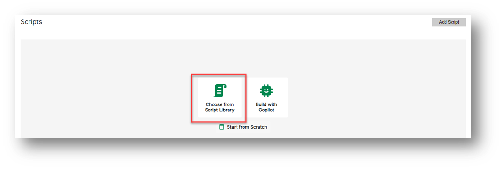
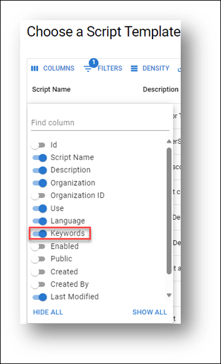
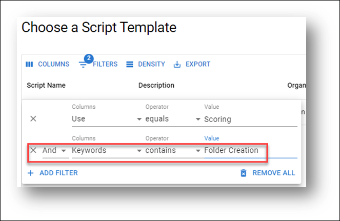
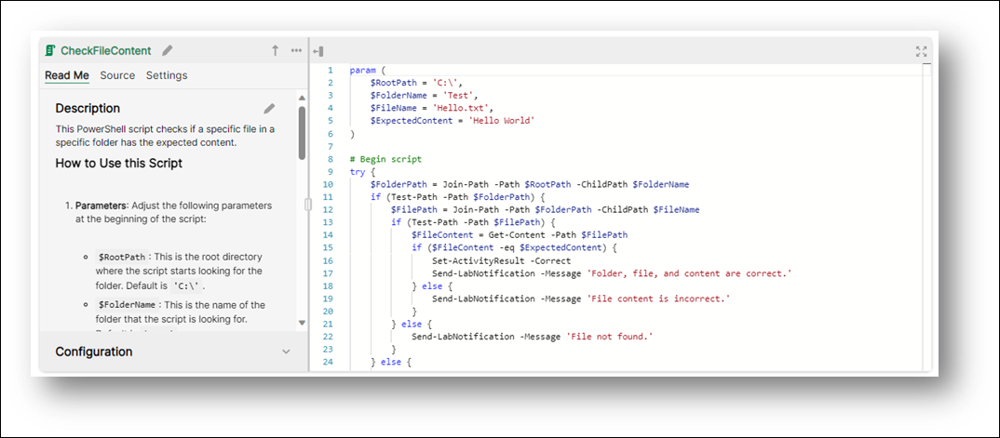

# Getting Started with Script Library

Embrace Simplicity with the Skillable Script Library: No More Tedious Scripting! Discover the ease of starting and reusing scripts, accelerating your progress and boosting your efficiency. Transform the way you create Automated Activities today!

Here’s a step-by-step guide on how to use the Skillable Script Library to add scripts to your Automated Activities:

## Creating Your First Activity from a Script Template

1.	**Start a New Automated Activity:** Begin by creating a new automated activity for your instruction set. This is where you’ll add your scripts.

2.	**Choose from Script Library:** Look for the option to “Choose from Script Library”. This will open up a list of available Script Templates.
 
    

3.	**Explore Script Templates**: You’ll see a variety of Script Templates that are available for your organization. These include templates released by Skillable and any that your organization has published.

4.	**Use Keywords to Find the Right Script**: To make finding the right script easier, turn on keywords. This will help you quickly identify potential script templates to use.

    

5.	**Filter and Select Your Script**: You can sort by the Keywords column or add a filter to find the specific script you’re interested in. For example, if you’re looking for scripts that test folder creation, add a filter for that.

    

 
6.	**Add the Script to Your Activity**: Once you’ve found the script you want, select it and click “OK”. This will add the script template to your automated activity.

    

    And that’s it! You’ve successfully added a script to your Automated Activities using the Skillable Script Library. Remember, it’s all about finding the right script for your needs and adding it to your activity. It’s as simple as that!  

    