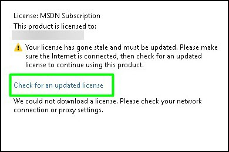

# Stale License for Visual Studio

If your lab environment is using Visual Studio and you receive a message that says _Your license has gone stale and must be updated_, please follow the steps below. 

1. **Select the link** on the message that says **Check for an updated license**. 

    
    
1. Add your own Microsoft information. You should have created a new Microsoft Live account to use in the lab. 

1. Once you sign in with your own account, the license for Visual Studio will be reactivated. 