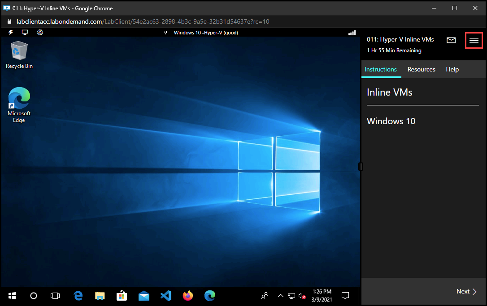
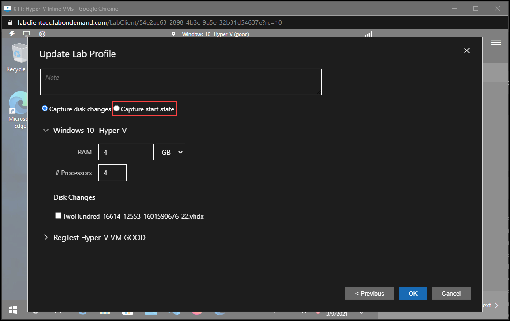
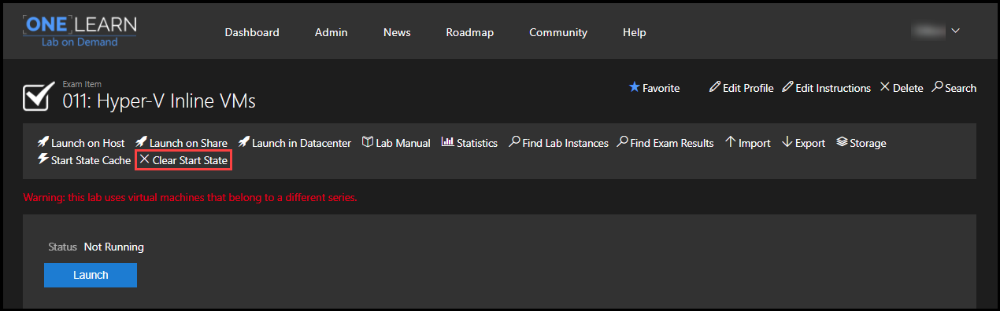
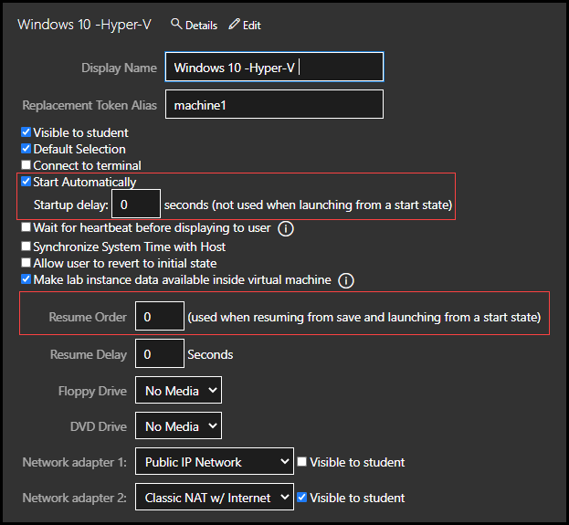

# Hyper-V Start States

Start States allow you to create a point in a lab where the lab will launch from for subsequent launches. In many cases, Start States can highly reduce lab start times, especially for large and complex labs.

>[!alert] Start States are limited to Hyper-V virtualization labs. Start States are not supported on vSphere.

- [Overview](#overview)
  - [Launch Time](#launch-time)
  - [Boot Sequence Dependencies](#boot-sequence-dependencies)
  - [Software Configuration](#software-configuration)
- [Creating a Start State](#creating-a-start-state)
- [Updating VMs in a Lab That has a Start State Configured](#updating-vms-in-a-lab-that-has-a-start-state-configured)
- [Best Practices](#best-practices)
  - [Lab Component Sequencing](#lab-component-sequencing)
  - [VM RAM Consideration](#vm-ram-consideration)
  - [Software Configuration](#software-configuration-1)
  - [Validate and Test](#validate-and-test)

## Overview

Hyper-V Start states allow a lab to be resumed instead of booted. When deciding to use a Start State vs naturally booting virtual machines (VM) in a lab, there are a few things to consider.

- Launch time
- Boot sequence dependencies
- Software configuration

Start States may not be an optimal solution for some lab scenarios. Start States come with some drawbacks, including restrictions on the ability to update the lab without additional steps. Some software does not work well being restored from a Start State. 

### Launch Time

Depending on the complexity of the lab and the lab components used, the launch times for your lab may vary. Creating a Start State at a point in the lab after lab components and services are started and running in the desired state will allow future lab launches to resume at that point, resulting in a quicker lab launch. 

### Boot Sequence Dependencies

If you have a complex lab, your boot sequence must account for dependencies between lab components. For example, if your lab has a server VM and a client VM, the server VM may need to boot first so that the client VM can properly connect and interact with the server VM. 

### Software Configuration 

If the lab uses any software that requires any configuration, it is helpful to configure the software and then capture a Start State. This allows the lab user to launch the lab and start using the software as it is intended to be used, instead of configuring the software first. 

## Creating a Start State

Start States can only be created on Hyper-V VMs. Start States are not supported on vSphere VMs. 

>[!alert] Do not implement Start States until you have fully validated your lab is working and you anticipate no changes. 

To create a Start State: 

1. Navigate to the Hyper-V lab profile you wish to configure a Start State on. 

1. Launch the lab.

1. Configure the VMs and any software in the VMs. 

1. Click the menu in the upper right corner of the lab. 

    {800}

1. Click **Save**.

1. Select **Commit my changes and update the lab profile**, then click **Next**.

1. On the next screen, select **Capture start state**. 

    {800}

    >[!knowledge] If your lab contains a NAT Web access network that uses DHCP, it is not a recommended configuration for a lab starting from a saved state. Because the DHCP leases will likely have expired when the lab starts, it could take several minutes for the virtual machines to regain network access. You should consider editing the lab profile and disabling DHCP in all NAT Web access networks, as well as assigning static IP addresses within your virtual machines.

1. Enter a note describing the changes that will be captured in the Start State. 

1. Select the VM(s) that will be captured. 

1. If any of the VMs used in the lab have time-limited software, check the box to **Disable Host Time Synchronization**. 

1. Click **OK**. 

1. The changes will now be committed to the lab profile. This process may take a few minutes to complete, depending on the amount of changes and number of VMs. 

1. After the changes are committed, a screen will be shown to indicate success. 

1. If additional changes need to be made that should be captured in the Start State, repeat the previous steps. If no additional changes need to be made, click the menu in the upper right corner of the lab and choose **End** to close the lab. 

Subsequent lab launches will launch in the state the lab was in when the Start State was captured. 

## Updating VMs in a Lab That has a Start State Configured

To update VM in a lab that has a Start State configured, you must remove the Start State. 

When you remove the Start State, all configuration will be removed and the lab will start as it did before a Start State was configured. This includes removing any software configuration made in the lab. 

To Remove a Start State: 

1. Navigate to the lab profile. 

1. Click **Clear Start State** at the top of the screen. 

    {800}

1. Click **OK** on the confirmation dialog. 

1. The Start State will be removed and the lab will return to the state it was in before the Start State was captured. 

## Best Practices

### Lab Component Sequencing

For complex labs, the boot sequence must account for dependencies between lab components. This is important so that components that depend on other components are put into place at the proper time in the boot sequence. 

In Lab on Demand, there are options to control how VMs start. These options can be found on the Virtual Machines tab of a lab profile.

{800}

- **Start Automatically**: this options controls if the VM starts when the lab launches. 
    - Enable this option to allow the VM to start automatically.
    - Disable this option if you do not want a VM to start automatically because it may need to be started after another VM. 
- **Startup Delay**: this option adds a delay to the VM startup when a VM is set to start automatically. 
    - Enable this option if you need a VM to start automatically, but want to make sure that it doesn't start before another VM. Enter a value in seconds for the delay amount, and the VM will not start until the startup delay amount has elapsed. 
- **Resume Order**: this option controls the resume order of VMs. Enter a numerical value to specify the order the VMs will resume. Each VM should have a value entered. If a value is not entered on a VM, the VM will resume when the lab is launched, unless there is a startup delay. 

### VM RAM Consideration

When using Start States, sequencing can be important. VMs with a high amount of RAM will take longer to restore than VMs with a low amount of RAM.

- If your lab does not require a high amount of RAM, use only the amount needed. 

### Software Configuration

If your lab uses specific software as part of the curriculum, Start States allow you to configure the software in the lab so that the lab user starts the lab with the software configured. 

- Preconfiguring software is beneficial because the lab user can focus on the techniques used within the software, rather than configuring the software. 

- Some software does not work well when it is restored. Fully test that all software in the lab functions as expected after being restored. 

### Validate and Test

- Do not implement Start States until you have fully validated your lab is working and you anticipate no changes. 

- After a Start State is captured, you should fully test the lab to confirm all software restores as expected and lab component sequencing works as expected. 
