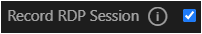
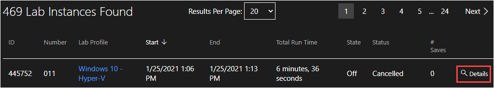
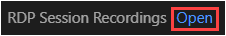

# Student Desktop Recording 

Student Desktop Recording allows the RDP session between the lab user and the lab to be captured in a video that can be used to view the lab user's activity in the lab after the lab has ended. 

When a lab user launches a lab, the RDP session will begin recording after the virtual machine (VM) connects. After the lab has ended, a video recording of the lab activity will be saved to the user's lab instance details page for that session. 

>[!alert] **This feature is in beta and there are some [known issues and limitations](#known-issues-and-limitations).**

- [Enabling Student Desktop Recording](#enabling-student-desktop-recording)
    - [Enabling For the Organization](#enabling-for-the-organization)
    - [Enabling On a Lab profile](#enabling-on-a-lab-profile)
- [Accessing Session Recordings](#accessing-session-recordings)
    - [View Session Recordings From a Particular Lab Profile](#view-session-recordings-from-a-particular-lab-profile)
    - [View Session Recordings For a Particular User](#view-Session-recordings-for-a-particular-user)
- [Known Issues and Limitations](#known-issues-and-limitations)

## Enabling Student Desktop Recording 

Student Desktop Recording is enabled for an organization, and then it is enabled on a per lab profile basis. The feature must be enabled for an organization before the option will be displayed in lab profiles. 

### Enabling for the Organization

If you are interested in using Student Desktop Recording, please contact our [customer support team](http://www.learnondemandsystems.com/customer-support/) to enable this feature for your organization. Once it is enabled for your organization, you can enable it on any lab profiles that belong to that organization. 

### Enabling on a Lab Profile 

Once Student Desktop Recording is enabled for a lab profile, any user that launches the lab will have their RDP session captured and saved to their lab instance. 

To enable a lab profile: 

1. Navigate to the lab profile. 

1. Edit the lab profile. 

1. Go to the Advanced tab. 

1. Click the checkbox next to _Record RDP Session_ to enable RDP session recording. 

    

1. Save the lab profile. 

When lab users launch the lab, their session will be recorded and saved to their lab instance. 

## Accessing Session Recordings

Lab session recordings can be viewed from the lab instance page for the lab session. 

### View Session Recordings From a Particular Lab Profile

1. Navigate to the lab profile. 

1. Click _Find Lab Instances_ at the top of the page. 

    >[!knowledge] Alternatively, you can use the _Find Lab Instances_ link on the Administration page of Lab on Demand, and filter for the lab profile you want to view. 

1. The next page will show all lab instances that are associated with the lab profile. 

1. Click _Details_ next to the lab instance you wish to see the recording of. 

    

1. Next, click **Open** next to _RDP Session Recordings_. 

    

1. The next page will show all RDP recordings for the lab instance in the upper-right corner. 

1. Click the recording and it will load into the video player. 

1. Click Play to start playback of the recording. 

### View Session Recordings for a Particular User

1. Navigate to the user's profile page in Lab on Demand. 

1. Click _Lab Instances_ at the top of the page to view all the user's lab instances. 

1. The next page will show all lab instances for the user. 

1. Click _Details_ next to the lab instance you wish to see the recording of. 

    

1. Next, click **Open** next to _RDP Session Recordings_. 

    

1. The next page will show all RDP recordings for the lab instance in the upper-right corner. 

1. Click the recording and it will load into the video player. 

1. Click Play to start playback of the recording. 

## Known Issues and Limitations

**Known Issues**
- Changing the resolution of the VM during the lab session may alter the size of the video player when playing back the recorded session. 
	- If any resolution changes need to be made during the lab session, we do not recommend decreasing the resolution as that could cause some areas of the recorded session to not fit in the playback window. 
	
- Clicking too frequently or dragging the mouse cursor on the video playback timeline may cause browser errors to appear. Doing so may cause playback to restart but does not result in any data loss. 
	
- Sometimes the video playback may appear frozen or unresponsive. If this happens, pause the video for a few seconds and then click play to resume playback. 
	
- When the recording initializes, some visual artifacts may be captured into the recording. 
	
- When navigating to a specific point in the playback timeline, the video may resume playback at an earlier point in the timeline than where you selected. 

**Known Limitations**
- Video playback is only available on https://labondemand.com cannot be downloaded or retrieved via API. 
- Periods of inactivity in the VM session may not be captured in the recording.
- If there is no activity in the VM during the lab session, the recording may appear like nothing was recorded. 