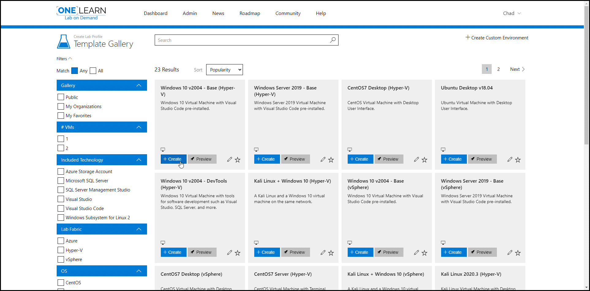
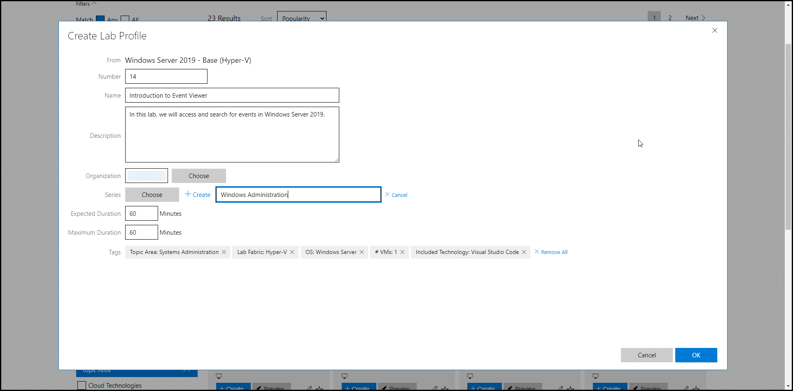
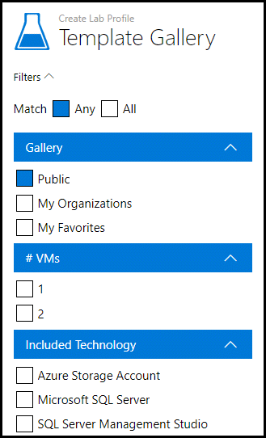
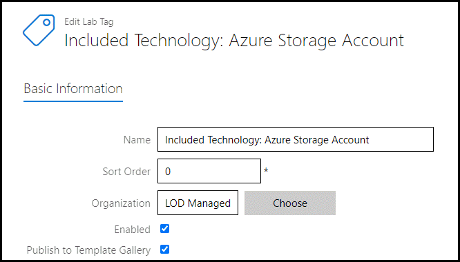
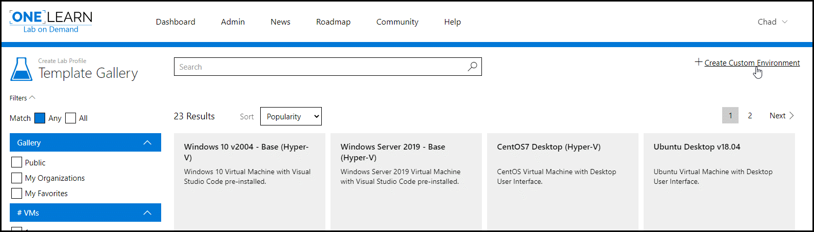

# Template Gallery

The template gallery allows lab authors to easily search for and select pre-created labs to use as the base for a new lab. Lab authors can select templates from the public template gallery maintained by Learn on Demand Systems or create a private gallery available only to their own users. Users can search by name or favorite individual templates and filter by only templates they have favorites for ease of finding frequently used templates. When accessing labs from the template gallery, authors are provided a few options:

 - The Create option allows you to generate a new lab directly from the gallery simply by defining some information – such as name, series and organization – about where you would like to save the new lab.
 - The Preview option allows you to launch the lab so you can review the environment and confirm it is what you are looking for before creating a new lab based on it.
 - The Pencil Icon allows you to edit the profile if you have management rights.
 - The Star Icon allows you to Favorite a template for future use.

## Create from Template

To create a lab profile from the Template, select Create on the chosen template and fill in the following fields.

- Number: Numbers are used in the title of the lab profile.
- Name: This will be the display name of the lab profile.
- Descriptions: A description of the Lab Profile.
- Organization:  Select the organization that will own the lab profile and be responsible for maintaining the profile. You may choose from any of the organizations you manage.
- Series: Select or dynamically create a new Lab Series to which your profile will be assigned. You may also choose none.
- Expected Duration: The expected amount of time it will take a user to complete the lab.
- Maximum Duration: The maximum amount of time that a user can spend in the lab.
- Tags: By selecting one or more tags, the lab profile will be available as a template under these filters when/if published to the template gallery. 

> [!note]These settings and more can later be modified from the lab profile edit page. 

## Filters

The lab templates in the gallery may be filtered based on their availability and technology focus.

- *Public* will show templates available to everyone in using Lab on Demand.

- *My Organizations* will show templates available only to the organizations you manage.

- *Favorites* will show any templates you have previously favorited(starred).

## Lab Tags

Organization Managers and Lab Authors can add additional filters for technology focus by tagging lab profiles with a lab tag. Lab Tags are created in the LOD admin portal by selecting *Lab Tags* under the Lab Profile pane. 

The Lab tags are in a *Title: Subject* format, separated by a colon.
Here is an example of what one of the *Included Technology* tags from the screenshot above would look like during configuration. Before saving, ensure *Publish to Template Gallery* is enabled if you would like it available as a filter in the template gallery.

## Publishing Labs.

Labs may be published to the organization gallery as a template by selecting the *Publish to Organization Template Gallery* option on the advanced tab when editing a lab profile. Additionally, lab profiles may be tagged from the Tags tab of the same page.

## Custom Environments

If you find none of the templates meets your requirements, or you have something special in mind, you may create the lab profile from the ground-up using the *Create Custom Environment* link in the top right corner.

