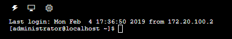
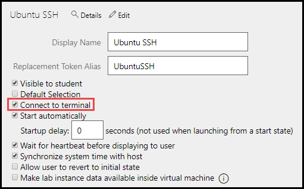

# Terminal Access to Virtual Machines



SSH Terminal access allows a user to connect and interact with a virtual machine from a terminal window.

There are a couple of virtual machine (VM) requirements for SSH terminal access:

- Hypervisor integration tools.
- A running SSH server.

## Installation

1. **For VMs hosted on Hyper-V**
    - Refer to the [Microsoft Linux support information](https://docs.microsoft.com/en-us/windows-server/virtualization/hyper-v/supported-linux-and-freebsd-virtual-machines-for-hyper-v-on-windows) to see if a distribution is supported on Hyper-V and instructions on installing any additional integration components
        - Network information needs to be communicated over the VMBus via Hyper-V integration services, currently RedHat, CentOS, FreeBSD, and most Debian distributions support this
        - Kali Linux does not support VM integration components


1.  **For VMs hosted on ESX**

    - Linux VMs must support the open-vm-tools package. On most builds, this is installed by default. It is recommended to verify this is installed using the following commands: 
        - On **Debian/Ubuntu** builds this can be installed with ```sudo apt-get install open-vm-tools```.
        - On **RHEL or CENTOS** ```sudo yum install open-vm-tools -y```.

## Configure networking

- Generally, Linux VMs need to be set to automatically bring online a new network adapter at boot and pull an address via DHCP. Most Linux distributions name adapters eth**X** where X is the number of adapters starting from 0.

- If the VM is unable to connect to the internet after enabling terminal access, you may need to disable the default route assigned to the new adapter. The SSH network has no routing capabilities.

### RedHat/CentOS
- Create a configuration file at /etc/sysconfig/network-scripts/ifcfg-eth**X**, where X is equal to the number of adapters your VM has. It should be set to automatically start at boot and pull an address via DHCP.
    
    - Sample Configuration:
    ```
    TYPE=Ethernet
    BOOTPROTO=dhcp
    NAME=eth1
    ONBOOT=yes
    ```

### Debian/Ubuntu

- Open /etc/network/interfaces and add an entry for eth**X** where X is equal to the number of adapters your VM has. It should be set to automatically start at boot and pull DHCP information.
    - Sample Configuration:
    ```
    auto eth1
    allow-hotplug eth1
    iface eth1 inet dhcp
    ```

## Configure a running SSH server

SSH configuration may need to be modified to enable password authentication or root login.

1. Open ```/etc/ssh/sshd_config``` and uncomment the line **_PasswordAuthentication yes_**. 

1. If you need root login as well, uncomment **_PermitRootLogin yes_**, or add the line if you can’t find it. 

1. Uncomment the line **_UseDNS yes_** and change it to **_UseDNS no_**, or add the line if you can't find it. This disables a reverse DNS lookup on terminal connect that can cause a 10 second delay.

1. Disable the networkmanager-wait service if applicable. This service can result in a 20 second boot delay when using NICs set to DHCP. On most versions of Linux this can be done via the following command: ```sudo systemctl disable NetworkManager-wait-online.service```.

    >[!alert] On **Ubuntu 18.04.2**, the network manager wait service is known as `systemd-networkd-wait-online.service`. If you are using Ubuntu 18.04.2, the **network manager wait service should not be disabled**. This will prevent SSH terminal access. 

1. Make sure the SSH service auto boots. On most versions of linux can be done by entering the following command: ```sudo systemctl enable ssh```.

1. Start the service with the following command: ```sudo systemctl startssh```.

1. Once this is done, capture a differencing disk. 

1. In LOD, edit the lab profile and on the **Virtual Machines tab**, check the **_Connect to terminal_** checkbox for the VM you performed the above steps on. 

    

1. Launch a new instance of your lab profile and verify the VM connects via SSH. The VM should boot to a terminal window.

For more information about how SSH works, and instructions on setting up an SSH server, click [here](https://www.tecmint.com/install-openssh-server-in-linux/).

## Additional Resources

- [Best Practices for running Linux on Hyper-V](https://docs.microsoft.com/en-us/windows-server/virtualization/hyper-v/best-practices-for-running-linux-on-hyper-v)
- [Hyper-V (LIS) On Ubuntu 18.04](https://oitibs.com/hyper-v-lis-on-ubuntu-18-04/)
- [Supported Linux and FreeBSD virtual machines for Hyper-V on Windows](https://docs.microsoft.com/en-us/windows-server/virtualization/hyper-v/supported-linux-and-freebsd-virtual-machines-for-hyper-v-on-windows)

[Back to top](#terminal-access-to-virtual-machines)
