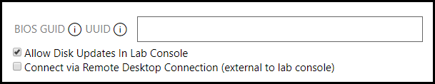

# Custom UUID in VMware Virtual Machines

If you would like to assign a custom unique ID to a virtual machine hosted on a VMware host, you can configure this on in the VM profile in Lab on Demand (LOD).

There are two types of unique IDs that can be configured:

- BIOS GUID
- UUID

## BIOS GUID

This controls the BIOS GUID set within the virtual machine's configuration. The value should include the curly braces. 

An example BIOS GUI looks like 

```nocopy
{46486DC1-B2A6-456E-B091}
```

## Custom UUID

This controls the UUID set within the virtual machine's configuration. The UUID is a 128-bit integar. The 16 bytes of this value are separated by spaces, except for a dash between the eighth and ninth hexadecimal pairs.

An example UUID looks like

```nocopy
00 11 22 33 44 55 66 77 88 99 aa bb cc dd ee ff
```

## Configuration in the VM Profile



To configure a BIOS GUID or a custom UUID:

1. Navigate to the VM profile you wish to configure.
1. Click **Edit** in the upper-right corner.
1. Click the **Advanced** tab.
1. Enter the BIOS GUID or UUID that you wish to use.
1. **Allow disk updates in lab console (enabled by default)**: This allows authors to access the Save Differencing Disks dialog, when using this virtual machine.
1. **Connect via remote desktop connection (external to lab console)**: You can supply an RDP file and have users connect directly to the VM using an RDP client instead of using our HTML5 controller. This requires public IP configurations.
