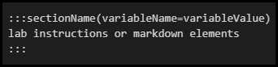

# Variable Display in Labs

IDLx has a function to allow showing and hiding of lab instructions and lab instruction elements. This is done by setting a lab variable and then using that lab variable in the lab instructions. This also works in conjunction with labs that use instructions stored in an external repository and displayed in the lab instructions using a Markdown Include - this allows the lab instructions to be displayed dynamically based on the variable in the lab instructions. Additionally, the variable can be selected with an API launch. This allows the lab to show specific content when the lab launches. 

There are two requirements for enabling these features:
- [Set a lab variable](#setting-variables)
- [Use the lab variable in lab instructions](#using-variables-in-a-lab)

# Setting Variables

The lab variable can be set multiple ways, but only needs to be set once in order to be used in lab instructions. The following methods can be used to set a lab variable:
- [Life Cycle Actions(LCA)](#life-cycle-actions-lca)
- [Activity Based Assessments (ABA)](#activity-based-assessments-aba)
- [IDLx Textbox](#idlx-textbox)
- [IDLx Drop-down Menu](#idlx-drop-down-menu)
- [Lab Variables Menu](#lab-variables-menu)

### Life Cycle Actions (LCA)

Set the lab variable in an LCA when the virtual machine or cloud environment are in the _First Displayable_ or _Resumed_ event. 

1. On the lab profile, click **Edit**.
1. Go to the **Life Cycle Actions** tab.
1. Click **Add Life Cycle Action**. 
1. Select the **Action** drop-down, then select _Execute Script in Virtual Machine_, _Execute Script in Cloud Platform_ or _Execute Script in Container_.
1. Select the **Event** drop-down, then select First Displayable or Resumed. This will set the variable in lab when the VM or Cloud environment is first displayed to the user or resumed by the user. 
1. Select the **Command Type** drop-down and select _PowerShell_. 
1. For the Command, enter: `Set-LabVariable -Name variableName -Value variableValue`.
1. Replace `variableName` with the name you wish to use for the variable.
1. Replace `variableValue` with the value you wish to use for the variable. 
1. Configure the lab instructions to show items based on the variable, by [configuring one of the options below](#using-variables-in-a-lab). 

For more information about LCAs, see our [Life Cycle Action documentation](life-cycle-actions.md).

### Activity Based Assessments (ABA)

Set the lab variable in an ABA activity when the user clicks the button for the activity in the lab instructions. 

1. On the lab profile, click **Edit Instructions**. 
1. Click the **Activities menu** (lightning bolt icon) at the top of the window. 
1. Click **New Automated Activity**
1. Enter a name for the activity in the **Name** field. 
1. Enter instructions in the **Instructions** field. 
1. Configure the **Correct Answer** and **Incorrect Answer** feedback fields.
1. In the script section, click the **Target** drop-down and select VM or Cloud subscription you wish to target with the script.
1. In the **Language** drop-down menu, select PowerShell. Other options can be used, but this documentation uses PowerShell for demonstration. 
1. For the script, enter: `Set-LabVariable -Name variableName -Value variableValue`.
1. Replace `variableName` with the name you wish to use for the variable.
1. Replace `variableValue` with the value you wish to use for the variable. 
1. Configure the lab instructions to show items based on the variable, by [configuring one of the options below](#using-variables-in-a-lab). 

For more information about ABA, see our [Activity Based Assessments documentation](activities.md).

### IDLx Textbox

Show lab instructions based on text a user enters into a textbox.

When a user enters text (variable value) into the textbox, any lab instructions or instruction elements that use that variable name will be shown. If a user enters text that does not correspond with a variable name, no lab instructions will be shown based on the user's input. 

>[!knowledge] It is recommended to provide the variable values in the lab instructions, so that lab users can enter a variable value that corresponds to a variable name. 

1. From the lab profile, click **Edit Instructions**. 
1. Click the @lab menu and choose `@lab.TextBox(name)`
1. Insert this into the section of the lab instructions where you want the drop-down menu to appear. 
1. Replace `name` with the name you wish to use for the variable name.
1. When a user enters text (variable value) into the text box, any lab instructions or instruction elements that use that variable name will be shown.

### IDLx Drop-down Menu

Set the lab variable by configuring values in a drop-down menu. The variable is used when a lab user selects one of the options in a drop-down menu. 

1. From the lab profile, click **Edit Instructions**. 
1. Click the @lab menu and choose `@lab.DropDownList(name)[val1,val2]`
1. Insert this into the section of the lab instructions where you want the drop-down menu to appear. 
1. Replace `name` with the name you wish to use for the variable.
1. Replace `val1` and `val2` with variable values. Additional values can be added if needed.
1. Configure the lab instructions to show or hide items based on the variable, by [configuring one of the options below](#using-variables-in-a-lab).

### Lab Variables Menu

1. From the lab profile, click **Edit Instructions**. 
1. Click the @lab menu and select the **Variables** tab at the top of the window. 
1. Enter a **Name** that you wish to use for the `variableName`.
1. Enter a **Value** that you wish to use for the `variableValue`.
1. The lab token is generated to the right of the Value field. Copy the token and paste into lab instructions or click Insert, to insert it at the current cursor position in the lab instructions. 
1. Configure the lab instructions to show or hide items based on the variable, by [configuring one of the options below](#using-variables-in-a-lab).

# Using Variables in a Lab

Lab instructions and elements can be shown by using the lab variable in the lab instructions. The following methods can use a lab variable that is set by any of the methods above:

- [IDLxSections](#idlx-sections)
- [IDLx Drop-down Menu](#idlx-drop-down-menu)
- [Dynamic Includes From an External Repository](#dynamic-includes-from-an-external-repository)
- [API Launch](#api-launch)

### IDLx Sections

Create a section of lab instructions and IDLx elements so they can be called on as one, using the lab variable. Sections are hidden by default and are only shown when a lab variable is set that calls on the section.

1. From the lab profile, click **Edit Instructions**.
1. Enter the following Markdown syntax: 

    > :::sectionName(variableName=variableValue)

    > lab instructions or markdown elements

    > :::

    >
1. Replace `sectionName` with the name you wish to use for the section.
1. Replace `variableName` with the name of the variable you wish to use in the Section.
1. Replace `variableValue` with the value paired with the variable you wish to use. 
1. Enter any lab instructions or markdown elements in the Section. 
1. If a lab variable is set in the lab, that matches the variableName and variableValue of the section, it will be shown. Otherwise, the section will be hidden. 

### IDLx Textbox

Show lab instructions based on text a user enters into a textbox. The user will enter text (variable value) into the text box that corresponds with a variable name/variable value that was set using one of the methods above and any lab instructions or instruction elements that use that variable name will be shown.

>[!knowledge] It is recommended to provide the variable values in the lab instructions, so that lab users can enter a variable value that corresponds to a variable name. If a user enters text that does not correspond with a variable name, no lab instructions will be shown based on the user's input. 

1. From the lab profile, click **Edit Instructions**. 
1. Click the @lab menu and choose `@lab.TextBox(yourVariableNameHere)`.
1. Insert this into the section of the lab instructions where you want the drop-down menu to appear. 
1. When a user enters text (variableValue) into the text box, any lab instructions or instruction elements that use that variable name will be shown.

### IDLx Drop-down Menu

Display a drop-down menu in lab instructions, where users can select an option. The options shown in the drop-down menu are variable values that were configured when the drop-down was created in the previous section. 

1. From the lab profile, click **Edit Instructions**. 
1. Click the @lab menu and choose token for the drop-down menu you created. If you created multiple drop-down menus, they will be listed here.
1. Insert this into the section of the lab instructions where you want the drop-down menu to appear. 

If you have not created a drop-down menu, please see the [IDLx Drop-down Menu section above](#idlx-drop-down-menu).

### Dynamic Includes From an External Repository

Lab instructions can be dynamically displayed based on the variable set in the lab and the variable value appended to the file name in the external repository. 

1. From the lab profile, click **Edit Instructions**.
1. If the lab variable is not already set in your lab, use [one of the methods above](#-setting-variables) to set a lab variable. 
1. In the lab instructions, enter a Markdown include with a lab variable appended: `!instructions.md)`
1. Replace `url` with the url to the raw file in your external repository.
1. Replace `variableName` with the name of the variable you wish to use.
1. Choose an option:
    - Insert a drop-down menu or textbox is the lab instructions that corresponds to the variable. These can be found in the @lab menu at the top of the window. 
    - Assemble a Launch Command URL with the lab variable appended, to launch a lab with lab instructions displayed based on the variable value appended.

>[!knowledge] Example:
> 
> **External repository file name**: 
> 
> `sample1-en.md`.
>
>**Include syntax with variable in file name**: 
> 
> `!instructions[(https://raw.githubusercontent.com/user1/sample1-@lab.Variable(language).md)`
> 
> In this example, the variable value is `en` and the variable name is `language`. 

### API Launch

Launch a lab using the Launch API command to launch a lab for a specified user and use a lab variable in the URL as a parameter. 

1. Assemble the URL for the API command: `https://labondemand.com/api/v3/launch?labid=100&userid=555&firstname=Joe&lastname=Smith&email=joe.smith@email.com&variableName=variableValue`.
1. Replace information in the URL with the lab and student information; lab ID, user ID, first name, last name and email address.
1. Replace `variableName` with the name of the variable you wish to use.
1. Replace `variableValue` with the value of the variable you wish to use.

For more information about the Launch command, see our [Launch command API documentation](lod-api/lod-api-launch.md).

