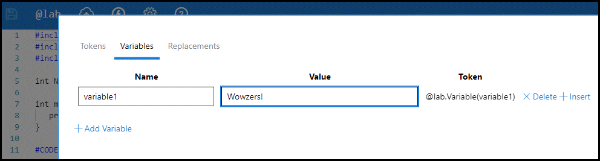

# Lab Variables

Variables store information and then that information can be recalled or used in the lab. Variables can be used in Life Cycle Actions, Automated Activities, and in lab instructions.

## Table of Contents

- [Lab Author Defined Variables](#lab-author-defined-variables)
- [Variables in Lab Instructions](#variables-in-lab-instructions)
- [Variables in Life Cycle Actions](#variables-in-life-cycle-actions)
- [Variables in Automated Activities](#variables-in-automated-activities)

## Lab Author Defined Variables 

A lab author may define variables before the lab is even launched. 

1. **Select the @lab icon** at the top of the edit instructions page. 
1. From the @lab Token and Variables page, **select Variables**. 

It is here that a lab author may set predefined variables for use in the lab instructions, life cycle actions, and automated activities. 

The variable can be used with the assigned replacement token, displayed next to the variable value field. 



## Variables in Lab Instructions

Variables can be defined in lab instructions so that lab users can input information unique to their lab, that can then be utilized later in the instructions. This is accomplished utilizing a combination of replacement tokens. 

Variables defined in lab instructions can use the following Replacement tokens;

- **&commat;lab.TextBox(name)** : A text box that allows the user to set the value of a named variable. This variable value can then be displayed elsewhere using @lab.Variable(name).

- **&commat;lab.EssayTextBox(name)[height]** : A larger essay style text box that can hold up to 5000 characters. Height in number of lines declared by [height] is optional. This variable value can then be displayed elsewhere using @lab.Variable(name).

- **&commat;lab.MaskedTextBox(name)**: A text box with hidden contents used for passwords. This variable value can then be displayed elsewhere using @lab.Variable(name).

Variables can be used in Life Cycle Actions, Automated Activities, or used in lab instructions with the following replacement token: 

- **&commat;lab.Variable(name)** : used to recall the information stored in the variable (name). Replace (name) with the name of any variable that is defined in the lab. 

## Using Replacement Tokens and Variables in Lab Instructions:

1. Place one of the **TextBox replacement tokens** where you would like the user to enter information into. The lab user will enter information into the textbox.
1. Next, place the **variable(name) replacement token** where you would like the entered information to be recalled.
    1. This could be in one or more locations throughout the lab instructions.

It is highly recommended that you give all TextBoxes a unique name in the (name) section of the replacement token. Giving these unique names, enables you to use more than one TextBox variable in a single lab. 

>[!knowledge] For example, you could create two variables with &commat;lab.TextBox(labUserUsername) and &commat;lab.TextBox(labUserPassword) and ask the lab user to enter a username and password in each textbox respectively. Further in the lab you could recall the lab user's username and password with &commat;lab.Variable(labUserUsername) and &commat;lab.Variable(labUserPassword). This prevents the lab user from having to remember or write down their username and password, since it they stored in the lab by variables.

### Below is how the TextBox and variable will look while editing  lab instructions and in a lab environment:

#### Defining Variable in lab instruction editor view:


### Defining Variable in lab from lab user view in the lab:


### The lab user enters their password in the lab


### Calling Variable in lab instruction editor view:


### Calling Variable in lab from lab user view in the lab:


# Variables in Life Cycle Actions

[Life Cycle Actions (LCAs)](life-cycle-actions.md) are actions that are triggered by specific events during the life cycle of the lab. Variables can be set in LCAs, and then later used in later LCAs, lab activities, and lab instructions. 

Variables set via LCAs must be set during a life cycle event that occurs before the variable will be used in the lab. For 
, if you configured an LCA to set a variable during the tear down event, the variable would not be set while the lab user is performing the lab. Similarly, if you set a variable in a LCA you cannot use the variable in the same LCA, but you may use it in LCAs that trigger afterwards. For example, setting an variable in a blocking LCA during the building event, and reusing it in a different building LCA or one that triggers on the built event.

There are currently two forms of Life Cycle Action that can be configured to set a variable:

- **Execute Machine Command**: used to target a virtual machine.
- **Execute Cloud Platform Command**: used to target a Cloud platform.

To set a variable in a Life Cycle Action:

1. **Edit the lab** you wish to configure.
1. Click the **Life Cycle** tab.
1. Click **Add Life Cycle Action**.
1. Select the **Action** that you wish to use.
1. Select the **Event** for when the action will be executed.
1. In the **Command** field, add your PowerShell script.
1. Within your PowerShell script, include the syntax below.

Life Cycle Actions support PowerShell Windows Command Shell, and Bash. Cloud Subscriptions must be targeted by a PowerShell script, and Windows-based virtual machines running on Hyper-V can be targeted by PowerShell or Windows Command  Shell. Linux-based VMs running Hyper-V or ESX can be targeted by Bash.

!INSTRUCTIONS[][syntax]

# Variables in Automated Activities

Variables set in an automated activity can be referenced in lab instructions, after the automated activity is executed. If the activity is not executed, the variable will not be set and any reference to that variable later in the lab will remain as a placeholder, instead of being replaced by the variable value. 

Variables that are set in an automated activity script can be used in a replacement token in subsequent scripts in the same activity, or in another automated activity that occurs after the variable is set. A variable may not be utilized in the same script where it is set. 

Automated activities can also use variables set by a life cycle action, as long as the life cycle event occurs before the automated activity is executed. If the life cycle event does not occur before the variable is referenced, the variable will remain as a placeholder.

Automated Activities support multiple languages. 
- Cloud Subscriptions can be targeted by PowerShell, C# or Python 
- Windows-based virtual machines running on Hyper-V or VMware can be targeted by PowerShell, Windows Command Shell or Bash. 
Linux-based VMs running Hyper-V or VMware can be targeted by Bash. 

### Automated Activity Syntax

Along with traditional PowerShell, Windows Command Shell, and Bash syntax, there is additional syntax that can be used. 

- **Setting Lab Variables**: sets a variable that can be recalled in subsequent lab instructions using @lab replacement tokens, as many times as necessary. 

- **Sending Lab Notifications**: Sends a a popup notification to the lab, using the text specified in the syntax.

- **Scoring**: used to determine how much of the score value the lab user will receive for the activity. This can be used to award partial score values for the automated activity. The partial score is dictated by a numerical value in the syntax, that represents the percentage of the score value that will be awarded. For Windows Command Shell and Bash, you can also display a message in the lab instructions with text specified scoring syntax.

#### **PowerShell** 

- **Setting Variables**
    
    `Set-LabVariable -Name firstname -Value John`

    `Set-LabVariable -Name lastname -Value Smith`

- **Sending Lab Notifications**

    `Send-LabNotification -Message "Hello from a script"`

- **Scoring**

    `Set-ActivityResult .5 -Correct`

#### **Windows Command Shell and Bash**

- **Setting Variables**
    
    `set_lab_variable "firstname" "John"`

    `set_lab_variable "lastname" "Smith"`

- **Sending Lab Notifications**

    `send_lab_notification "Hello from a script"`

    `send_lab_notification "I hope you're doing well"`

- **Scoring**

    `set_activity_result .5 "good job!"`

!INSTRUCTIONS[][syntax]

> [syntax]:
> ## Syntax
>
> ### **PowerShell**
>
> Variables can be declared via PowerShell and then re-used in lab instructions by the following syntax - where nameHere is the variable name and valueHere is the variable value:
> 
> Set the variable
>
> ```Set-LabVariable -Name nameHere -Value valueHere```
> 
> Recall the variable
>  
> > ++&commat;lab.Variable(storageKey)++
>
> #### Example
> As an example, you could set a variable for an Azure Storage Account's Key by running the commands to get the key and assigning to a variable. A variable like this would be declared similar to:
> 
> ```
> $storageKeys = Get-AzureRmStorageAccountKey -AccountName $StorageAccountName -ResourceGroupName $ResourceGroup
> $primaryKey = $storageAccountKey.Value[1]
> Set-LabVariable -Name storageKey -Value $primaryKey
> ```
> 
> You can recall the variable by using the following syntax:
> 
> > ++&commat;lab.Variable(storageKey)++
>
>
>
> [bash-syntax]:
>
> ### **Bash**
>
> Variables can be declared via Bash and then re-used in lab instructions by the following syntax - where `"nameOfVariable"` is the variable name and `"valueHere"` is the variable value. The name and value must be surrounded by quotation marks. 
> 
> Set the variable
>
> ```set_lab_variable "nameOfVariable" "valueHere"```
> 
> Recall the variable
>  
> > ++&commat;lab.Variable(nameOfVariable)++
>

[Back to top](#lab-variables)