# VM Automatic Login 

Virtual machines (VMs) can be configured to log into Windows automatically when the VM is booted. The steps to configure automatic login are different, 
depending on the virtualization fabric and remote controller that is used.

#### vSphere 

- Automatic login is configured using the Netplwiz utility built into Windows.

#### Hyper-V 

- For Hyper-V labs that **do not use Enhanced Session Mode (ESM)**, automatic login is configured using the Netplwiz utility built into Windows.

- For Hyper-V labs that **use ESM**, Windows Registry and Group Policy must be configured to enable automatic login. 

## Table of Contents
- [Configuring Netplwiz](#configuring-netplwiz)
- [Configuring Automatic Login for Hyper-V and Enhanced Session Mode](#configuring-automatic-login-for-hyper-v-and-enhanced-session-mode)
  - [Disable Limit Local Accounts use of Blank Passwords](#disable-limit-local-accounts-use-of-blank-passwords)
  - [Disable Password Complexity Requirements](#disable-password-complexity-requirements)
  - [Set a Blank Password](#set-a-blank-password)
  - [Edit Windows Registry](#edit-windows-registry)
  - [Configuring Other ESM VMs in the Lab](#configuring-other-esm-vms-in-the-lab)

## Configuring Netplwiz

Netplwiz is a utility built into Windows that allows you to manage user accounts. 

1. **Navigate to the lab profile** that contains the VMs that you wish to enable automatic login on. 

1. **Launch** the lab. 

1. If the lab has multiple VMs, **select the VM that should be automatically logged in**.

1. **Enter the login password** and login to the VM. 

1. In the Windows Start menu, search for **Netplwiz**, and then select **Netplwiz**. 

1. **Uncheck** the box next to **Users must enter a user name and password to use this computer**. 

    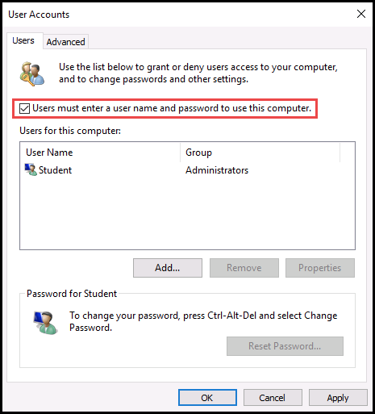{600}

1. In the dialog that appears, enter the VM user name and password and click **OK**. 

    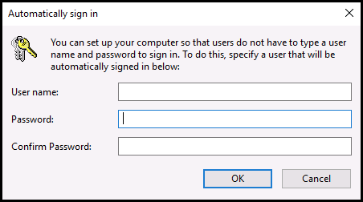{600}

1. Repeat steps 3-7 for any other VMs that should be automatically logged in.

1. Save these changes to the VM disk(s).

    1. Select the **Hamburger menu** in the upper-right corner of the lab. 

    1. Select **Save**

## Configuring Automatic Login for Hyper-V and Enhanced Session Mode

For labs that **use ESM**, Windows Registry and Group Policy must be configured to enable automatic login. There are two settings that need to be changed, and a PowerShell command to execute. 


1. [Disable Limit Local Accounts use of Blank Passwords](#disable-limit-local-accounts-use-of-blank-passwords)
1. [Disable Password Complexity Requirements](#disable-password-complexity-requirements)
1. [Set a Blank Password via PowerShell](#set-a-blank-password)
1. [Edit Windows Registry](#edit-windows-registry)

### Disable Limit Local Accounts use of Blank Passwords

1. **Navigate to the lab profile** that contains the VMs that you wish to enable automatic login on. 

1. **Launch** the lab. 

1. If the lab has multiple VMs, **select the VM that should be automatically logged in**.

1. **Enter the login password** and login to the VM. 

1. In the Windows Start menu, search for **Group Policy**, then select **Edit Group Policy**. 

    {600}

1. Select **Computer Configuration**

    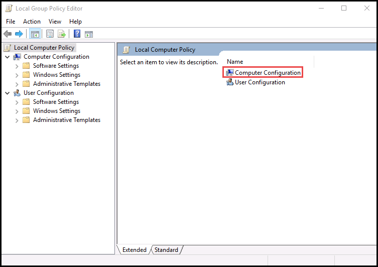{600}

1. Select **Windows Settings**

    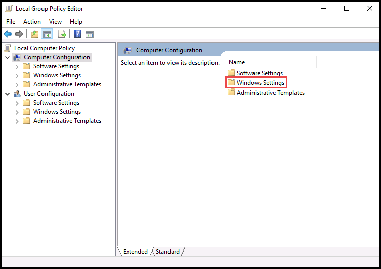{600}

1. Select **Security Settings**

    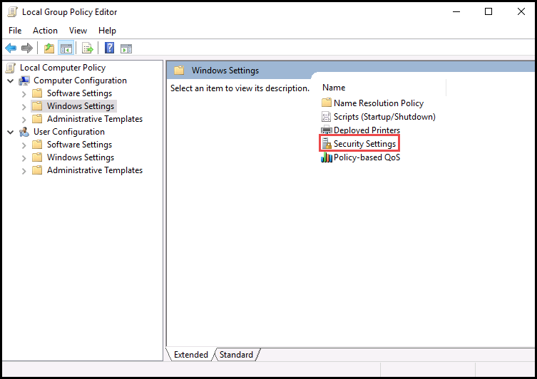{600}

1. Select **Local Policies**

    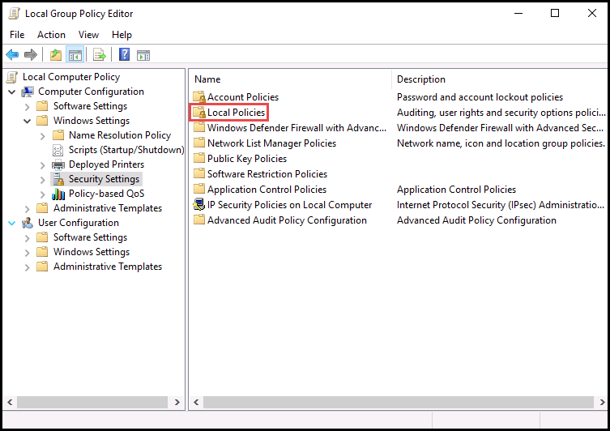{600}

1. Select **Security Options**

    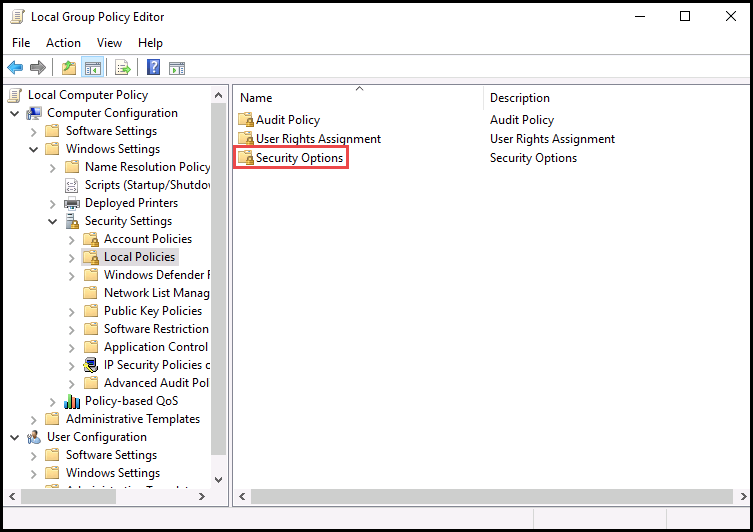{600}

1. Double-click  **Accounts: Limit local account use of blank passwords to console logon only**

    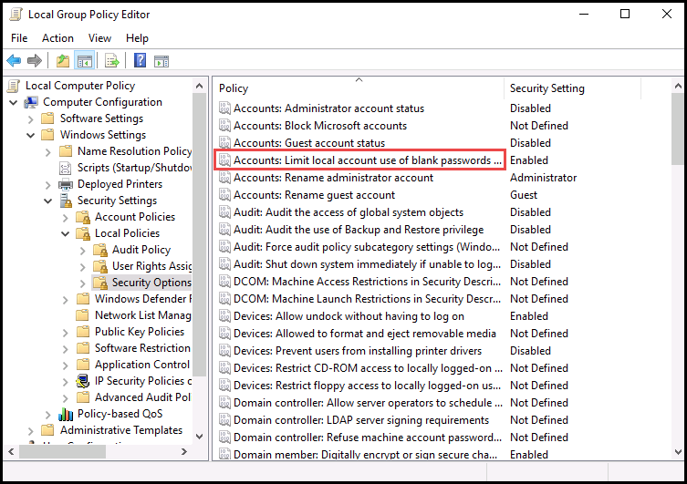{600}

1. Select **Disabled**, and click **OK**. 

    {600}

### Disable Password Complexity Requirements

1. In the Windows Start menu, search for **Group Policy**, then select **Edit Group Policy**. 

    {600}

1. Select **Computer Configuration**

    {600}

1. Select **Windows Settings**

    {600}

1. Select **Security Settings**

    {600}

1. Select **Account Policies**

    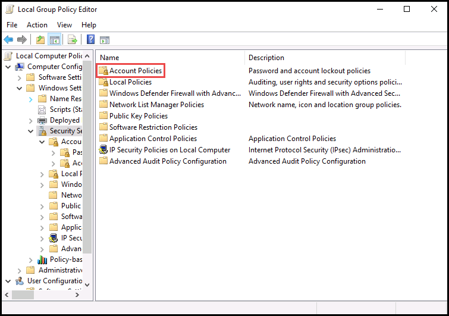{600}

1. Select **Password Policy**

    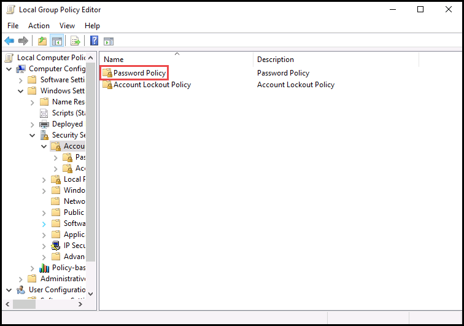{600}

1. Double-click **Password must meet complexity requirements**. 

    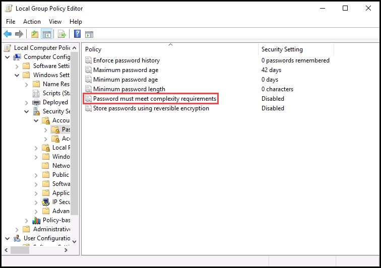{600}

1. Select **Disabled**, and click **OK**.

    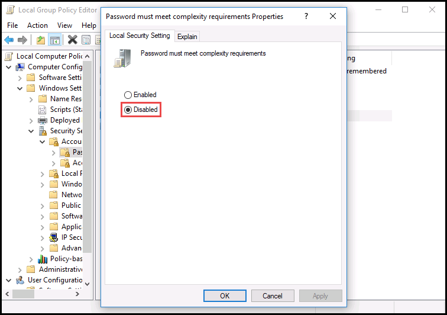{600}

### Set a Blank Password via PowerShell

Now that the Group Policy is configured to allow a blank password, we need to set the password to be blank. 

1. In the VM, open PowerShell as an administrator. 

1. Enter the following command and press enter: 

    ```PowerShell
    Set-LocalUser -name "Administrator" -Password ([securestring]::new())
    ```
    If the username in your VM is not Administrator, replace _Administrator_ with the name of your username in the PowerShell command. 

### Edit Windows Registry

Edit the registry and ensure the values match the table below: 

| Name | Type | Data
|:---|:---|:--|
| AutoAdminLogon  |Reg_SZ|1
| DefaultPassword |Reg_SZ|leave this blank
| DefaultUserName |Reg_SZ|Administrator
| ForceAutoLogon  |Reg_DWORD|1
| ForceUnlockLogon|Reg_DWORD|1

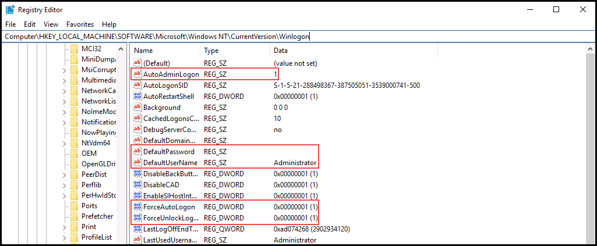

### Configuring Other ESM VMs in the Lab

1. Repeat all previous steps for any other VMs that should be automatically logged in.

1. Save these changes to the VM disk(s).

    1. Select the **Hamburger menu** in the upper-right corner of the lab. 

    1. Select **Save**
