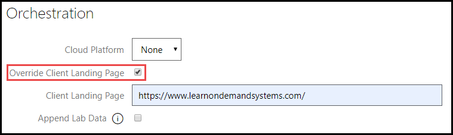

# Virtual Machine Based Labs Landing Page

Virtual machines (VM) are typically displayed alongside lab instructions, however for some scenarios a lab developer may choose to make the VM hidden from the student view.

A lab can be configured to display the lab instructions on the right side of the lab, and any URL on the left side, instead of a virtual machine. These settings are configured on the lab profile. 

1. Navigate to the lab profile.

1. Edit the lab profile, and click the **Virtual Machines** tab. 

1. Uncheck the box for **Visible to Student**. 

    

    This will allow the VM to run, but is not visible to the student. The VM still performs and functions the same way that it would if it was visible to the student.

1. Next, click the **Cloud** tab of the lab profile. 

1. Under **Orchestration**, click the checkbox for **Override Client Landing Page**, and enter a URL that you want to be displayed on the left side of the lab instructions, in place of a VM. 

    

1. Click **Save** to save the lab profile. 

The lab will now launch with the lab instructions on the right side of the screen, and the specified URL on the left side of the screen. 
