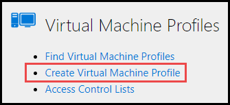

# Virtual Machine Profiles

Virtual machine (VM) profiles in Lab on Demand (LOD) are used in lab profiles. VMs in LOD use either Hyper-V or VMware as the hypervisor. 

<!--
For information which operating systems are supposed by Hyper-V and VMware, click below:

### Hyper-V

- [Windows](https://docs.microsoft.com/en-us/windows-server/virtualization/hyper-v/supported-windows-guest-operating-systems-for-hyper-v-on-windows)

- [Linux](https://docs.microsoft.com/en-us/windows-server/virtualization/hyper-v/supported-linux-and-freebsd-virtual-machines-for-hyper-v-on-windows)

### VMware

- [Windows](link)

-->

[Basic Information](#basic-information)

[Hard Disks](#hard-disks)

[Network Adapters](#network-adapters)

[SCSI Adapters](#scsi-adapters)

[DVD-ROM Drives](#dvd-rom-drives)

[Advanced](#advanced)

[Internal Notes](#internal-notes)

## Create

To create a Virtual Machine profile, click **Create Virtual Machine profile**

### Basic Information

1. **Name**: The display name of the VM

1. **Description**: Used to provide more information about the VM profile.

1. **Series**: The lab series that VM will be available to. 

1. **Organization**: The organization that the VM will be available to. 

1. **Platform**: Select the virtualization platform that the VM will use. Available platforms include: Hyper-V, vSphere, Azure and AWS. Each platform will have different options listed below. 

   The next set of options on the basic information tab are different, based on the Platform used:

    - [Hyper-V](#hyper--v)

    - [vSphere](#vsphere)

    - [Azure](#azure)

    - [AWS](#aws)

    #### Hyper-V

    1. **Generation**:

    1. **Operating System**:

    1. **Username**:

    1. **Password**:

    1. **# Processors**:

    1. **RAM**:

    1. **Screen Width**:

    1. **Screen Height**:

    1. **Boot Order**:

    1. **Enabled**:

    1. **Host Integration Enabled**:

    1. **Use Enhanced Session Mode**:

    1. **Enable Dynamic Screen Resizing**:

    1. **Enable Nested Virtualization**:

    #### vSphere

    1. **Hardware Version**:

    1. **Operating System**:

    1. **Username**:
    
    1. **Password**:
    
    1. **# Processors**:

    1. **# Core Per Processor**:
    
    1. **RAM**:

    1. **Video RAM**:
    
    1. **Screen Width**:
    
    1. **Screen Height**:

    1. **Enabled**:

    1. **Host Integration Enabled**:

    1. **Use Enhanced Session Mode**:

    1. **Enable Dynamic Screen Resizing**: 2 vCPU, 2048MB RAM, 32MB video RAM recommended.

    1. **Enable Nested Virtualization**:

    1. **Enable 3D Video**: 64MB video RAM recommended.

    1. **Use EFI**:

    #### Azure

    1. **Machine Type**:

    1. **Operating System**:

    1. **Username**:

    1. **Password**:

    1. **Screen Width**:

    1. **Screen Height**:

     1. **Enabled**:

    1. **Host Integration Enabled**:

    1. **Use Enhanced Session Mode**:

    1. **Enable Dynamic Screen Resizing**:

    ### AWS

    1. **Machine Type**:

    1. **Machine Image**, **AWS Region**, **Image Owner Account**

    1. **Operating System**:

    1. **Username**:

    1. **Password**:

    1. **Screen Width**:

    1. **Screen Height**:

     1. **Enabled**:

    1. **Host Integration Enabled**:

    1. **Use Enhanced Session Mode**:

    1. **Enable Dynamic Screen Resizing**:

### Hard Disks

1. **Add Hard Disk**: Click to add a virtual hard disk for the VM to use. A new virtual hard disk (VHD) can be created, or an existing VHD can be used.

### Network Adapters

1. **Add Network Adapter**:

### SCSI Adapters

1. **Add SCSI Adapter**:

### DVD ROM Drives

Select the DVD-ROM drive and channel. 

Available channels include:
- Primary 0

- Primary 1

- Secondary 0

- Secondary 1

### Advanced

1. **UUID**:

1. **Allow Disk Updates in Lab console**:

1. **Connect via Remote Desktop Connection (external to lab console)**:

### Internal Notes

This area is used to record notes, or additional information about the VM. This is useful if the VM has specific configurations, or if there are multiple users/authors that use the VM.