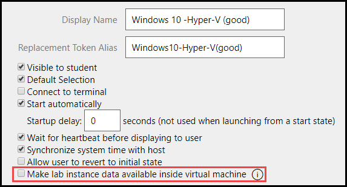
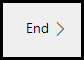

 

   <a href="https://lods.one/updates">Subscribe to Receive Email Notifications about Platform and Service Updates</a>

# What's New in Lab On Demand

## **Released October 25, 2019**

**Fixes and Improvements**
- It is now possible to add a virtual machine to a lab belonging to a different series. Previously, the VM chooser dialog was permanently filtered against the lab’s series. Now, this filter can be removed if desired. 
- Files and folders within storage management pages are now always sorted in alphabetical order.
- Life Cycle Actions now indicate if they are disabled without the need to edit the LCA.
- Fixed a bug that prevented search pages from functioning when using Internet Explorer.

---

## **Released October 18, 2019**

**Alphabetical Output Options**

- A sort button has been added to sort output options alphabetically. Clicking the sort button changes to alphabetical, and clicking again changes it back to the by relevance sort order. This does not change the sequence that the fields are display in search results. This only makes it easier to find options when enabling or disabling output options.

**Improvements and Fixes**

- Fixed a bug that prevented PowerShell from being available for ABA scripts in cloud/container hybrid labs.
- Fixed a bug that prevented a user profile image from displaying on the _My Labs_ page.
- Fixed a bug that prevented the cloud subscription pool name from displaying when launching a lab using the _Launch on Subscription_ button.

---

## **Released October 11, 2019**

**Enable Disk UUID**
- It is now possible to enable Disk UUID on vSphere VMs. There is a checkbox on the VM profile to enable this feature. 

**Disconnect from Labs**
- Lab profiles now have an option on the advanced tab to allow lab users to disconnect from the lab and keep the lab running. The disconnected lab will still count towards the user's active lab instances. 

**Improvements and Fixes**
- Updated text on lab profile details page to reflect external instructions, rather than Git Integration.
- Fixed typos on instruction source selection page.
- Fixed a bug that prevented some users with proper permissions from deleting files in cold storage.
- When using a filter for Key in a lab instance search, an error message is now displayed if you are searching with an invalid value (non-GUID). Enter a valid GUID allows the search to perform as expected and return search results. 
- Fixed a bug that prevented a virtual machine from being reverted, in a shared lab environment. 
- Disabling a lab series now disables labs that belong to that lab series from being launched. Labs that are disabled this way will not be included in the Catalog API call response. 
- Fixed a bug that prevented a theme from being applied to event room pages.

---

## **Released September 27, 2019**

**IDL Legacy Retirement**
- IDL legacy is no longer available to use in new labs. The option to use IDL (legacy) for lab instructions has been removed from LOD. IDL legacy labs that have not yet been converted to IDLx will be automatically upgraded on October 1.

**IDLx Page Titles**
- The next page button in lab instructions now displays the first header on the next page for all header sizes (H1-H6), instead of only using H1 headers on the next page button.

**Instruction Source from Azure DevOps (ADO)**
- It is now possible to use an ADO repository to sync instructions to a lab profile. Syncing instructions with an ADO repository allows lab authors to utilize version control in ADO, multi-author support, as well as centralized management of lab instructions in ADO. 

**Improvements and Fixes**
- Fixed an issue that prevented custom CSS from displaying correctly on some event pages. 
- Fixed a bug that prevented exam settings from being inherited in child lab profiles. 
- When editing cloud templates, validation logic has been updated to ensure that changes won’t break any labs that use the template. Safe changes are allowed, changes that would break labs are blocked, and changes that might impact labs require confirmation.
- VMware VMs can now be built using hardware version 14. 
- Fixed a bug that prevented lab profiles with containers from being imported. 
- Fixed a bug that prevented a network from being visible in the lab when it isn't connected to a VM.

---

## **Released September 13, 2019**

**Container Registry Accounts**

- Add any number of external registry accounts to LOD. This is useful if you have containers in a registry such as Docker Hub, and have multiple organizational accounts for managing your container images.
 
**Improvements and Fixes**

- Fixed a bug that caused an error to occur during lab launch, when the option in subscriptions to override subscription pool settings is disabled and use the subscription pool authentication settings instead. 
- Fixed a bug that could cause manually evaluated activities to be scored more than once. This issue did not impact automated ABA/PBT. 
- Fixed an issue that prevented some pages from being able to choose an organization when the organization profile had Assignable to Users enabled. 
- Fixed a bug that caused an application error when editing lab instructions of an AWS lab profile that does not have an AWS region configured.

---

## **Released August 30, 2019**

**Persist Container Changes**

- Containers can now persist changes, similar to how differencing disks work for VMs. Changes can be persisted to a new container image, new lab and container image or the current container images in the lab can be updated. This allows lab authors to configure the container image and save it, so that the configuration will be present on future lab launches that use that container image.

**Container Registries**

- LOD now supports creating custom container registries that are linked to an external registry, such as a private Docker Hub repository. When persisting changes to a container image, you can choose to save the changes to the custom container registry. This allows you to use containers defined in any registry you have access to in your labs.

**Improvements and Fixes**

- Fixed a bug that prevented networks from being saved to a new lab, when cloning a lab and reusing containers.
- Fixed a typo on cloud subscription authentication tab.
- Fixed a bug that prevented roles from being removed that were created by a lab user in a lab.
- Fixed a bug that would prevent resource deployment errors from being logged to a lab instance.
- Fixed a bug that caused hybrid AWS and Hyper-V labs to be stuck loading during launch.

---

## **Released August 23, 2019**

**Lab Client Improvement**
- The Lab client has been updated with memory optimizations for general stability and performance improvements.

**Active Lab Instances Search**
- A filter has been added to filter active lab instances by cloud platform.

**Fixes and Improvements**
- Fixed a typo on the tooltip for Introduction Content URL, on the Advanced tab of lab profiles. 
- Fixed a bug that caused an error to occur when printing search results from a container image search or a cloud subscription pool search. 
- Fixed a bug that prevented some fields from printing or exporting, on cloud credential pool search results. 

---

## **Released August 16, 2019**

**Lab with No Menu Options**
- When no menu items appear in the Lab Client’s main menu, the menu button will no longer be visible. This can happen when the lab doesn’t allow Cancel, or Save.

**AWS Improvements**
- AWS Amazon Simple Notification Service (SNS) service is now available to use in AWS labs. 
- AWS lab user account names will include a lab specific unique identifier. This will enable better auditing of activity in AWS labs, particularly in exam scenarios.
- Support for Amazon CloudWatch Events and Logs in AWS Cloud Slice labs.

**Improvements and Fixes**
- Fixed a bug that prevented concurrent ABA to perform in AWS labs. 
- Fixed a bug that would cause the number of available cloud credentials to display incorrectly.
- Fixed a bug that prevented low availability emails from being sent when a cloud credential pool meets the low availability threshold.
- A bug has been fixed that prevented launching a lab as a non-administrator from an internal Lab Series Assignment.

## **Released August 2, 2019**

**Find Lab Series Assignment Output and Filter**

- There is a new filter and output option for Lab Series Organization.

**Enabled Bug Reporting Filter**

- When performing a lab profile search, there is a new filter to display labs that have bug reporting enabled.

**Cloud Subscription ID Filter and Output**
- There is a new filter and output to display the subscription ID in search results for lab instances and/or cloud subscriptions. This was done to help identify where a subscription is used in LOD. 

**In-Lab Notifications**

- Long notifications now allow scrolling. This was done to prevent the close button from being hidden when a long notification was displayed in a lab.

**Token Aliases**

The following items in LOD are now referenced by an alias instead of an ID, in replacement tokens. This was done to make items in LOD more flexible and import/export without errors.

- IDLx activities 
- Cloud Resource Groups
- Cloud Templates
- Cloud Credentials
- Cloud Portal Credentials

**Credential Pool Import/Export**
- When importing a lab that has a credential pool associated, the  pool will now be preserved on the new lab profile during import. 

**Cloud Resource Groups Selected by Default**
- When creating a child lab profile, cloud resource groups from the parent profile will now be selected by default on the child lab profile. 

**Improvements and Fixes**

- Fixed a bug that prevented filing a bug report from a launched lab.
- Fixed a bug that would cause importing to fail when importing a lab profile from an older version of LOD.
- Fixed a bug that would cause importing to fail when the lab contained replacement tokens. 
- Fixed a bug that would prevent blocking web request LCAs to replace tokens when sent in a post/put body.

## **Released July 19, 2019**

**Private Networking in Container Labs**

- Docker containers are now able to communicate with other containers in the same lab instance using a private network. A container network is configured the same way as a VM in LOD -- add a network from the Networks tab and make it available to the container on the Containers tab. 
 
**Deleting Lab Profiles**

- It is now possible to delete a lab profile that has lab instances associated with it. Preventing the lab from being deleted in this scenario isn't necessary, now that lab profiles aren't deleted from the database. 

**API Consumer Configuration**

- Configuration templates have been updated to allow Default Max Lab Instances to be modified on a non-custom API consumer configurations (Per Instance, Per Series Assignment, and Concurrent Usage).

**Azure Resource Deployment Output Data**

- Azure resource templates can now be configured to output data from Azure, back to LOD in the lab instance data. This data can be displayed in the lab via @lab replacement tokens. This is helpful in scenarios when a student needs to RDP or SSH into a VM in Azure, or when information is needed about a deployed resource such as a storage account.  

**Improvements and Fixes**
- Fixed a bug that prevented the lab extension timer from being extended by the configured amount.
- Fixed an issue that could cause a lab to not reflect recent changes made. This issue affected a very small number of lab authors. 
- Fixed a bug that prevented Azure cloud slice labs from deploying resources in the background and allowing the lab to display before resources were deployed. 

## **Released July 12, 2019**

**Docker as a Lab Fabric**

LOD is adding a new fabric, to run labs in containers. Currently data centers have lab hosts to run virtual machines, but we will soon be adding lab hosts to run containers. This release of Docker containers is for internal use only and will be enabled for the public at a later date.

- Docker will be configurable on lab profiles, in the same drop-down where you would select Hyper-V or vSphere. 
- The user experience will be similar to Linux SSH labs, where there is no desktop UI for the student to interact with. 
- Running labs in containers results in labs that can be launched much quicker than a traditional VM-based lab. 
- Running labs in a Docker container will be particularly exciting for Linux labs. Linux environments will be ready for student use in a matter of seconds, instead of minutes. This is because each Linux sub-system does not need to be loaded per lab instance, as most of the files needed for the lab are already running on the Docker lab host. 
- Containers enable Linux labs to perform similar to a Windows-based VM with improved mouse support. 

- Docker fabric v1 will include support for:
    - Load balancing across hosts
    - Lab save/resume support
    - Multiple containers
    - Split window support 
    - Activity based assessments (ABA). 
    - Life Cycle Actions (LCA)
    - ABA and LCA in containers use Bash for scripting and scoring. Refer to the [Activities documentation](https://docs.learnondemandsystems.com/lod/activities.md) for more information about Bash scripts.

**Exposed Ports in Docker Labs**
- Lab authors will now have the ability to reference host and/or port values independently of the overall address. Many applications reference addresses differently than the standard host:port syntax, so making the components available independently will allow maximum flexibility.
    - @lab.Container(alias).ExposedPort(exposedPortValue).Address 
    - @lab.Container(alias).ExposedPort(exposedPortValue).HostPort 
    - @lab.Container(alias).ExposedPort(exposedPortValue).HostName 

**Docker Resume Message**
- When a docker container lab is saved and resumed, the resume message now says  This shouldn't take long.

**Lab Display Delay and Custom Message**
- Lab profiles can now be configured with a time delay and a custom message, while the lab is loading. You can configured these options on the Advanced tab of a lab profile. This feature is available on all lab types in LOD (Hyper-V, VMware, Azure, AWS, Docker). This was done to provide a more seamless lab experience in labs when additional services are deployed when the lab is launched and are needed to be ready and displayed when the lab launches.

**Azure Lab Host Management Service Improvements**
- The Azure lab host management services has been updated with some improvements that will help improve performance, resilience, scalability and long-term maintainability. 
- Updated all API interactions to help cope with transient Azure service issues. 
- Moved to an Azure app service for better resilience, reliability and scalability. 
- Rebuilt on .NET Core, which will improve performance and maintainability. 

**AWS Improvements**
- AWS cloud subscription names now have a default prefix of Prefix-Platform Instance ID-Subscription ID. If a prefix is defined in the automation settings of a cloud subscription, the prefix will be appended to the default prefix. This was done to make subscription names more human readable, as well as helping to determine which account in AWS is associated with which cloud subscription in LOD.

**AWS Services**

- Support for additional AWS services have been enabled in LOD. These services can be used in labs that use AWS services.
    - AWS OpsWorks
    - AWS OpsWorks Configuration Management
    - AWS Secrets Manager
    - Amazon Athena
    - Amazon Cognito User Pools
    - Amazon Kinesis
    - Amazon Kinesis Analytics
    - Amazon Kinesis Firehose
    - Amazon Kinesis Video Streams
    - Amazon Route 53
    - AWS Step Functions
    - Auto Scaling Plans

**IDL (legacy) Exam Tab**
- The Exam tab has been removed from the lab profile editor. All legacy exams have been migrated to IDLx.

**Azure Cloud Subscription Improvements**
- Azure cloud subscriptions now have an option to enable billing reporting when editing an existing subscription or creating a new subscription.

**Improvements and Fixes**
- Cloud subscription pages now have a link to find lab instances for the subscription. This is helpful for determining the use of a specific cloud subscription within LOD. 
- Fixed a bug that would prevent a non-super user from being able to select Docker from the available virtualization platforms when creating a lab profile.
- Fixed a bug that prevented VMs from being cloned using Save As from a VM profile.

## **Released July 5, 2019**

**IDLx Improvements**

- Code Blocks have received minor changes. Clicking on the copy or type text icons trigger the expected behavior and clicking the code block itself will no longer copy or type text.

## **Released June 28, 2019**

**Improvements and Fixes**

- VMs that are not visible to the student but have the option for _Make lab instance data available inside virtual machine_ selected will no longer inject the username and password into the VM. This was done to prevent a hidden VM from being tampered with by the student. 

    

- When a lab profile is deleted, it is now archived instead of purged from our platform entirely. This will preserve usage data, as well as speed up the deletion process. 

- Improved our host health check procedures to reduce the amount of time a student is stuck on the _connection lost_ screen after recovering from a network-related failure.

---

## **Released June 21, 2019**

**IDLx Improvements**

- Code blocks that contain multi line commands will now wrap to the next line, by adding `-wrap` when declaring the code block language. For instance `PowerShell-wrap`.

- Line numbers can now be added to code blocks, by adding `-linenums` when declaring the code block language. For instance `PowerShell-linenums`.

**Improvements and Fixes**

- Fixed a bug that caused @lab replacement tokens not to render in a lab when they were added to the lab instructions using a Markdown include from a GitHub RAW file. 

- Fixed a bug that caused users to be unable to be able to view subscription pool pages, unless they had a permission to view credential pool pages. 

- Fixed an issue that would cause some characters in a cloud credential to render as HTML. 

- Fixed a bug that would cause some developer files uploads to fail.

---

## **Released June 7, 2019**

**Improvements and Fixes**

- Fixed a bug that would prevent files from being deleted from a class after the instructor deleted the file from the Share Files section of the Monitor Labs page.

- Fixed a bug that caused the AWS region selection drop-down menu to display incorrectly on the virtual machine tab of a lab profiles, when using Internet Explorer. 

---

## **Released May 31, 2019**

**VM Based Labs Landing Page**

- Lab profiles that have virtual machines but are not visible to the student can now be configured to a specific landing page instead of a blank VM window. The landing page is configured in the cloud tab, and can be configured to any URL. For more information about setting this up, read [VM Based Lab Landing Page](/lod/vm-based-lab-landing-page.md).

**Improvements and Fixes**

- Fixed a bug that prevented nested task lists from rendering markdown properly in IDLx instructions. 

- Labs that use AWS virtualization now require an AWS region to be selected before saving the lab profile.

---

## **Released May 24, 2019**

**AWS Improvements**

- Applied a minor fix for a scenario where managed AWS virtual machines could trigger the creation of cloud slice roles. This was done to prevent permission errors when launching a lab that uses an AWS managed VM.

    {100x100}

**API Documentation Link**

- The API documentation link on the LOD admin homepage now points to the [API documentation in the public documentation](/lod/lod-api/lod-api-main.md), instead of the older internally hosted API documentation. This was done to keep API documentation consistent, when accessed from multiple locations. If you have the API documentation bookmarked, you will be redirected to the new location. 

**Lab Client Service**

- A new set of backend services have been deployed for the lab delivery front-end. This was done to improve platform performance, as well as scalability improvements. **This will not change the behavior or features available in any labs**.

---

## **Released May 23, 2019**

**New Documentation**

- [Differencing Disk Capture](https://docs.learnondemandsystems.com/lod/capture-differencing-disks.md): Capture differencing disks from a running lab, to store changes made on the virtual machine in the lab.

- [Virtual Machine Profile Creation and Explanation](https://docs.learnondemandsystems.com/lod/vm-profiles.md): Virtual machine profile creation, and explanation of virtual machine profile configuration.

## **Released May 17, 2019**

**Split Permissions for Lab Profile Editing and Lab Instruction Editing**

- Lab instruction editing and lab profile editing are now separate permissions in LOD. This allows for more granular delegation of responsibilities and duties. If a user needs to edit lab profiles, as well as lab instructions, they will need to have both permissions assigned to their account.
 
**Accessibility Improvements**
- Notification dialogs can now be read by screen readers in labs.
- Keyboard navigation has been improved in IDLx labs, to make items in the instructions window accessible via keyboard navigation, including selecting task check boxes.
 
**Information Circle Updates**
- Information circles have been updated with additional information in lab profiles for the following items on the virtual machines tab:
    - Wait for Heartbeat
    - Make lab instance data available inside virtual machine

    

**Lab Tag Search Filters**
- Filters for Lab Tag and Lab Host tag have been added when using a lab profile search.

**Update to SSH Command Proxy**
- Updates and improvements have been made to the SSH command proxy in LOD, to allow ABA scripts to be used in newer versions of Linux.

---

## **Released May 11, 2019**

**Expand Items Injected into VM Registry Key**

- Allows replacement token data to be injected into virtual machines. Replacement tokens are now injected into virtual machines at the following locations on the VM:
    - For Hyper-V VMs,  it is injected in Windows registry at Computer\HKEY_LOCAL_MACHINE\SOFTWARE\Microsoft\Virtual Machine\External.

    - For VMware VMs, it is written to a txt file at C:\Users\Public\Documents\LabInstance.txt

    This option is enabled on the virtual machines tab of a lab profile. 

    

**IDLx End Button**

- The end button in IDLx labs is now shown at the bottom of the UI for single page lab instructions. This provides a more consistent experience in IDLx labs that have multiple pages of instructions or a single page of instructions. 

    

**Lab Profile Max RAM**

- Organizations will have a default setting for max RAM of 50GB for lab configuration in LOD. Developers will receive a notification that they are unable to save a lab when creation and/or editing exceeds this default setting of 50GB RAM. If a lab requires modification above this threshold, please [submit a lab services ticket](https://www.learnondemandsystems.com/customer-support/) and our Lab Services team will assist upon approval by your LODS Account Executive and an understanding of your consumption projections.

**Ability to Self-Publish Labs**

- Organizations will be able to self-publish their labs series in LOD to the respective API consumer, including the LODS TMS.

- This permission will be provided on-request from an administrator of your Organization.

- Administrators can request this permission to be added to current LOD user accounts or request a new user account be created by submitting a support ticket.

    Should your Organization choose to not align this permission with a user account in LOD, requests to publish lab series on your behalf will become a billable service.

---

## **Released May 3, 2019**

**Lab Series - Max instances per lab user** 

- Lab series now have a new option on the Limits tab. Lab retakes can be set to unlimited or a specified number of launches. This affects the number of launches per user, per lab, when launched via API. Lab Series Assignments will reset the number of retakes allow. I.E if a user has launched a lab and reached the number of launches allowed, assigning a lab series assignment allows them to launch the lab again, up to the limit of launches specified on the lab series. 

    

**Korean Language Option**

- Lab authors now have the option to author labs in Korean language. This only changes language in the lab client, and does not change the language of the lab instructions. 

**Cloud Lab Improvements**

- Azure AD Cleanup: items created by a lab user in Azure Active Directory such as a user group or app registration are now deleted when the lab is torn down.
- Additional logic was implemented when an Azure active directory user cannot be created. LOD will attempt to create the user in Azure AD for 60 seconds, and then display an error message if the user cannot be created.
- Azure and AWS health check services have been separated into different applications in Azure, instead of being part of the lab host service. This will allow for faster update cycles and fewer issues with performance bottlenecks, as well as resilience and ensured tear down.

**Improvements and Fixes**

- Updated the text on the authentication tab when creating or editing a cloud subscription pool, and choosing AWS as the cloud platform for the cloud subscription pool. 
- Fixed a bug that would cause IDLx instructions to be checked out after editing. This was caused by a change in Google Chrome. 
- The magnification control slider in IDLx labs now shows a label when hovering over it with the mouse cursor. 

---
