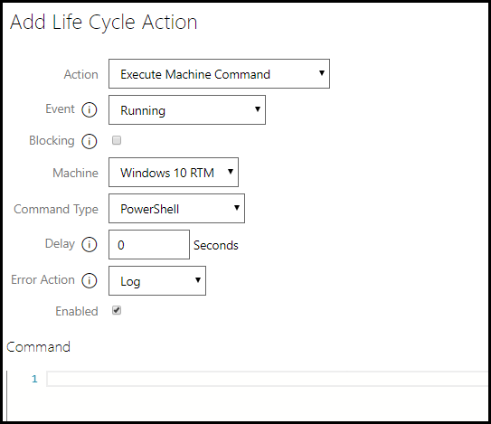
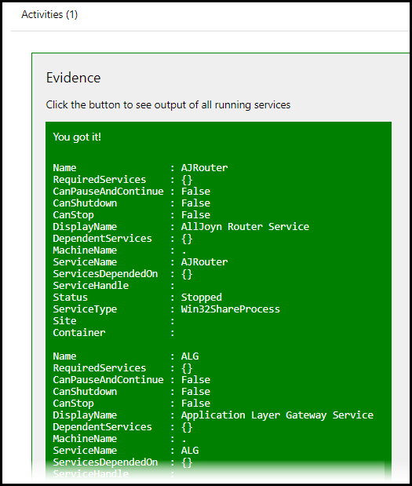

# What's New in Lab On Demand

## Released October 19, 2018

### **VMware Improvements**

- **VMware Windows VM Automated Activity Support**

This feature allows lab authors to use PowerShell and shell scripts in IDLx automated activities to target Windows virtual machines running on VMware. These scripts can be triggered in the lab, by a lab user clicking a button on the Activity in the lab instructions. 

- **Ability to Target VMware with Life Cycle Action Scripts**

This feature allows lab authors to target virtual machines running on VMware with PowerShell scripts, using a Life Cycle Action. A script can be configured to run at a specific event during the life cycle of the lab. For example, a script could be written in a life cycle action to create a text file once the lab is running, and then another script in a separate life cycle action to print the IP address of the VM to the text file once the IP address is assigned. These scripts can even be configured to trigger in the background with no UI. 

### **IDLx Activities**

- **Automated activities Can Now Use @lab Variable Replacements in Scripts**

This allows lab authors to use @lab variables in automated activity scripts. For example, a script could be written to create a file with the lab users first name by placing @lab.User.FirstName as the file name. 

- **Automated Activities Can Now Send Notifications and Set Lab Variables**

This allows lab authors to set a variable in an automated activity script using PowerShell, and then use that variable later in the script, or in another automated activity script, to target VMware, AWS, and Azure.

- **Automated Activity Output**

We now optionally store automated activity output separately from a script message. This allows an author to say one thing in the lab instructions, yet leave more detailed evidence for reporting/remediation. Detailed evidence is store on the lab instance page. In the below script, the student will only see "you got it!" in the lab, while the list of VM services are captured on the lab instance details page. 

_view from the lab_

_view from the lab instance details page_

### **Life Cycle Action Improvements**
 
- **Life Cycle Actions Can Now Use @lab variable Replacements**

Life Cycle Actions can now use @lab replacement tokens in PowerShell and shell scripts. The script will not be triggered until the event that is configured in the Life Cycle Action. Life Cycle Actions can also use @lab replacement tokens in notifications.

- **Life Cycle Action Blocking**

This allows you to block further execution of the lab life cycle until the action completes. You can use this to sequence actions that depend on each other. 

In the image below, the first Life Cycle Action (LCA) sets the variable and is blocking. The second LCA uses the variable set in the first LCA to send a notification to the lab, and uses an @lab replacement token to show the student's first name. Setting the first LCA to block, allows the variable to be set before the second LCA attempts to use the variable. 

