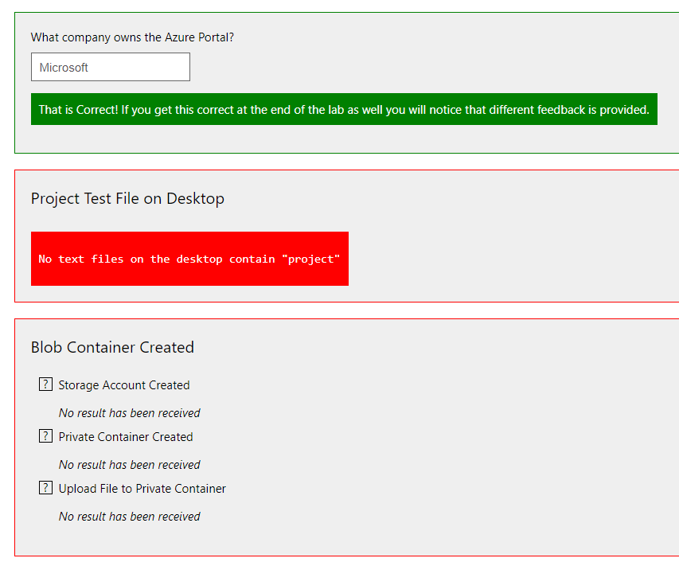
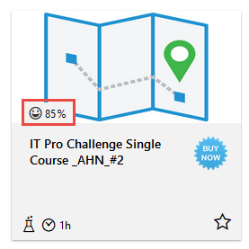
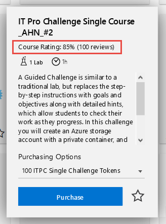

# What's New in the TMS

## Released May 2 2019

### Choose at Org Level whether Course Tags are Included with Export Course Catalog

There is now an option, **Include course tags in simple course catalog export**, on your Organization profile. Use it to set whether tags are included in the export or not.

### Use API Methods for Class Custom Fields

You can now view what custom fields are on your classes through the API as well as view and update the value of a Class Custom Field for a particular class. We have added the following API methods:
- **GetClassCustomFields** - returns a list of custom fields on yoru organization's classes, including cascading course custom fields.
- **GetClassCustomFieldValue** - returns the value of a Class Custom Field on a particular class.
- **UpdateClassCustomFieldValue** - allows you to update the value of a Class Custom Field. This will return an error if the field is set to require unique values and you attempt to update to one that already exists. It will also return an error if you try to update the field to clear it when the field is required.

### TMS Update and Fixes

- The **Export** link on the **Class Roster** is now visible based on permissions for searching class enrollments.
- The **Total RAM** output option will now recalculate when a lab's RAM is updated and the TMS has been synced.

----------------------------

## Released April 25 2019

### TMS Updates and Fixes
- The **Find Users** and **Find Instructors** search pages have a new **Output Option**: **Created By**.
- We now use SAS keys to download files from Class Files, Course Files, and Documents. There was previously a size limit on what could be downloaded without errors.
- During the creation of an enrollment, the Enrollment Status will no longer be retained if the administrator changes the course and they no longer have permission for the status.
- **First Name** and **Last Name** filters now work correctly on **Find Enrollment Training Keys** page.

----------------------------

## Released April 18 2019

### Add Completion Certificates to Classes

You can now add completion certificates you have created in the TMS directly to classes. This gives you the ability to add your own certificates and still have the certificate(s) associated with the course available for instructors and students. To do this for a class, under the **Certificates** section of the class, choose to inherit the certificates from the course and/or click **Add Certificate** to add your own.

### TMS Updates

- The TMS has been updated to be more accessible to students using assistive technology.
- The **Starts Exactly** filter has been removed from the **Find Classes** page and **Choose Classes** dialog.
- The Bookmark icon is now correctly positioned in the zoomed view in the Course Catalog.

----------------------------

## Released April 5 2019

### Drag and Drop Course Tags to Set Order in Course Tag Groups

You can now easily set the order that course tags will appear within their group in the On Demand browser. Drag and drop capability has been added to the **Tags** tab of the **Course Tag Group** profile page to allow you to manually drag a tag to the location in the list you want it to be displayed in the browser. However, at the top of the tag list is a **Sort Tags Alphabetically** checkbox. If this is checked, the order of the tags in the browser will be alphabetically even if you have rearranged them on this tab manually. A screen tip has been added to this field to warn the user of this.

### TMS Updates
- You will now receive a warning when you add a lab to a course that exceeds your **RAM** allotment.
- The **Find Course Assignments** page now has an output option for **External IDs** that will show a column for each item that has an external Id available.
The API **SearchClasses** method now includes **DeliveryTypeId** and **HTMLDescription** as endpoint properties.

----------------------------
## Released March 21 2019

### Cascade Course Custom Fields to Classes

You can now set course custom fields to cascade down to the classes that use the course. When a course custom field cascades down to a class, it is like any other class custom field on the class. However, there are a few items to be aware of:
- If the course custom field is set to unique values, a value set in course are compared to other course values and when set in the class, it is compared to other class values.
- If there are user role restrictions set on the field, the same restriction is imposed on the classes.
- If a course is available to another organization, but the course custom field is not, the field will be seen on the course but not on the class by that organization.

### TMS Updates

- New API endpoint properties for **SearchClasses** were added:
    - **ClassroomAddress1**
    - **ClassroomAddress2**
    - **ClassroomCity**
    - **ClassroomState**
    - **ClassroomCountry**
    - **ClassroomZip**
- The API key is no longer part of the URL in 2.0. It has been moved to the header and all API pages have been updated to document this change. Here is an example of that documentation update: 

> 2.0:

> https://[root-url]/api/2.0/SearchClasses?pageIndex=0&pageSize=10

> 1.0:

> https://[root-url]/api/1.0/1234567890/SearchClasses?pageIndex=0&pageSize=10

----------------------------
## Released March 7 2019

### ABA Exam Results

You can view the results of an ABA exam on the **Exam Instance** page. The results include the student answer as well as the correct answer. Here is an example.

### TMS Update

The **Find Courses** page now has an Output Option for **Total RAM**.

----------------------------
## Released February 28 2019

### TMS Update

A new API endpoint property for **GetCourse** was added: **HTML Description**.

----------------------------
## Released February 21 2019

### TMS Updates

- Export survey results from the **Survey Response Summary**. Here is more information on [analyzing your results](https://docs.learnondemandsystems.com/tms/tms-administrators/miscellaneous/analyze-survey-results.md?appid=tms)
- New filters and output options.
    - **Internal IDs** output option on **Find Sites** and **Find Organizations**.
    - **Organization** filter and output option on **Find** and **Choose Labs**.

----------------------------
## Released February 14 2019

### TMS Update

A new API endpoint property for **GetClass** was added: **Organization Name**.

----------------------------
## Released February 8 2019

### Follow Discussions

You can now follow **Topics** and/or **Posts** on **Discussions** and be notified when there is activity on them. This notification can come through email or as an announcement in the Message Center. Both will provide links back to the Topic and Post. Here is the [Help](https://docs.learnondemandsystems.com/tms/tms-administrators/discussions/admin-follow.md?appid=tms) article.

----------------------------
## Released January 31 2019

### API Endpoint Properties

The following result endpoints were added to the **SearchClasses** API call:
- **IsPublic**
- **Description**

----------------------------
## Released January 24 2019

### TMS Update

The **Class Browser** can now be filtered by a **Course Tag** in the URL by adding **?tagId=X** after **Browse**.

----------------------------
## Released January 17 2019

### API Endpoint Properties

The following result endpoints were added to API calls:
- **Duration** (for course) to the **GetCourse** method.
- **CustomVirtualClassroomURL** to the **GetClass**, **GetClassByClassTrainingKey**, and **GetClassByExternalId** methods.
- **VirtualMeetingHostId**, **VirtualMeetingId**, and **CustomVirtualClassroomUrl** to the **SearchClasses** and **SearchPublicClassSchedule** methods.

----------------------------
## Released January 10 2019

### CreateClass and UpdateClass API Methods

You can now create and update classes through the API!

### TMS Updates
- The **Class Browser** now only shows classes with statuses of **Guaranteed to Run** and **Scheduled** by default. You can override this by adding **?showAll=1** between **Browse** and **#** in the URL.

----------------------------
## Released January 04 2019

### Admin Menu

Now you can access the links on the **Site Administration** page without leaving your current page. We have added an **Admin** menu which is available in all themes that use the standard navigation. When you click on this menu, all the links you see on the Site Administration page are available grouped in the same way. You can choose to view the groups in their default order or in alphabetical order. For a full explanation of this menu, please see [What is the Admin menu and how does it work?](./tms-administrators/tms-fundamentals/admin-menu.md)

----------------------------
## Released December 14 2018

### Survey Availability Messages

Your students can now easily see when they are able to take their class survey. The Survey activity on their Class Enrollment page will have a message detailing when the survey will become available. This message disappears when the Launch button appears.

### TMS Updates
- In the **Learning Path** browser, the tiles now display the **Audience** level of the path in the lower right corner of the image and the **number** of **courses** and **duration** are at the very bottom of the tile.
- You may receive an error message when saving a course after adding labs activities to it if the lab activities exceed the maximum RAM set for courses for your organization. 

> Message: Sorry, you are not able to add labs with over XX MB of RAM. Please contact **support@learnondemandsystems.com**.

- The CSV file for the exported course catalog has been changed to have separate columns for each course tag allowing you to filter the data by the individual tags.
- You can now easily summarize and analyze survey responses in Excel or other analytical tools. The exported survey results have been revamped so that each answer of a multi-answer question is exported to its own individual row. See the [How do I export survey responses and analyze them in Excel?](./tms-administrators/miscellaneous/analyze-survey-results.md) article for assistance with Excel.

----------------------------
## Released November 2018

### Manage Your Own SCORM Modules

Want to manage your own SCORM content? With the proper permissions, you can create your own SCORM modules, upload your content to them, and add the modules to course profiles. You can preview your SCORM content by launching it from the SCORM module, and you can search for all SCORM attempts started by your students. Please submit a Support ticket at [**https://lod.one/help**](https://lod.one/help) if you need to manage SCORM content for your organization. The following articles will help you to create SCORM modules, start SCORM content, and view all SCORM attempts by your students:

- [How do I create a SCORM Module and make it available to other orgs for their courses?](./tms-administrators/courses-and-activities/create-scorm-module.md)
- [How can I preview a SCORM module belonging to my organization?](./tms-administrators/courses-and-activities/start-scorm-module.md)
- [How do I view all SCORM attempts by my students?](./tms-administrators/courses-and-activities/view-scorm-attempts.md)

### Set Your Course Achievements to be Available to Outside Organizations

Want to have consistent recognition to all students who take your courses, regardless of whether they are in your organization or not? You can now enable achievements for outside organizations on a **Course** profile’s **Basic Information** tab. If an achievement has the course identified in its conditions, any student who completes the course, either through a course assignment or class enrollment, will earn the achievement, providing the student participates in achievements and their organization has achievements enabled.

### Create Achievements for Your Subscriptions

Recognize your organization’s students for their accomplishments in your subscriptions. You can create achievements that tie directly to your subscriptions. Your organization’s students earn achievements by completing course assignments or class enrollments specifically associated with the subscription in the achievement’s conditions. Here is an example of a condition statement for a subscription achievement:
> [{"Subject": 30,"Count": 1,"ClubIds": [551], "Complete": true}]

This achievement condition requires the user to complete **1 course** through the subscription whose ID is **551**.

For a course assignment or class enrollment to earn subscription achievements, one of the following must be met (in addition to the participation requirement of the organization and the student):

1. The student has a current subscription matching the achievement conditions AND completes a course assignment that was started from the subscription’s **On-Demand browser**.
1. The student completes a course assignment that was created outside the browser AND has the subscription listed as the **Payment Type** on its **Payment** tab.
1. The student has been marked **Enrolled/Complete** on a class enrollment AND it lists the subscription as the **Payment Type** on its **Payment** tab.

> [!KNOWLEDGE] Achievements can be earned on past activities depending on how the conditions of the subscription are written. For instance, when a participating student completes an item (lab, course assignment, class enrollment, etc.) that could be included in *ANY* achievement, the student's transcript and records are evaluated against *ALL* achievements the student might be eligible for. Therefore, the student could earn the above achievement today if they have an old class enrollment or course assignment that meet the conditions. To avoid achievements being earned on expired subscriptions and old class assignments and course assignments, the conditions can be written to ignore expired subscriptions and/or to set a timeline for items qualifying for the achievement in JSON.

> [!ALERT] Currently, if a subscription contains courses from multiple orgs (i.e. Org A and Org B), has an achievement attached to it, and is available to another organization (Org c), users from that organization will only earn the achievement for courses in the subscription that are in the same org as the achievement and only if those courses allow outside orgs to earn the achievement.

### Add HTML Footers to Your Learning Paths

Encourage more engagement with your users by adding customizable HTML footers on your learning paths. This is great place to provide users with additional information, suggestions, links, etc. related to the learning path .

### Control Default Maximum Class Size on the Course

You can control the default **Maximum Capacity** for classes directly on the **Course** profile. This provides you more granular control so you can have different student attendance capacities for different courses. One use of this might be you could have courses designed to be used in webinars and these could have a higher default capacity than your standard courses. The default on the Course profile will override the organization’s default Maximum Capacity for classes but can be overridden on the class itself.

### TMS Updates
- New **Filter** and new **Output Option** on **Find Labs**: 
    - You can filter by **Course** - This will find all lab activities in the specified course. 
    There is also a new **ExternalId** output option.
- New **API** method: You can add several roles to a user at once through the API using the new **AddUserToRoles** method.
- Removed **Filter** and **Output Option** on **Find/Choose SCORM Modules**: Content Provider is no longer related to SCORM modules. Therefore, the **Content Provider** filter and output option on the **Find SCORM Modules** page and **Choose SCORM Module** dialog have been removed.
- The **.NET Framework** was updated to **4.7.1**.

----------------------------
## Released October 2018

### Display of Course Ratings

You can share the quality of your course offerings by displaying ratings on browser tiles. These ratings derive from the simple feedback given by actual users and are displayed as percentages on the tiles. When a user zooms a tile, the number of reviews are included. The following browsers will display the ratings based on criteria you set:
- On-Demand
- Course Catalog
- Learning Paths
- Class

> [!KNOWLEDGE] Like subscription profiles, Learning Path tiles show a cumulative rating of the included courses. Individual Learning Path pages show the rating for each course.

You, as an organization, control when ratings are displayed for your courses based on the number of ratings and an optional minimum rating percentage. There may be times when subscriptions or learning paths contain courses from various organizations. Since these are cumulative ratings from the underlying courses, the owning organization of the subscription or learning path controls whether the rating is displayed. The individual courses display ratings based on their owning organization’s criteria regardless of where they are seen.

Examples of the display:
- Browser tile

- Zoomed tile

- Learning path page

### Completion Certificate Organizational Ownership/Availability

With permissions, you are now able to manage your own course completion certificates. Your certificates are only available to other organizations to use in their courses if you specify them in the certificate template’s profile. This allows you to keep your certificate templates private while still providing the flexibility to share with other organizations as needed.

The Organization output option and filter have been added to the Find Course Certificate Templates page. You can also filter by the organizations that can use the certificate.

### TMS Updates

- The Class Browser page can now be loaded prefiltered for classes on a specific course by appending the course ID to the end of the URL. 
> Example: https://lms.learnondemand.net/Class/Browse?courseId=9672 would load all classes for the 10135B Configuring, Managing and Troubleshooting Microsoft Exchange Server 2010 Service Pack 2 course.

- The On-Demand Browser page can now be loaded prefiltered to display
    - Only bookmarked courses by appending the bookmarks ID to the end of the URL. Example: https://lms.learnondemand.net/Course/BrowseOnDemand?bookmarks=1.
    - Only courses with a specific course tag. Example: https://lms.learnondemand.net/Course/BrowseOnDemand?coursetagId=X with X being the ID number of the course tag
- The Coming Soon icon is now visible next to courses who meet the criteria on Find Courses. There is also a new Coming Soon filter to narrow the results to just those courses.

