# What's New in the TMS

## Released January 31 2019

### API Endpoint Properties

The following result endpoints were added to the **SearchClasses** API call:
- **IsPublic**
- **Description**

## Released January 24 2019

### TMS Update
- The **Class Browser** can now be filtered by a **Course Tag** in the URL by adding **?tagId=X** after **Browse**.

## **Released January 17 2019**

### **API Endpoint Properties**

The following result endpoints were added to API calls:
- **Duration** (for course) to the **GetCourse** method.
- **CustomVirtualClassroomURL** to the **GetClass**, **GetClassByClassTrainingKey**, and **GetClassByExternalId** methods.
- **VirtualMeetingHostId**, **VirtualMeetingId**, and **CustomVirtualClassroomUrl** to the **SearchClasses** and **SearchPublicClassSchedule** methods.

## **Released January 10 2019**

### **CreateClass and UpdateClass API Methods**

You can now create and update classes through the API! 

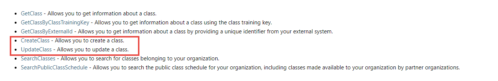

### **TMS Updates**
- The **Class Browser** now only shows classes with statuses of **Guaranteed to Run** and **Scheduled** by default. You can override this by adding **?showAll=1** between **Browse** and **#** in the URL.

## **Released January 04 2019**

### **Admin Menu**

Now you can access the links on the **Site Administration** page without leaving your current page. We have added an **Admin** menu which is available in all themes that use the standard navigation. When you click on this menu, all the links you see on the Site Administration page are available grouped in the same way. You can choose to view the groups in their default order or in alphabetical order. For a full explanation of this menu, please see [What is the Admin menu and how does it work?](./tms-administrators/tms-fundamentals/admin-menu.md)

## **Released December 14 2018**

### **Survey Availability Messages**

Your students can now easily see when they are able to take their class survey. The Survey activity on their Class Enrollment page will have a message detailing when the survey will become available. This message disappears when the Launch button appears.

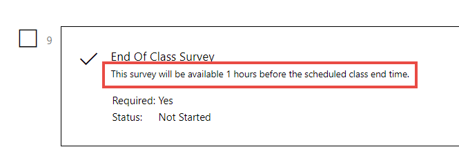

### **TMS Updates**
- In the **Learning Path** browser, the tiles now display the **Audience** level of the path in the lower right corner of the image and the **number** of **courses** and **duration** are at the very bottom of the tile.
- You may receive an error message when saving a course after adding labs activities to it if the lab activities exceed the maximum RAM set for courses for your organization. 
> Message: Sorry, you are not able to add labs with over XX MB of RAM. Please contact **support@learnondemandsystems.com**.
- The CSV file for the exported course catalog has been changed to have separate columns for each course tag allowing you to filter the data by the individual tags.
- You can now easily summarize and analyze survey responses in Excel or other analytical tools. The exported survey results have been revamped so that each answer of a multi-answer question is exported to its own individual row. See the [How do I export survey responses and analyze them in Excel?](./tms-administrators/miscellaneous/analyze-survey-results.md) article for assistance with Excel.

## **Released November 2018**

### **Manage Your Own SCORM Modules**

Want to manage your own SCORM content? With the proper permissions, you can create your own SCORM modules, upload your content to them, and add the modules to course profiles. You can preview your SCORM content by launching it from the SCORM module, and you can search for all SCORM attempts started by your students. Please contact **support@learnondemandsystems.com** if you need to manage SCORM content for your organization. The following articles will help you to create SCORM modules, start SCORM content, and view all SCORM attempts by your students:

- [How do I create a SCORM Module and make it available to other orgs for their courses?](./tms-administrators/courses-and-activities/create-scorm-module.md)
- [How can I preview a SCORM module belonging to my organization?](./tms-administrators/courses-and-activities/start-scorm-module.md)
- [How do I view all SCORM attempts by my students?](./tms-administrators/courses-and-activities/view-scorm-attempts.md)

### **Set Your Course Achievements to be Available to Outside Organizations**

Want to have consistent recognition to all students who take your courses, regardless of whether they are in your organization or not? You can now enable achievements for outside organizations on a **Course** profile’s **Basic Information** tab. If an achievement has the course identified in its conditions, any student who completes the course, either through a course assignment or class enrollment, will earn the achievement, providing the student participates in achievements and their organization has achievements enabled.

### **Create Achievements for Your Subscriptions**

Recognize your organization’s students for their accomplishments in your subscriptions. You can create achievements that tie directly to your subscriptions. Your organization’s students earn achievements by completing course assignments or class enrollments specifically associated with the subscription in the achievement’s conditions. Here is an example of a condition statement for a subscription achievement:
> [{"Subject": 30,"Count": 1,"ClubIds": [551], "Complete": true}]

This achievement condition requires the user to complete **1 course** through the subscription whose ID is **551**.

For a course assignment or class enrollment to earn subscription achievements, one of the following must be met (in addition to the participation requirement of the organization and the student):

1. The student has a current subscription matching the achievement conditions AND completes a course assignment that was started from the subscription’s **On-Demand browser**.
1. The student completes a course assignment that was created outside the browser AND has the subscription listed as the **Payment Type** on its **Payment** tab.
1. The student has been marked **Enrolled/Complete** on a class enrollment AND it lists the subscription as the **Payment Type** on its **Payment** tab.

> [!KNOWLEDGE] Achievements can be earned on past activities depending on how the conditions of the subscription are written. For instance, when a participating student completes an item (lab, course assignment, class enrollment, etc.) that could be included in *ANY* achievement, the student's transcript and records are evaluated against *ALL* achievements the student might be eligible for. Therefore, the student could earn the above achievement today if they have an old class enrollment or course assignment that meet the conditions. To avoid achievements being earned on expired subscriptions and old class assignments and course assignments, the conditions can be written to ignore expired subscriptions and/or to set a timeline for items qualifying for the achievement in JSON.

> [!ALERT] Currently, if a subscription contains courses from multiple orgs (i.e. Org A and Org B), has an achievement attached to it, and is available to another organization (Org c), users from that organization will only earn the achievement for courses in the subscription that are in the same org as the achievement and only if those courses allow outside orgs to earn the achievement.

### **Add HTML Footers to Your Learning Paths**

Encourage more engagement with your users by adding customizable HTML footers on your learning paths. This is great place to provide users with additional information, suggestions, links, etc. related to the learning path .

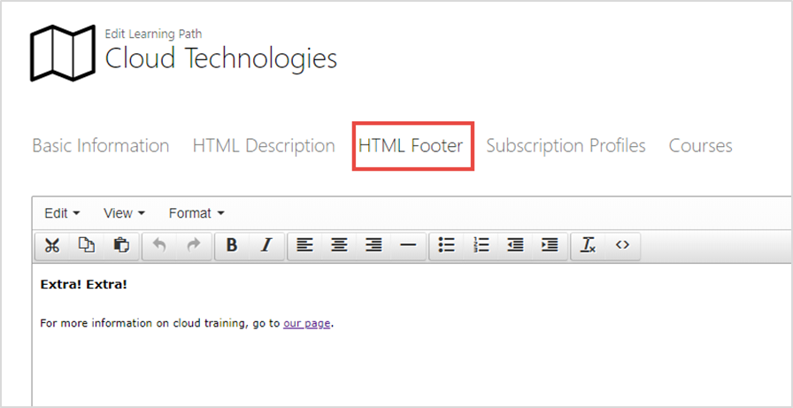

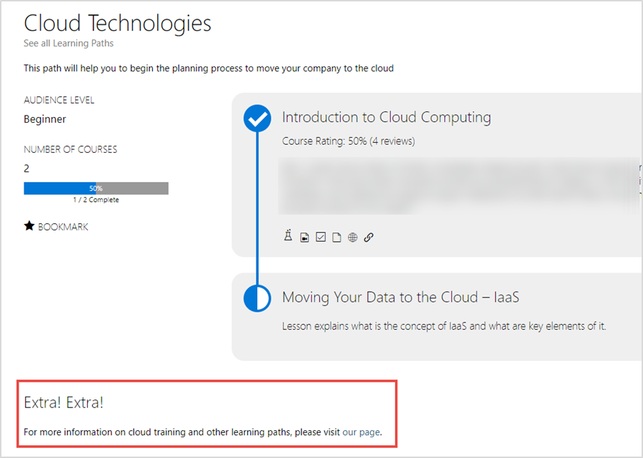

### **Control Default Maximum Class Size on the Course**

You can control the default **Maximum Capacity** for classes directly on the **Course** profile. This provides you more granular control so you can have different student attendance capacities for different courses. One use of this might be you could have courses designed to be used in webinars and these could have a higher default capacity than your standard courses. The default on the Course profile will override the organization’s default Maximum Capacity for classes but can be overridden on the class itself.

### **TMS Updates**
- New **Filter** and new **Output Option** on **Find Labs**: 
    - You can filter by **Course** - This will find all lab activities in the specified course. 
    There is also a new **ExternalId** output option.
- New **API** method: You can add several roles to a user at once through the API using the new **AddUserToRoles** method.
- Removed **Filter** and **Output Option** on **Find/Choose SCORM Modules**: Content Provider is no longer related to SCORM modules. Therefore, the **Content Provider** filter and output option on the **Find SCORM Modules** page and **Choose SCORM Module** dialog have been removed.
- The **.NET Framework** was updated to **4.7.1**.

## **Released October 2018**

### **Display of Course Ratings**

You can share the quality of your course offerings by displaying ratings on browser tiles. These ratings derive from the simple feedback given by actual users and are displayed as percentages on the tiles. When a user zooms a tile, the number of reviews are included. The following browsers will display the ratings based on criteria you set:
- On-Demand
- Course Catalog
- Learning Paths
- Class

> [KNOWLEDGE] Like subscription profiles, Learning Path tiles show a cumulative rating of the included courses. Individual Learning Path pages show the rating for each course.

You, as an organization, control when ratings are displayed for your courses based on the number of ratings and an optional minimum rating percentage. There may be times when subscriptions or learning paths contain courses from various organizations. Since these are cumulative ratings from the underlying courses, the owning organization of the subscription or learning path controls whether the rating is displayed. The individual courses display ratings based on their owning organization’s criteria regardless of where they are seen.

Examples of the display:

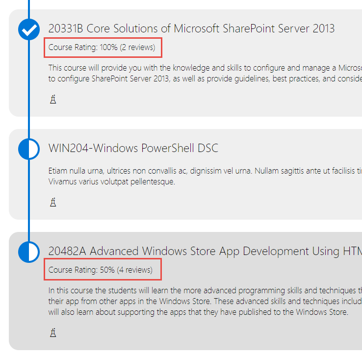

### **Completion Certificate Organizational Ownership/Availability**

With permissions, you are now able to manage your own course completion certificates. Your certificates are only available to other organizations to use in their courses if you specify them in the certificate template’s profile. This allows you to keep your certificate templates private while still providing the flexibility to share with other organizations as needed.

The Organization output option and filter have been added to the Find Course Certificate Templates page. You can also filter by the organizations that can use the certificate.

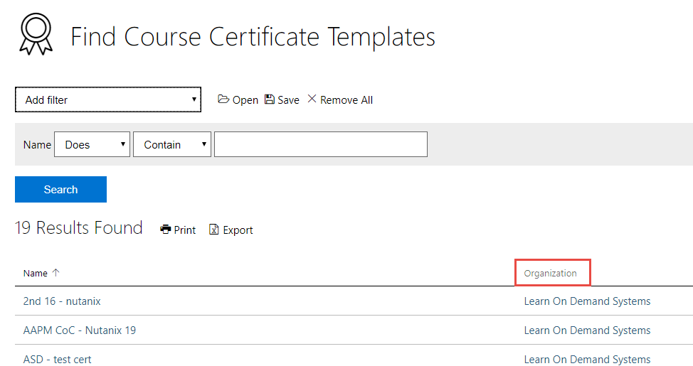

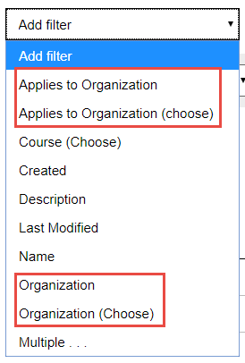

### **TMS Updates**

- The Class Browser page can now be loaded prefiltered for classes on a specific course by appending the course ID to the end of the URL. 
> Example: https://lms.learnondemand.net/Class/Browse?courseId=9672 would load all classes for the 10135B Configuring, Managing and Troubleshooting Microsoft Exchange Server 2010 Service Pack 2 course.

- The On-Demand Browser page can now be loaded prefiltered to display
    - Only bookmarked courses by appending the bookmarks ID to the end of the URL. Example: https://lms.learnondemand.net/Course/BrowseOnDemand?bookmarks=1.
    - Only courses with a specific course tag. Example: https://lms.learnondemand.net/Course/BrowseOnDemand?coursetagId=X with X being the ID number of the course tag
- The Coming Soon icon is now visible next to courses who meet the criteria on Find Courses. There is also a new Coming Soon filter to narrow the results to just those courses.

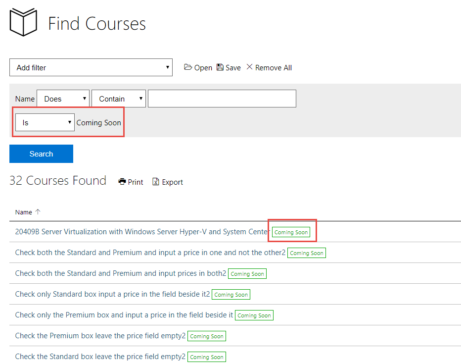

## **Released September 27, 2018**

### **Share Files with Students in a Class**

Provide your students with files you specifically have for the class to give them a unique experience. Instructors (and administrators) with the **Class file management** permission can now use the **Manage Files** functionality on a class to share files with students in their class. All Instructors (with the permission above) who are assigned to the class have access to the Class Files. All files uploaded can be managed (edited, deleted, downloaded) by them regardless of who originally uploaded them.

### **TMS Updates**
- Two new API call methods were added along with their documentation:
    - **GetClassbyExternalId**
    - **GetCoursebyExternalId**

## **Released September 20, 2018**

### **User and Admin Landing Page Options Available on Sites**

If you have your own site, you can now request where users will land when they sign in to your site. Your site can be set to have students and administrators (those with administrative functions) land on one of the following options:

Students
- **Default** (currently My Training)
- **Subscription** (On-Demand subscription browser)
- **Class Browser** – (Class Browser)
- **Custom** (a page in the TMS or a TMS webpage)

Users with administrative functions
- **Default** (currently Site Administration)
- **Custom** (a page in the TMS or a TMS webpage)

> [!ALERT] If you use a TMS webpage for either landing page, it must be enabled for anonymous access.

### **Use Custom Virtual Classroom URLs for Your Virtual Classes**

You can now use any virtual meeting program you want for your virtual classes if you have a URL for it. Your students will be able to access the meeting program from their class enrollment. 

To set your class up to use your own virtual classroom:
1. On the **Create/Edit Class** page, expand the **Delivery** section.
1. On the **Delivery Type** dropdown, select either **Virtual** or **Physical and Virtual**.
1. The Virtual Meeting Host field will appear. In its dropdown, select **Custom Virtual Classroom**.
1. The URL field will appear. Enter the unique **URL** for the virtual classroom. This can be a Skype for Business meeting URL, a Join.me URL or any other URL that a company wants to use.
> [!KNOWLEDGE] **BEST PRACTICE**: The Enter Classroom button remains available to students on their class enrollment after the class is over. Therefore, it is best to use unique URLs for each class to avoid students from an old class accidentally getting into a new class.

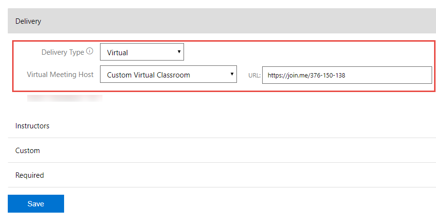

When the students click Enter Classroom, they will be taken to the URL provided. The TMS passes along the classId, studentLastName, studentFirstName, and studentEmail to the receiving site.

To find your classes that use custom virtual classrooms, you can use the new **Custom Virtual Classroom** filter and output option on **Find Classes**.

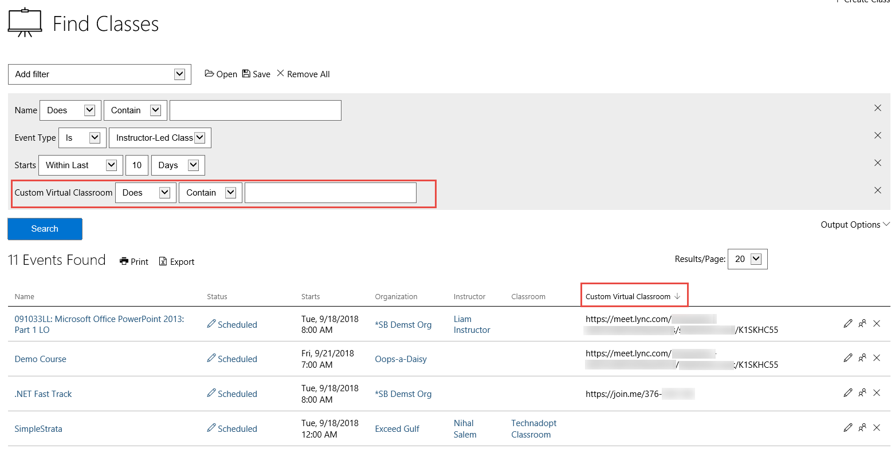

### **New Functionality and Permission for Discussions**

You can now create a disclaimer that will be displayed on all your discussions, limit who can participate in those discussions, and add moderators to discussions. 

#### **Disclaimers**

To add disclaimer to all of your discussions:
1. Edit your organization.
1. Click the **Preferences** tab and scroll down to **Discussion Disclaimer**.
1. This is an HTML field. Add the message you want to appear at the top of discussions to all discussion participants. 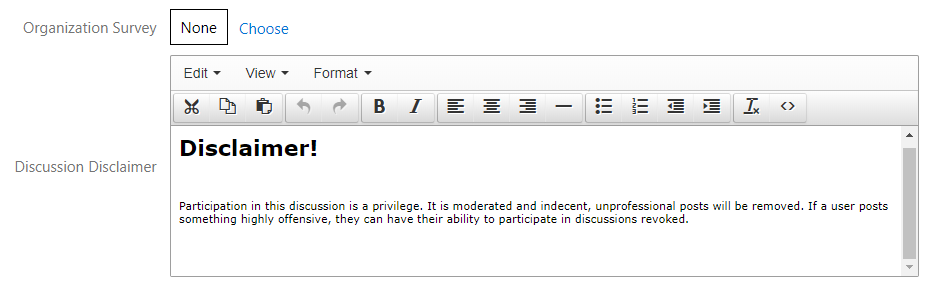
1. Click **Save**.

When a user accesses any of your discussions, the disclaimer will be displayed above the area to create a post.

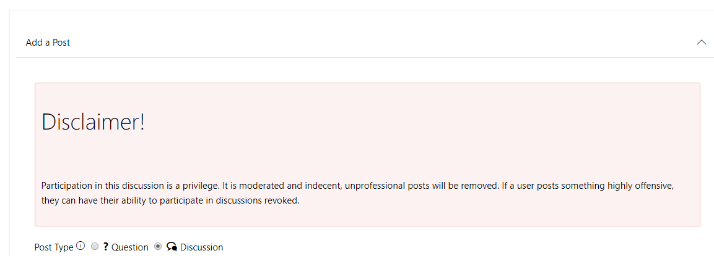

#### **Participation Permission**

There is a new General permission that any user must have to participate in discussions, Discussions – Participation. This permission, if made part of a supplemental role, will allow your organization to be a little more granular in who you allow to participate. If it is added to the default user role, then anyone with access to the discussion can post and respond to posts. If a user does not have this permission, they will not see the Discussion link on the course, class, class enrollment or course assignment. You will need to work with our support team to set this up, **support@learnondemandsystems.com**.

#### **Moderators**

You can add moderators to discussions. Only moderators can delete posts, responses, and comments from discussions and only if they are added to the discussion. To add one or more moderators to a discussion:
1. Edit the **Discussion** profile.
1. On the new **Moderators** tab, click **Add**. 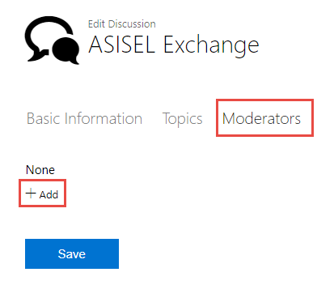
1.  The Choose Moderators dialog will open. This dialog is pre-filtered for users from the Discussion’s organization who have a role with the General permissions, Discussions – Moderating and Discussions – Viewing, in it. 
1. Use the filters to narrow the results and click **Search**.
1. Select the moderator(s) and click **OK**. 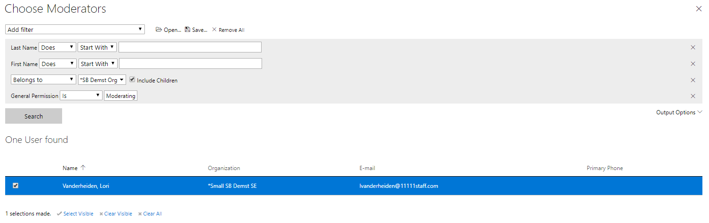
1. Click **Save**.

Moderators that have not been assigned to a discussion may be able to access the discussion but will not be able to delete posts, responses, and comments. 

View of discussion by Moderator assigned to it:
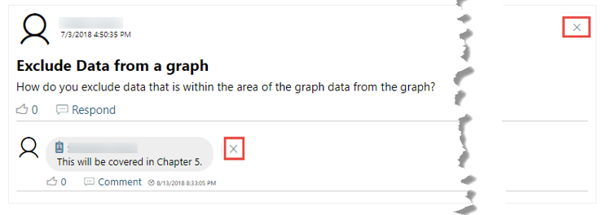

View of discussion by Moderator not assigned to it:
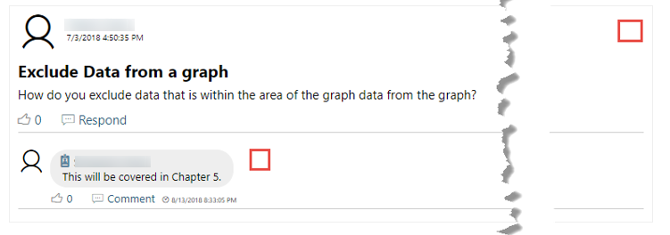

### **Copy HTML Content from One Announcement to Another Announcement**

Have an old announcement whose HTML Content you want in a new announcement? This is now easy to do without having to manually copy the HTML Content in the old and pasting it in the new. To do this:
1. Simply click the new **Choose HTML Content** button on the **HTML Content** tab of the new announcement.
1. The Choose Announcement dialog will open. Turn on any **Output Options** you need and add any **filter** to narrow your search.
1. Click **Search**.
1. Select the announcement whose HTML content you want to copy and click **OK**.

The HTML Content is copied with its formatting into your current announcement.

### **Set a “Coming Soon” Flag on the Course Catalog for Courses with no Training Format
Courses that have no training format set for them can now be displayed on the Course Catalog and will have a Coming Soon flag on their tile. To set a course to appear on the Course Catalog with this flag:

1. On the **Basic Information** tab of the course, scroll down to the bottom and ensure the **Show on Course Catalog** field is checked.
1. Verify both the **Available Instructor-Led** and **Available Self-Paced** fields are unchecked. You can hover over the Information icon for a screen tip explaining this.
1. Save the course.

This can be done for new or existing courses. The Coming Soon flag will remain on the course until either one of the Available … fields are checked.

### **TMS Updates**
- There have been several other updates to the Catalog pages (On-Demand Browser, Organization Course Catalog, Learning Path Browser, Class Browser, and Simple Course Assignment):
    - The number of **Results** is now displayed on browser pages next to the page navigation. This number will change based on filtering applied.
    - On the **Class Browser** page, if no filters are available for the classes, the **Match Any/All** is hidden.
    - The expected duration of a course is displayed on both the initial tile and the hover (details) tile on the **OnDemand Browser** and **Organization Course Catalog** if all the activities in the course have an expected duration set.
    - The TMS now checks to see if user is logged in before showing bookmark related actions.
    - The **Simple Course Assignment** page now scales the image as the page is resized to make it easier to access the tabs at the bottom. 
    - The **Date** filter can now be hidden on the **Class Browser** page by appending **?hideDateFilter=1** to the end of the url.

> [!ALERT} Internet Explorer has a limit of 2,083 characters that can be sent in a query. Therefore, when too many filters are checked, the page locks and loses the resultant tiles.

- A new **General** permission has been added, **Subscriptions - Editing supplement - expiration editing**. A user with this permission can change the **Expires** date on one of their managed user’s subscription even though the subscription is owned by another organization.
- When a user clicks **Close My Account** on their profile, the **Close My Account** page now includes a reminder to contact LODS support for Zendesk account deletion.
- Documentation has been added for the Course Assignment API methods:
    - **GetCourseAssignment**
    - **GetCourseAssignmentByExternalId**
    - **CreateCourseAssignment**
    - **DeleteCourseAssignment**
    - **UpdateCourseAssignment**
    - **SearchCourseAssignments**

## **Released August 30, 2018**

### **Role Assignment through Authentication Provider**

You can now request to have an **Authentication Provider** set up with associated roles so when a user logs in via that authentication provider (AP), the role(s) are automatically added to the user. If the role is later removed from the user’s profile by an administrator, the next time the user logs in using the AP, the role will again be assigned to the user.

Please contact **support@learnondemandsystems.com** to set up your Authentication Provider. Note: this provider will need to be added to your TMS site to be visible to your users.

### TMS Updates
- The **New** flag on courses (on the Find Courses, On Demand Browser, Course Catalog, and Classes browser) is now calculated using the date the **Available Instructor-Led** and/or **Available Self-Paced** checkboxes are checked on the course, rather than the **Created** by date. To make the flag show up for existing courses, uncheck both Available checkboxes on the course and save. Then check at least one of them again and save. Remember that a course must be:
    - Checked **Available instructor-led** to have classes based on it and thus show up on the **Classes** browser page.
    - Checked **Available Self-Paced** to allow course assignments and thus show up on the **On-Demand** browser page. 
- **Subscriptions**:
    - The Create links (**Create Subscription** and **Create Multiple Subscriptions**) have been moved from the **Subscriptions** tile on the **Admin** page to the **Find Subscriptions** page be consistent with other tiles.
    - The **Subscriptions** link text has been changed to **Assigned Subscriptions**.
- Due to infrastructure improvement requirements, we have a new Azure compatible PDF generation tool for **Course Completion Certificates**. If you use the Certificate feature, you should ALWAYS preview the certificate when you upload the template to ensure data replacement, readability and layout are correct.

## **Released August 16, 2018**

### **New Class Browser Page** 

Your students may now be able to view your organization’s classes using the modern Class Browser page. This page is accessed from the Classes link on the default navigation bar. 

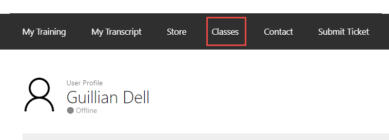

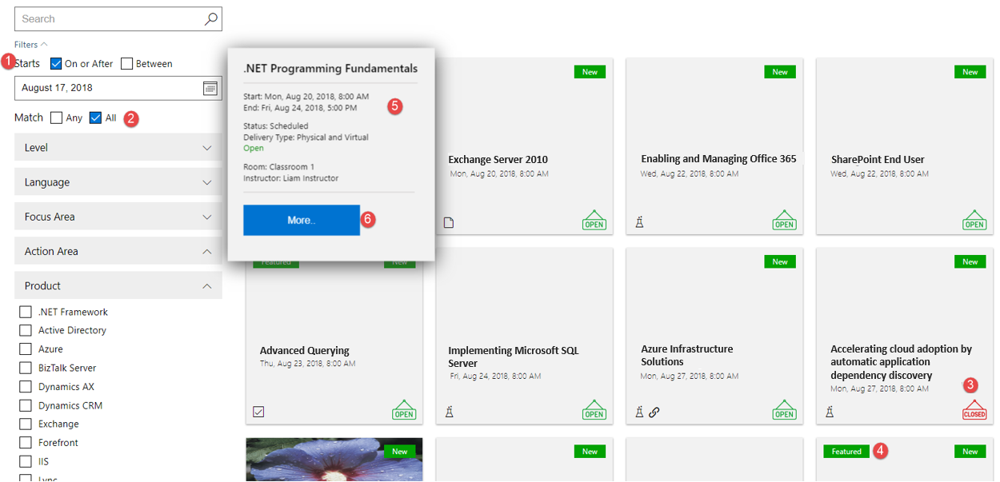

It is similar to the look and functionality of the On-Demand browser pages:
1. Use the **Starts** filter to filter for classes that start in a particular time frame.
1. Use the other filters to narrow the search to classes on courses with certain tags.
1. See whether a class is **Open** (still has seats available) or **Closed** (at max capacity).
1. Notice the **Featured** and **New** flags are visible to help draw attention to those classes.
1. Hover over a class to see more details such as when it **ends**, its **status** and **delivery type**, and the **classroom** and **instructor**. 
1. On the zoomed-in tile, click **More** to access the **Class Details** page for further information.

> [!NOTE] If your organization has customized the navigation bar, this link will need to be set up on your instance. Please contact **support@learnondemandsystems.com** for assistance.
