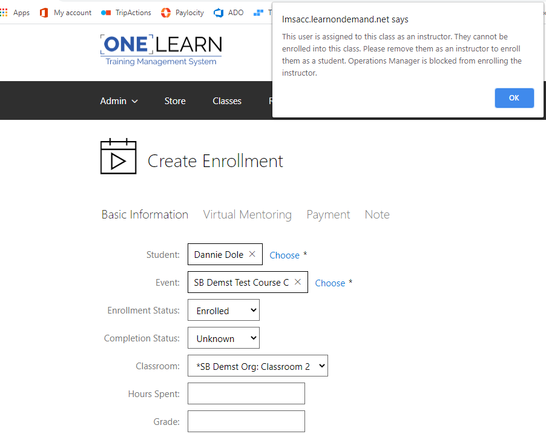

# What's New in the TMS

 <a href="/whats-new-toc.md">What's New in the other LODS platforms?</a>

## Released March, 11 2021
### Accessibility Items
Accessibility Items
In our continuing effort to improve accessibility for all our students and meet MAS standards,
we have made the following changes:
*   Focus indicator (Dotted Lines) are visible on My Training, My Transcript, Roadmap, Contact and Help links while navigating using the Tab key on the keyboard.
*   The ‘Please Make A Selection’ window text on the ‘End Lab’ dialog meets the minimum luminosity ratio of 4.5:1.
*   The Screen Reader now narrates Role and State for tab controls Instructions, Resources, and Help within a lab. 
*   Keyboard focus is restored back on the ‘More’ options menu after invoking the ‘Cancel’ button in the ‘End Lab’ dialog.
*   The Screen Reader focus is restored back on the More options menu after invoking the 'Cancel' button in the 'End Lab' dialog.
*   The Screen Reader now narrates Name and Role on the lab ‘More’ options menu.
*   The Screen Reader now narrates the ‘Add’ filter for Organizations and ‘Include Children’ check box on Find Courses.

### SKUs
We have added a new ApprovedSKUList field on Application Settings. A Super User can copy/paste new SKUs into the field with items separated by commas. To retire a SKU, simply remove the SKU from the ApprovedSKUsList, save the change and the list is updated. 
 
These approved SKUs are only visible to Super Users and can be selected from a dropdown list on the following pages: 
 
*    Classes - Basic Information tab
*   Courses - Pricing tab
*   Organizations - Financial tab
*   Publishing Groups - Basic Information tab
*   Subscription Profile - Basic Information tab

### Updated SKU Hierarchy
SKUs follow a hierarchy to determine which SKU is shown on customer invoices for each billable event.
Each billable event type’s hierarchical flow is listed below from lowest to highest priority: 
*   Course Assignments: Organization SKU -> Publishing Group (PG) SKU -> (Course SKU (highest priority) 
*   Course Assignment from Non-Billed Subscription: Organization SKU -> Subscription Profile SKU -> Course SKU
*   Class Enrollments: Organization SKU -> Publishing Group (PG) SKU -> Course SKU -> Class SKU 
*   Shared Lab Class Creation: Organization SKU -> Publishing Group (PG) SKU -> Course SKU -> Class SKU 
*   Subscription Memberships: Organization SKU -> Subscription Profile SKU

### Enhancements and Fixes
*   User Impersonation: We have enhanced security and access for those who can impersonate another user by preventing the impersonator from seeing the Active Lab Instances link on the Labs tile.
*   User Password Complexity: We have added an application setting to allow for a minimum ¾   of the applied rules to meet the password complexity requirement check. 
*   New Sites – B2C: When a site is created, ‘Enable B2C Authentication’ is enabled by default and cannot be modified until the site is saved.  
*   User Profile – B2C:  We have updated the user profile page to no longer display ‘This user cannot login with a local account’. when the user is managed by B2C.

----------------------------
## Released February 25 2021
### Accessibility Items
*   In our continuing effort to improve accessibility for all our students and meet MAS standards:
    *   General search pages will retain the focus on Add Filter after a filter option is selected. 
    *   Screen Reader is now narrating the pagination and Next controls on the Course Catalog page.  
    *   Screen Reader on the Course Catalog page from the header of the Open Saved Search dialog box now narrates My Searches and Shared Searches.
    *   Screen Reader is now narrating Display Times in Output Options. 

### Enhancements and Fixes
*   Course Certificate – Completion Certificate Template: We have added a Course Certificate Date Format field with 8 different options to choose from.  A user with the appropriate permissions can specify the date format on the certificate template. 
*   Find Organizations – Lab On Demand Organization ID Output Option: We have added a Mapped To Lab Provider filter and output option on Find Organization. 
*   User Profile – Time Zone Flag: We have added the ability to set a flag on the Time Zone field on the User Profile.  
*   API Documentation – SearchClasses: A CustomFieldSearchFilter has been added to the SearchClasses API calls. 
*   Bulk Update User Profiles – Organization Management: We have fixed an issue when Bulk Editing Users auto-checking all organizations and assigning organization management to edited users.  

----------------------------
## Released February 11 2021
### Accessibility Item
*   In our continuing effort to improve accessibility for all our students and meet MAS standards, 
    *   The Screen Reader will narrate Include Children for the add filter option of Belongs to Organization on Find Courses.

### Create Multiple Course Assignments
An option to create multiple course assignments for multiple students has been added to the Course Assignments tile.

### Enhancements and Fixes
*   Find Courses – Subscription Filters: We have added a “Subscription Profile (Choose) and Subscription Profile Name” filter on Find Courses. 
*   Find Courses – Organization Search:  You will no longer receive a query message indicating to reduce the scope of your query when finding courses. We have increased the default maximum organizations that you are able to search from 50 to 100.

----------------------------
## Released January 28 2021
### Enhanced account security scheduled for implementation at 10:00pm ET Friday, February 12th
Learn on Demand Systems is implementing enhanced account security for user accounts that sign in with a username/password. You can learn more about these security measures here.
Starting 10:00pm ET on Friday, February 12, local users will be prompted to reset your TMS password upon login at https://lms.learnondemand.net. Users logging in through API or Corporate Azure AD will not be prompted to reset their password

### This password reset will require email verification. 
*   If you want to continue to use this email address, no action is required. 
*   If you want to change your email address on file, update your profile by 10:00pm ET on Tuesday, February 9.

This small task will enable you to reset your password quickly and easily upon first login after the platform update.

### Credit Pools
The Credit Pool feature and functionality has been removed from all TMS UI.

### Enhancements and Fixes
Find Entities by ID – Filter: We have added an “ID” filter to the following search/choose pages.
*   Find/Choose Classes
*   Find/Choose Class Enrollments
*	Find/Choose Courses
*	Find/Choose Course Assignments
*	Find/Choose Subscriptions
*	Find/Choose Users

----------------------------
## Released January 14 2021
### Enhancements and Fixes
*   Find Lab Instances – E-mail Address: We have added a student “E-mail” address filter and output option on Find Lab Instances.
*   Find Publishing Group – Aligned To An Organization:  We have added an “Aligned To An Organization” filter on Find Publishing Groups.
*   Edit Users – Flag: When flagging fields for change, then editing the users page a second time and saving the formerly flagged fields are now flagged.  
*   Edit User Profile – Roles: The Starts/Expires time fields now fully display AM or PM and no longer stacked.
*   Course, Class, and Catalog Browsers – Default Search Save: When saving a search and making it default, then navigating away the default search is now saving.

----------------------------
## Released December 17 2020
### Bulk Update User Profiles
A new Bulk Update User Profiles page has been added to TMS. This page allows TMS administrators to disable users, set time zones, change company and account executives, assign permanent or temporary roles, and designate user accounts for organization management en masse. It can also flag the following fields for update on next user login:

*   First Name
*   Last Name
*   Job Title
*   Primary Phone
*   Secondary Phone
*   Address
*   Address Line 2
*   City
*   State / Province
*   ZIP / Postal Code
*   Country

### Enhancements and Fixes
*   API Documentation – Archived Status: An Archived field has been added to the GetCourse and GetCourseByExternalId API calls. 
*   Find Assessments – Company Name Field: A Company Name output option has been added to the Find Assessments Response page. 
*   Bug Fix – Duplicate Training Key: Fixed an issue that could allow for two course assignments to be assigned the same Training Key.
*   Bug Fix – TMS Error Messaging: Fixed a typo in a TMS error message displayed to students who enter their classroom before the class begins.
*   Custom Site – User Creation Landing Page: Newly created users will now be presented with a custom site’s designated landing page on first login. 
*   Bug Fix – Lab Instance Search Page: Fixed an issue on the Lab Instance Search page that displayed a non-translated string in a filter dropdown.
*   Bug Fix – Deferred Launch Labs: Fixed an issue that caused deferred launched labs to not be associated with a user profile.

----------------------------
## Released December 3 2020
### User Role Expiration on Bulk User Import
When assigning individual roles to users during the user import process, an option has been added to add automatic expiration dates for each role on a per user basis. 

*   API Documentation – Postman Collection: An importable Postman Collection of API calls has been added to the OneLearn TMS API documentation page.
* Bug Fix – Launching Archived Courses: Fixed an issue that allowed students to launch expired courses from their subscriptions by directly accessing the course launch URL.
*   Bug Fix – Course Progress Bars: Fixed an issue that caused progress bars on the Enrollment and Course Assignment pages to not properly reflect a student’s progress.
*   Bug Fix – Launch Activities Buttons: Fixed an issue that caused Activity Launch buttons to not appear when viewing the Class Details page.

----------------------------
## Released November 19 2020
### Browser and Catalog Save Filter Selections
When enabled, users will now be able to save custom search filters on the Course Browser, Class Browser, and Course Catalog pages.

### Enhancements and Fixes
*   Bug Fix – Notification plan calendar invites: Notification plans now properly send attached calendar invites.
*   Bug Fix – Enrollment status: Users with the enrollment statuses of Requested, Cancelled, or Denied are no longer treated as being enrolled in the class.
*   Bug Fix – Zoom recordings: Fixed an issue that would cause single delivery classrooms delivered over multiple days to only display the first days Zoom recordings.

----------------------------
## Released October 29 2020
### Create Multiple Enrollments
We have added a Create Multiple Enrollments link on the Classes tile. Operations managers can now waitlist and enroll multiple students to multiple classes simultaneously from a single menu. If the class is full and users are added with an enrollment status of “Enrolled,” the enrollment status changes to “Wait-Listed” when then enrollments are saved. 

----------------------------
### Enhancements and Fixes
*   Sites - Class browser anonymous access: The class browser will now have an option to Allow users to access the class browse page anonymously, allowing users to view class “sessions” without signing into TMS.
*   Notification plans with calendar invites: The following changes were made to notification plans. 
    *   Calendar invites are now only sent when a user has the status of Enrolled or Audit.
    *	Cancellations are now sent when a user status is changed from Enrolled or Audit.
    *	No calendar invite or cancellation is sent when a user is placed in a non-enrolled status.
*   Subscription Profile – Create multiple subscriptions: A Create Multiple Subscriptions link on the Subscription profile page has been added. This will allow an Operations Manager to assign multiple students to a subscription. 
*   Sites – Use training key pool checkbox: The Use training key pool owner organization for new user registrations checkbox will now appear when the Enable register by training key on logon page is checked.
*   Find Enrollments/Find Course Assignments – Duration: Duration has been added as an output option to the Find Enrollments and Find Course Assignments searches. 
* Find Courses – Training days: A training days field has been added as an output option and search filter to the Find Courses search. 

----------------------------
## Released October 15 2020
### TMS Platform – Adobe Flash
At the end of 2020, Adobe will permanently end the life of Flash. To prepare for this, the SCORM video upload and Adobe Connect integration have been updated to remove Flash from the platform. It should be noted that Internet Explorer only has legacy Adobe Connect available; once Flash is deprecated, students using Internet Explorer will have to download the Adobe Connect Client or switch to a different browser.

### Instructors – Class Enrollments
When an Operations Manager assigns an instructor to a class, the instructor will be prohibited from enrolling or auditing the class.  The following message will appear when the instructors Enrollment Status is set to Enrolled or Audit when attempting to save.

When an instructor has an Enrollment Status of Enrolled or Audit and is then assigned to the class as an instructor, the following message will appear when attempting to save. 

If the instructor is not assigned to the class but has an Enrollment Status of Wait-Listed or Requested, the instructor’s enrollment will be bypassed when another student’s enrollment is cancelled.  The student with the earliest created date will be automatically enrolled.   If there are no Wait-Listed students, it will look for Requested enrollments to promote. 

### Enhancements and Fixes
*   Find Users - Created By Filter Added: We have added Created By and Created By (Choose) as a filter on Find Users.
*   Featureset - Description: We have updated the Description field to allow values up to 2,000 characters from the previous limit of 1,000.
*   Custom Sites - Training Key Pool: Users can now redeem keys against a central (parent) site and still be placed correctly into the appropriate child org. This removes corner cases where students could register on a parent organization site that uses an older custom login page file that bypasses the normal org id check process, leaving the user registered incorrectly.
*   Class - Lab Activities: Resolved an issue that allowed non-basic users to launch otherwise disabled class activities.

----------------------------
## Released October 1 2020

### Courses – Virtual Meeting Host – Custom Virtual Classroom

We have updated the Custom Virtual Classroom to specify when the “Enter Classroom” launch button is available for Pre and Post Class access. Admins now have more flexibility to specify when Instructors and Students can access/enter class using a Custom Virtual URL. 

### Enhancements and Fixes
* Publishing Groups: We have added Open and Save options to the Published Organizations tab.  
* Class Details: We have removed Manage Courseware Vouchers from the quick launch menu bar on the Class Details page.
* Notifications: Attach a Calendar Event - We have fixed the .ics file attached to a calendar event from displaying as “Not Supported Calendar Message” within Outlook.

----------------------------
