# What's New in the TMS

 <a href="/whats-new-toc.md">What's New in the other LODS platforms?</a>

## Released November 07 2019

### Manual Issuance of Badges by Instructors/Operations Managers
As an instructor or administrator, with the proper permissions, you can now manually issue badges to students. This allows you to add a badge to a student rather than only having badges issued automatically by meeting the requirements to earn an achievement. This can be done from the Class Roster or from individual course assignments, with a different process for each.

#### Class Enrollments
As an instructor or administrator, you can issue one or more badges to students in your class using the following steps:

1. On the **Class** page, click **Roster** and then click **Issue Badges** in the quick launch bar.
1. On the **Issue Badges** page under **Badges**, click **Add Badges**. 
1. In the **Choose Badges** dialog, select the badges to be issued and click **(Select a Badge)**. Only badges belonging to the same organization as the class will be listed.
1.  Under **Students**, click **Add Students**. 
1. In the **Choose Student(s)** dialog, select the student(s) to whom to issue the badge and click **OK**. If the instructor is an organization instructor (not a contract instructor), only enrolled students from the instructor’s organization in the class are listed. If the instructor is a contract instructor, all students enrolled in the class are listed.
1. Review the listed badges and the students and click **Issue Badges**. A list of the students and the badges issued to them will appear at the bottom of the page under the heading “The following badges were successfully issued:”

> Note: Students are only allowed to earn a badge once. Therefore, if there are any errors in issuing the badge, the user will receive a warning message stating: Warning: Not all badges were successfully issued. See the Failed Badge list for details. These failures will be listed at the bottom of the page under the heading “The following badge issuances failed:”. A description of the failure will be included. 

> 

#### Course Assignments
As an administrator, you can also issue badges to students from their course assignments using the following steps:

1. Navigate to the course assignment and click **Issue a Badge** in the quick access bar.
1. In the **Choose Badge** dialog, select the badge to issue and click **Select a Badge**. Note: Only one badge can be selected/issued at a time for course assignments.

> 

There is no indication on a course assignment that the badge has been issued. To verify this, the administrator can either look at the Find Issued Badges page or at the Achievements/Badges page of the user.

### Class Vouchers Return
If you use class vouchers to create classes, and have assigned any that won’t be used for enrollments in the class, you can request to have them released and made available to you to assign to a different class. To request that vouchers be released from a class, please create a Support ticket on our customer support page, https://lods.one/support.

### Customized Required User Registration Fields
If you allow users to create their accounts from your login page, you can now choose which fields from the User Registration form are required to be completed. If you use the Basic User Registration form, any fields you have requested to be required will be added to the form as required. To request this customization to your User Registration form, please create a Support ticket on our customer support page, [https://lods.one/support](https://lods.one/support).

Here is the list of fields you can choose to be required:
> 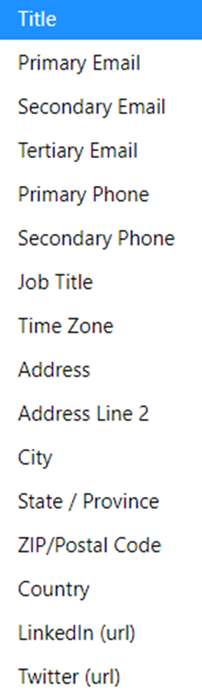

### TMS Improvements and Fixes
- The logos for the **TMS** and **IT Pro Challenges** will now show as favicons on the browser tabs.
- To make it faster to select instructors to assign to a class, Class Schedulers can now filter the **Choose Instructor** dialog by those preferred by their organization. This requires that Operations Managers designate those instructors on the **Preferred Instructors** tab of the **Organization** profile.
- To better assist their students, instructors will now be able to view the **Lab Instance** profile pages for labs launched by students in their classes.
- Users will now be able to see when lab access expires post-class on the **Class** and **Enrollment** profile pages. This data is also available on the **Find Courses**, **Find Classes**, and **Find Enrollments** pages using the output option, **Post-class lab availability**.
- The **Abbreviated Name** field has been removed from the **Organization** profile and thus from the API calls of **GetOrganization**, **GetOrganizationbyExternalId**, **CreateOrganization**, and **UpdateOrganization**.
- The **Maintenance Banner** will now display properly on sites where the login page has been customized.
- When class vouchers are used to create a class, all enrollments for the class, regardless of how they are created, will be associated with a class voucher.
- When a class is updated through the API, users will now see, on the **Class History** page, the correct **Last Modified** and **Last Modified By** data for the update in those output columns.
- Filters that had their closing “X” out of alignment with other filters have been fixed. All filters will have the Xs aligned.

----------------------------

## Released October 24 2019

### Organization Profile Fields Moved to Different Tabs
To make the **Organization Profile** more efficient and easier for you as Operations Managers to use, we have modified the **Basic Information** and **Preferences** Tabs. The **Basic Information** tab is now available to you, but the **Name** field is view-only. The **Preferences** tab has had all the fields you need for your organization moved here. These fields have been organized into the following sections for ease: 
- Business Settings
- User Settings
 -Class Settings, including subsections
     - Set Defaults on new Classes
     - When choosing instructor(s) for class
- Course Settings
- Default Surveys for new Courses and Classes
- Miscellaneous Settings

In addition, several fields have been renamed for clarity.

Basic Information tab:
> 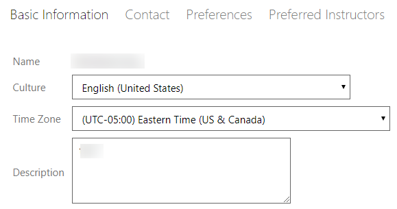

Preferences tab:
> 

### Basic Anonymous User Registration Form
To facilitate quicker anonymous user registration, we have updated the **Basic Anonymous User Registration** form. Now the user can select their time zone from a dropdown. We have removed the **LinkedIn** and **Twitter** fields. Also, two settings will match your organization settings: the **Enable Notifications** and **Participate in Achievements** checkboxes.

> 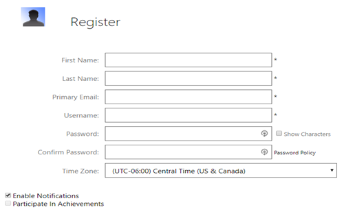

### EULAS on Publishing Groups
As an Operations Manager, you can now add **End User License Agreements (EULAs)** to your publishing groups that users taking courses in the publishing group will have to accept. This new functionality facilitates our transition to Publishing Groups in place of Content Providers.

To add a EULA to a publishing group:
1. Edit the publishing group.
1. On the **Basic Information** tab, click **Choose** next to **End User License Agreement**.
1. In the **Choose License Agreement** dialog, search for and select the EULA to apply and click **OK**.
1. Save the publishing group. 

Any student who takes a class or course assignment based on any course in the publishing group will have to agree to the EULA before they can launch the activities in the course.

### TMS Improvements and Fixes
We have made the following enhancements to our TMS:
- Announcements are no longer be marked as **Expired** before their set expiration date.
- Course custom fields are no longer bulleted.
- The **Missing Information** flags in the **User Profile** fields are now positioned on the right-hand side of the fields.

----------------------------

## Released October 10 2019

### Publishing Groups and Course Availability
Soon courses will only be available for classes and course assignments if they are associated with a publishing group. Therefore, to assist LODS staff and Operations Managers, courses that don't belong to a publishing group are identified by a message at the top of the profile that states: **This course must be added to a Publishing Group to be available for use.** In addition, we have added a **Has Publishing Group** filter and output option to **Find Courses**.

> 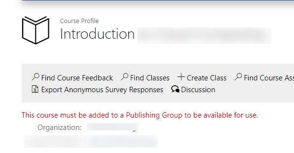

### Global Achievements
With the proper permissions, achievements can now be made globally available. Your organization has the ability to opt in or out of global achievements when it has achievements enabled. Opting in allows your student to earn these achievements. This eliminates the need to mark **Enable achievements for outside organizations** on courses.

> 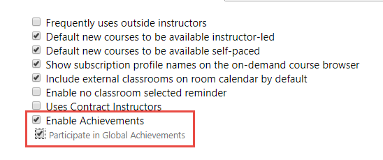

### Sort Output Option Lists
You can now sort the Output Options list on search pages and Choose dialogs alphabetically or by groups (traditional method). Many of these pages and dialogs have large output option lists. The new Sort Alphabetically/Sort by Group toggle at the top of the lists help you to quickly find the output options you are looking for.

> 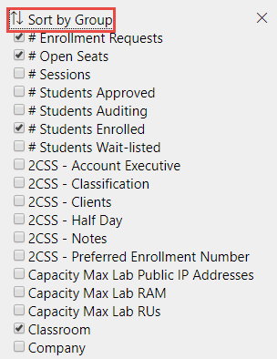

> 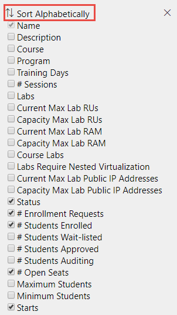

**Note**: The 2CSS custom fields in the images are fictitious fields that are only shown to demonstrate that these type of fields are included in the sort.

### New Output Options on Instructor Schedule
To help those who schedule classes and plan the logistics for instructors, we have added two new output options on the **Instructor Schedule**: **City** and **Country**. When turned on, these will display the city and country the instructor is from if that data is in their profile.

> 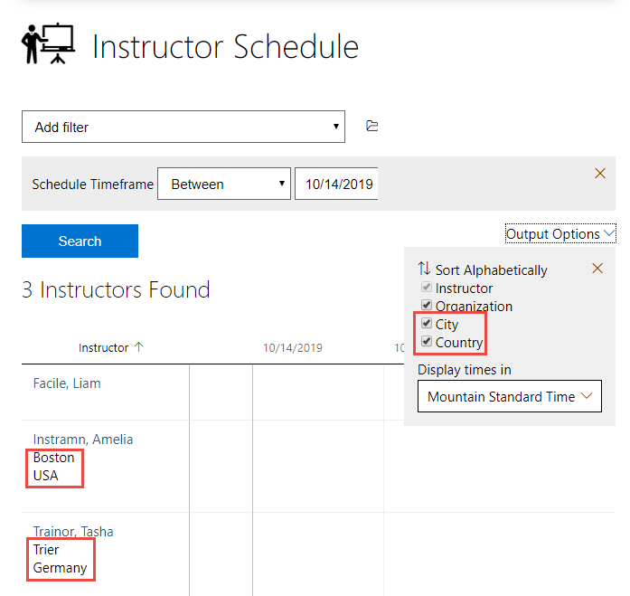

**Note**: The instructor names in the image are fictitious.

### TMS Improvements and Fixes
We have made the following enhancements to our TMS:
- For accessibility purposes, screen readers now correctly read the **Login Assistance** page.
- We now prevent users from being created through the API for organizations that have been disabled.
- All users created through the API will now have **Enable Notifications** set for them automatically.
- You can no longer save a class with a **Custom Virtual Classroom** delivery without the **URL** for the classroom.
- Instructors with the **Response viewing (by instructor class)** permission will now be able to export survey results from their classes.
- New subscriptions can now be saved without an expiration date if **Expires** is unchecked.
- Course custom fields can now be deleted.
- The small Achievements icon is no longer visible above the **Badges** section of a student's **Achievements** page.

----------------------------

## Released September 19 2019

### TMS Improvements and Fixes
We have made the following enhancements to our TMS:
1. Announcements can now be set by LODS employees to be seen by all organizations. These type of announcements will not happen often and will normally be targeted to **Operation Managers** only. If you do not want your organization to receive these announcements, please contact support.
1. To make our platform more accessible for all students, two more accessibility enhancements have been added to meet MAS - 
    1.  If you use a screen reader, the HTML content of an announcement is now read;
    1. If you use the keyboard to navigate and/or a screen reader, the X to close the Cookie Banner now works properly.
1. For those of you who use our API, the **SearchClasses** API method now returns whether the training key is enabled or not for each class, and if so, the training key.
1. On the **Class** profile and **Enrollment** profile pages, the **Instructor** and **Room** lines have been removed if there is no instructor or classroom assigned to the class.
1. On an announcement, the **Show automatically on login** checkbox, if checked, will now remain checked upon **Save**.

----------------------------

## Released September 12 2019

### Manual Badge Issuance

With the proper permissions, you and your instructors can now manually issue badges to students directly from the class Roster page. This provides you the flexibility of determining if the badge requirements have been met by a user through the class and possibly other ways not monitored by the TMS. For instance, if the badge is not tied to an achievement for the class, but you feel the class’ content meets the badge’s requirements, you could manually issue it. 

A badge must be set on its profile to allow manual issuance to be issued via the roster. When you have the proper permissions and there are available badges, you will see an **Issue a Badge** icon to the right of each student from which you can choose the badge.

> 

### More Accessibility Improvements to Meet MAS
In our continuing efforts to improve our accessibility for all students and meet MAS, we have made the following improvements:

1. When a sight-impaired user encounters errors in saving changes to their profile,
    1. The focus will now automatically return to the first error field.
    1. The color contrast of the error messages has been enhanced.
1. When using keyboard navigation,
    1. The user will now see an outline on the Save button when it has focus.
    1. The user will now be able to navigate the User menu with the arrow keys. Some screen reader programs may interfere with this capability.
1. For Screen reader users
    1. The bookmark on a course assignment will clearly identify whether the bookmark has been selected or not.
    1. The heading levels on the Contact Information page have been  corrected to progress from heading 1 to heading 2.
    1. The Training Key field announces as required / invalid if empty on the Training Key page.

----------------------------

## Released September 5 2019

### New Badge Output Option and Filters on Find Achievements
Operations managers, you now have an easy way to view which badges are attached to which achievements and to filter for achievements with a certain badge attached. We have added the **Badge** output option to the **Find Achievements** page. This column will display the name of the badge attached to the achievement. The name is a link to the badge profile. If no badge is attached to the achievement, the column will be empty for that achievement. 

You can also filter the results for those achievements that have a certain badge attached using one of two filters. The **Badge Name** filter allows you to filter on part or all of the name of the badge. The **Choose Badge** filter allows you to see badges and select the one you want to use as the filter criteria.

> 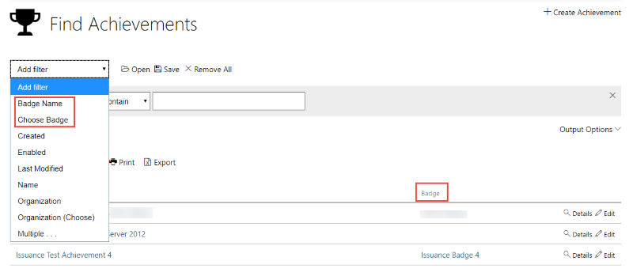

### TMS Improvements and Fixes
We have made the following improvements to our TMS:

- For our users who use screen readers, we changed the **Edit User's Basic Information** tab for improved accessibility. The page no longer contains a table around the fields. This change was to meet MAS standards and reduce confusion by screen readers.
- For managers, we have removed the **Manager/Supervisor** tab and the **Fax** field from the **Contact** tab on the **Organization Profile**. This streamlines the profile by removing items that are not used.

----------------------------

## Released August 29 2019

### API Created Classes Use Organization Setting for Event Training Key
If you use the TMS API to create classes, these classes will now default to allow automatic enrollment using event training key if  your organization is set to allow automatic enrollment using event training key by default in new classes.

You can now pull this information for a class through the API, as well, using the **GetClass** API call response. The response will include the following properties:

- EnableClassTrainingKey - True/False
- ClassTrainingKey - the key

> 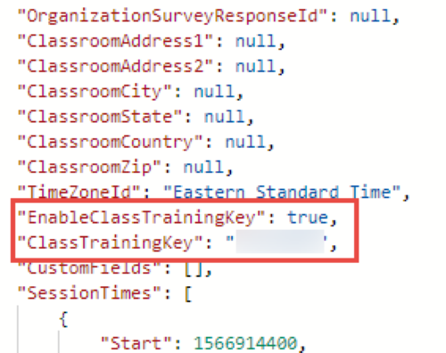

### Courses Visible on Publishing Groups
For those of you who manage your organization's publishing group, you can now save time by adding courses directly to the publishing group itself, rather than going to each course to add the publishing group to it. All restrictions and warnings are still in effect. 
See the updated article, [How do I add a course to my publishing group?](/tms/tms-administrators/courses-and-activities/pgs/add-courses-to-publishing-group.md).

In addition, for anyone who can view the publishing group's profile page, the courses are now listed at the bottom of the page. This saves you time searching courses by a publishing group. 

> 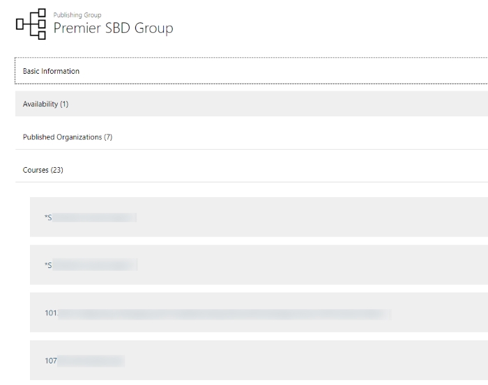

The Help articles have been updated to reflect these changes. 

### Accessibility Improvements to Meet MAS
In our continuing efforts to improve our accessibility and meet MAS, we have made the following improvements:

 - Users with screen readers will now hear
    - The page title announced as a Heading 1 on the **Simple Course Assignment** page and in the **Redeem Training Key** dialog.
    - The **Training Key** announced as required on the **Redeem Training Key** dialog.
    - The TMS Logo announced as **Link, Learn on Demand TMS**.
- The language has also been set to English on pages for screen readers.
- Users who use keyboard controls will be able to cleanly tab through the **Current Training** page due to removing tab index values greater than 0.
- For users with impaired vision, the **Integrated Help** article links now have a color contrast greater than 4.5.

### Enable Achievements Output Option and Filter
Want to be which of your organizations have achievements enabled? On the **Find Organizations** search page, you can select the new **Enable Achievements** output option. You can also filter for those organizations who do or do not have achievements enabled using the new **Enable Achievements** filter.

> 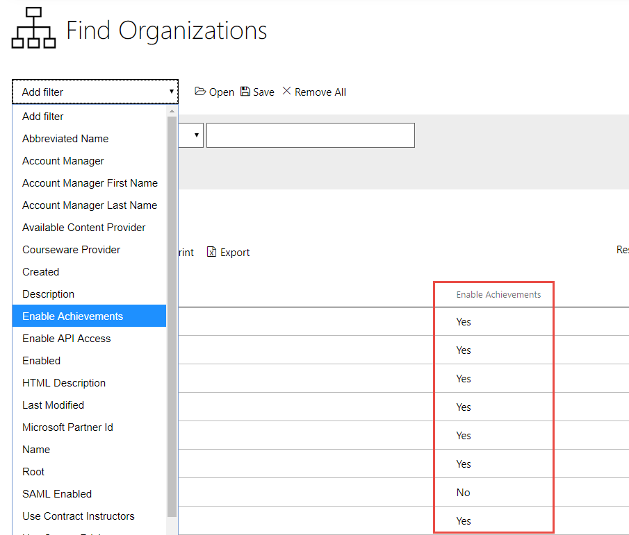

### Expected Duration Output Option
Want to be able to control the duration of a course and its activities? You can turn on the new **Expected Duration** output option in the **Choose Lab** dialog when adding a lab activity to a course to be aware of how much time it will add to your course. 

> 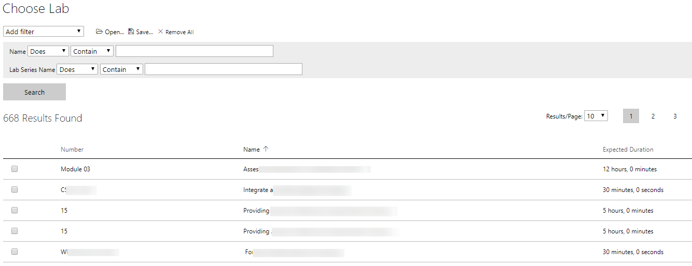

You can also use thise output option on the **Find Lab Instances** search page to compare how long students were in labs versus the expected duration.

> 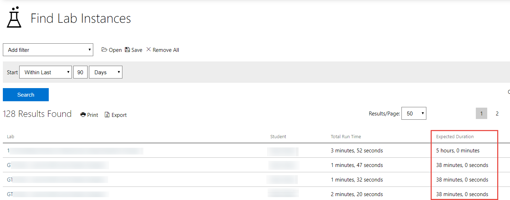

### TMS Improvements and Fixes
The following improvements have been been pushed to TMS Production:

- To match current practices and to save everyone time, we have changed several defaults for new organizations and new child organizations.
- We have updated the **Maintenance and System Message** to have a more modern look.
- The **Theme** field has been removed from the **Company Profile** page.
- The icon on **External Link** activities in courses is now a chain link instead of the same icon used for video activities.

----------------------------

## Released August 16 2019

### TMS Improvements and Fixes

We have pushed the following items to TMS production:

- For those with the proper permissions to manage vouchers, you can now easily access your Manage Class Vouchers page from your **Organization Profile** page. There is now a Manage Class Vouchers link in the quick access bar for all organizations.
- You can now see the both the **Expected** and **Maximum Durations** on the **Lab Profile** page in the TMS. These values are set in LOD for the lab. This will help you when planning the duration for your courses and classes.
- You no longer need to use a shortened URL for activities in courses. The URL field for activities on the **Activities** tab of the **Course** Profile now has an unlimited character length.
- On the **Find Training Key Pools** search page, you will now see accurate results when using the **Expiration** filter.

----------------------------

## Released August 8 2019

### Badges on Student Achievement Page
You and your students can now easily view the badges and the achievements they have earned in one place, the student's Achievements page. To access this age, click the **Achievements** link in the quick access bar on the student's profile page. At the top of the page, you can see the achievements with their point values and description. Below achievements, you can see the badges earned with their description.

> 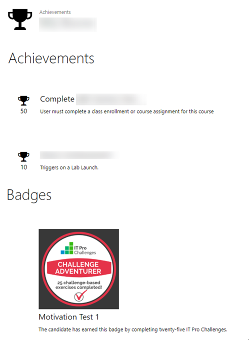

In addition, to make it easier for your students to participate in achievements, current organizations have been updated to have achievements enabled. If you would like to disable achievements for your organization, you can do this by unchecking ‘Enable Achievements’ at the bottom of the Preferences tab of your organization profile. Child organizations, at the time of creation, will have achievements enabled/disabled based on their parent organization’s setting.

### Course Duration versus Activities Duration Check
The course duration must now be longer than the amount of time the course activities are expected to take, based on a 12-hour day. Therefore, when creating or editing a course, you will need to ensure the course duration is less than the sum of the course’s activity durations. If it is less, you will receive an error message upon attempting to save the course. This only applies to activities available to everyone. For instance, if your course has the duration set to 1 day but the activities available to everyone have durations that add up to 12 hours and 15 minutes, you will be unable to save the course. You will receive the following error message: **The expected duration of the activities you have added to this course exceeds the time given in the Course’s duration for a student to complete the work. Please increase the Course’s duration. You may contact our help desk for further assistance.** 

Please be advised, once you attempt to save the course and receive this message, any changes you have made to the Activities tab prior to the save attempt currently will not be saved. You will need to make those changes again after adjusting your course's duration.

### TMS Improvement

The TMS will now return a 403 “Not Found. Sorry, the page you requested could not be found.” message when someone tries to access an invalid or disabled site URL.

----------------------------

## Released July 17 2019

### External Badges

Your students can now earn externally supported badges through their activities/achievements in the TMS. This will give your users an additional sense of accomplishment, and they will be able to share that accomplishment with others outside the TMS.

You create the badges in the external badge provider and attach them to achievements you have created in the TMS. This feature has the following components:

- **Badge Provider** - a repository to distribute badges. This is a third-party vendor that will issue the badge to the user. Currently the TMS only supports badges from Credly/Acclaim.
- **Badge** - the token given by a Badge Provider to a student to share based on the achievement earned.
- **Achievement** - the criteria needed to earn the badge. An achievement is given to users who complete a specific task(s) in the TMS. When the achievement is earned, the badge associated with it is issued.

The process to create badges and associate them to achievements has four steps. The first one is completed in the Badge Provider’s system. The final three steps are inside the TMS:

1. Create your badge templates
1. [Create the Badge Provider entity](/tms/tms-administrators/badges-achievements/create-badge-provider.md)
1. [Create the Badge entity](/tms/tms-administrators/badges-achievements/create-badge.md)
1. Associate the badge with an [existing](/tms/tms-administrators/badges-achievements/associate-badge.md) or [new Achievement](/tms/tms-administrators/badges-achievements/create-achievements-to-motivate-learners.md)

----------------------------

## Released July 03 2019

### Achievements for Exams

Your students can now earn achievements when they pass an exam or complete a learning path and if badges are attached to the achievements, they can share the externally hosted badge with others.

You can now build achievements for exams and learning paths. The JSON conditions can be written for passing the exam for a simple achievement or can be more complex including multiple conditions. Here are some examples:

Simple conditions for passing the exam lab with the ID of 12345 – 
[
   {
      Subject:0,
      Count:1,
      Passed:true,
      LabProfileIds:[12345]
    }
]

Complex conditions for completing a learning that is comprises of 2 courses with one regular lab each (IDs 11223 and 11224) and a course with an exam lab (ID 12345) -

[
   {
      Subject:0,
      Count:1,
      Complete:true,
      Distinct:true,
      LabProfileIds: [11223,11224]
   },
   {
      Subject:0,
      Count:1,
      Passed:true,
      LabProfileIds: [12345]
   }
]

### Keyboard Navigation for some Dropdown Filter Menus

On Search pages that contain the **Organization**, **Program** and/or **Classroom** filters, you can now navigate these filters’ dropdown menus with the keyboard using **TAB**, the **Arrow** keys, and **ENTER. **

When on a search page that has one of these filters applied, 
1. Tab to the dropdown for one of these filters and press **ENTER**. The dropdown menu will open to the list of filter criteria. 
1. Use the arrow keys to navigate up and down the list. 
1. When the arrow next to a “Parent” in the list is highlighted, press **ENTER** to expand its hierarchy to allow the selection of children from the dropdown menu. 
1. When the item you want is highlighted, press **ENTER** again to select and add it to your search filter as the criteria.

### Event Training Key Redemption

As an administrator, you can now limit the time Event training keys can be used to create enrollments: until the class ends or for a set amount after the class. These two options are on the Create/Edit Class under Allow automatic enrollment using event training key.

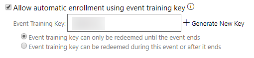

The first option, **Event training key can only be redeemed until event ends**, is the default option and restricts any enrollments being created using the key after the event ends. 

The second option, **Event training key can be redeemed during event or after it ends**, restricts after-class enrollments from being created outside the post-class lab availability window. This timeline is controlled by the Post-class lab availability set on the course. 

### TMS Updates and Fixes

- A **Roadmap** link now shows in the TMS Default Top Navigation bar. When you click this, you will be taken to our Roadmap page on our website, which has explanations of our latest product updates on both the TMS and LOD. If a TMS site has a custom top navigation bar per the customer's request, this link will not be seen.
- The Recordings link is now accurately hidden for classes with the Event Builder virtual host.

----------------------------

## Released June 13 2019

### Course Duplication

You can now duplicate an existing course without having to create a new one from scratch. With this you can easily create multiple courses for different customers or uses with slight differences in activities, availability, custom fields, etc.

To duplicate a Course:

1. On the Course profile page, click Edit.

1. Make all changes you wish to be reflected in the new course.

1. Scroll down to the bottom of the page and click Save As. You will be prompted to enter the name for the new course.

1. Click Save. The newly created Course will automatically open in Edit mode to ensure any additional changes can been made.

Note: When you click Save As, if a custom field requiring unique values is present, you will be prompted to change it prior to creation of the new course.

### Personalized Notifications

You can now personalize notifications to recipients by including the new replacement text fields in the body of the notification:
- RecipientFirstName
- RecipientLastName
- RecipientFullName
- RecipientSiteUrl

When these are used, the email notification will pull the recipient’s information and include it in-place of the fields. For instance, if Amelia Johnston, an instructor, is receiving a notification that a student has cancelled, the notification could be addressed **Dear [RecipientFirstName] [RecipientLastName]**. The email that Amelia would receive would read Dear Amelia Johnston.

### TMS Updates and Fixes

- The **Find Publishing Group** page now has the **Internal Ids** output option. This output option is included in exported and printed search results.
- You can now include your **External Ids** in the **Class Import** template.
- The **GetClass** and the **SearchClasses** API methods now return:
    - **InstructorId**
    - **InstructorFirstName**
    - **InstructorLastName**
- The **HTML Description** field on the **Course Profile** page is now an accordion section below Activities.
- We now properly filter and show output options for enrollments when the payment type is class enrollment training key. We also store and report in Enrollment History if a class enrollment was created using an event training key.
- On Find Notification Plans, the Received By filter now contains all possible recipient types, including Creator, Class Custom Users, and Editing Delegates.
- On the Organization Profile page, the dependent field, Default Organization Manager Role, is now directly below the Allow Anonymous Organization Registration section instead of after the Account Manager field.

----------------------------

## Released June 3 2019

### Accessibility Updates

We have made several improvements to student facing pages to ensure they are accessble to all students. These include:

- The **Sign In** dialog choices now have dotted outlines when they are in focus.
- System messages and temporary status messages will now stay open until you close them or leave the page. In addition, if you are using a screen reader, the messages and their **Close** (**X**) button are now read.
- The **Course Image** on the **Course Profile** page now has the **ALT text** attribute.
- Pages available to students have been parsed correctly.
- The **Search** link on the **Course Profile** page has been hidden for students. They should use the **Course Catalog**, if available to search for courses.
- The tabs on the **Simple Course Assignment** page now wrap if the window is zoomed or resized to be smaller. In addition, if you are using a screen reader, the tabs are now read as part of a list including their number in the list and their status at point of focus and selection. The tabs' contents are also read when you enter the tab and give it focus.

### TMS Update and Fixes

- You can now use the arrow keys and **Enter** to scroll the **Admin menu** search results to select an item from the results.
- Course activities now properly roll-up their prices to the course level, regardless of whether they are in a section or not. This was already in Production as an emergency hotfix in May.

----------------------------

## Released May 9 2019

### CreateClass and UpdateClass API Methods Simplified and Updated

The **CreateClass** and **UpdateClass** API methods have been simplified for use and updated to allow for setting the time zone and organizational availability. The documentation pages have also been simplified with clearer examples.

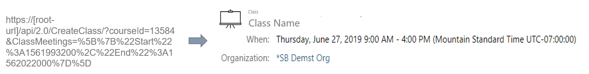

### TMS Update

The **GetClass** API call now returns the time zone and organizational availability of the class.

----------------------------

## Released May 2 2019

### Choose at Org Level whether Course Tags are Included with Export Course Catalog

There is now an option, **Include course tags in simple course catalog export**, on your Organization profile. Use it to set whether tags are included in the export or not.

### Use API Methods for Class Custom Fields

You can now view what custom fields are on your classes through the API as well as view and update the value of a Class Custom Field for a particular class. We have added the following API methods:
- **GetClassCustomFields** - returns a list of custom fields on yoru organization's classes, including cascading course custom fields.
- **GetClassCustomFieldValue** - returns the value of a Class Custom Field on a particular class.
- **UpdateClassCustomFieldValue** - allows you to update the value of a Class Custom Field. This will return an error if the field is set to require unique values and you attempt to update to one that already exists. It will also return an error if you try to update the field to clear it when the field is required.

### TMS Update and Fixes

- The **Export** link on the **Class Roster** is now visible based on permissions for searching class enrollments.
- The **Total RAM** output option will now recalculate when a lab's RAM is updated and the TMS has been synced.
